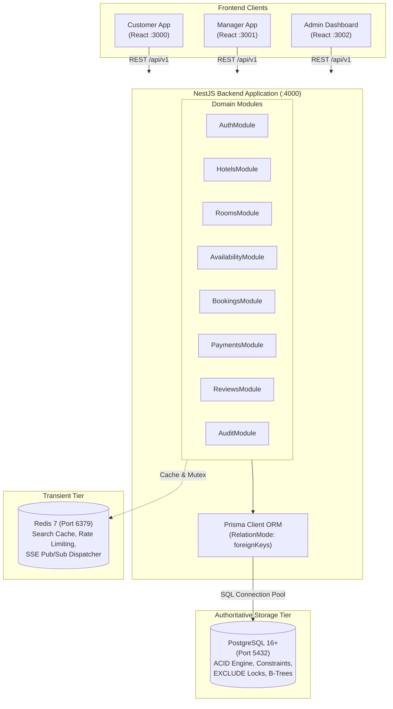
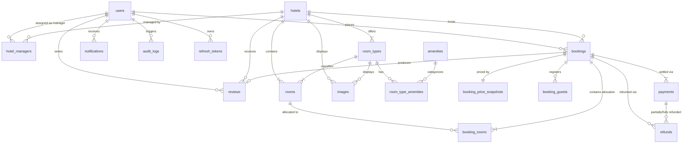
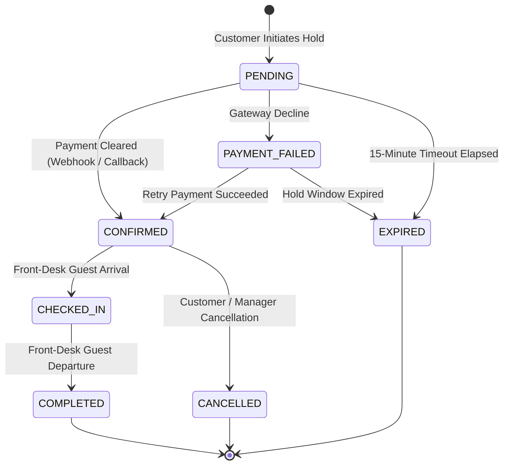
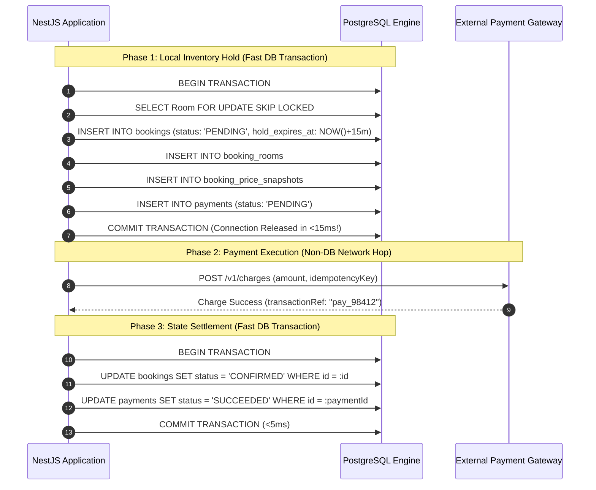
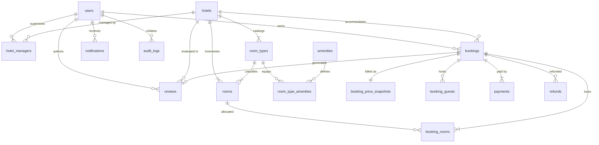

# Stayora — Database Architecture Specification

> **System Data Architecture & Relational Engineering Contract**  
> **Document Version:** 1.0.0-production  
> **Target Database Engine:** PostgreSQL 16+ (Local Dev & Containerized Testing)  
> **Data Access Layer:** Prisma ORM 5.x / 6.x (Engineered with PostgreSQL Foreign Key Referential Actions)  
> **Companion Caching Tier:** Redis 7.x (Strictly Non-Authoritative Cache & Ephemeral Mutexes)  
> **Status:** Approved for Schema Migration & Backend Service Implementation

---

## Table of Contents

1. [Executive Summary & Architectural Baseline](#1-executive-summary--architectural-baseline)
2. [PostgreSQL & Prisma Research Foundation](#2-postgresql--prisma-research-foundation)
3. [System Context & Architectural Boundaries](#3-system-context--architectural-boundaries)
4. [Core Business Model & Domain Hierarchy](#4-core-business-model--domain-hierarchy)
5. [Entity Set Taxonomy (V1 Core, Supporting, Future)](#5-entity-set-taxonomy-v1-core-supporting-future)
6. [Conceptual & Logical Entity-Relationship (ER) Model](#6-conceptual--logical-entity-relationship-er-model)
7. [Detailed Physical Table Specifications](#7-detailed-physical-table-specifications)
   - 7.1 `users`
   - 7.2 `hotels`
   - 7.3 `hotel_managers`
   - 7.4 `room_types`
   - 7.5 `rooms`
   - 7.6 `bookings`
   - 7.7 `booking_rooms` (Allocation & Inventory Ledger)
   - 7.8 `booking_guests`
   - 7.9 `booking_price_snapshots`
   - 7.10 `payments`
   - 7.11 `refunds`
   - 7.12 `reviews`
   - 7.13 `notifications`
   - 7.14 `amenities` & `room_type_amenities`
   - 7.15 `images`
   - 7.16 `audit_logs`
8. [Primary Key Architecture](#8-primary-key-architecture)
9. [Foreign Key Strategy & Referential Actions](#9-foreign-key-strategy--referential-actions)
10. [Soft Deletion, Deactivation & Historical Integrity](#10-soft-deletion-deactivation--historical-integrity)
11. [Historical Data Immutability & Financial Preservation](#11-historical-data-immutability--financial-preservation)
12. [Relational Normalization & Denormalization Analysis](#12-relational-normalization--denormalization-analysis)
13. [Physical Address & Location Modeling](#13-physical-address--location-modeling)
14. [Amenities Modeling (Normalized vs JSONB)](#14-amenities-modeling-normalized-vs-jsonb)
15. [Media & Imagery Architecture](#15-media--imagery-architecture)
16. [Booking Data Model & Room Allocation Engine](#16-booking-data-model--room-allocation-engine)
17. [Date Range Semantics: Half-Open Intervals `[checkIn, checkOut)`](#17-date-range-semantics-half-open-intervals-checkin-checkout)
18. [Concurrency & Booking Overlap Protection](#18-concurrency--booking-overlap-protection)
19. [Booking Lifecycle & Deterministic State Machine](#19-booking-lifecycle--deterministic-state-machine)
20. [Payment Architecture, Retries & Idempotency](#20-payment-architecture-retries--idempotency)
21. [Monetary Representation & Currency Precision](#21-monetary-representation--currency-precision)
22. [Dynamic Pricing Snapshots & Historical Folios](#22-dynamic-pricing-snapshots--historical-folios)
23. [Guest Manifest & Guest Identity Modeling](#23-guest-manifest--guest-identity-modeling)
24. [Multi-Tenant Hotel Management (`hotel_managers`)](#24-multi-tenant-hotel-management-hotel_managers)
25. [Verified Reviews & Social Proof Integrity](#25-verified-reviews--social-proof-integrity)
26. [Durable Notifications & Event Logs](#26-durable-notifications--event-logs)
27. [Immutable Append-Only Audit Logging](#27-immutable-append-only-audit-logging)
28. [Database Constraints Matrix](#28-database-constraints-matrix)
29. [Indexing Architecture & Access Pattern Analysis](#29-indexing-architecture--access-pattern-analysis)
30. [Composite Indexes & Column Ordering Rationale](#30-composite-indexes--column-ordering-rationale)
31. [PostgreSQL Partial Indexes](#31-postgresql-partial-indexes)
32. [Timestamp Standardization & Temporal Auditing](#32-timestamp-standardization--temporal-auditing)
33. [Enum Strategy: Native Enums vs CHECK Constraints](#33-enum-strategy-native-enums-vs-check-constraints)
34. [Entity Data Lifecycle & State Progression](#34-entity-data-lifecycle--state-progression)
35. [Persistence Rules & Mutation Invariants](#35-persistence-rules--mutation-invariants)
36. [Transaction Boundaries & ACID Isolation](#36-transaction-boundaries--acid-isolation)
37. [Concurrency Isolation Levels & Lock Strategies](#37-concurrency-isolation-levels--lock-strategies)
38. [Storage Boundaries: PostgreSQL vs Redis Matrix](#38-storage-boundaries-postgresql-vs-redis-matrix)
39. [SSE & Database-to-Client Event Boundary](#39-sse--database-to-client-event-boundary)
40. [Production-Ready Prisma Schema (`schema.prisma`)](#40-production-ready-prisma-schema-schemaprisma)
41. [Native PostgreSQL DDL & Custom Extensions](#41-native-postgresql-ddl--custom-extensions)
42. [Database Migration Lifecycle & Operational Strategy](#42-database-migration-lifecycle--operational-strategy)
43. [Seed Data Specification](#43-seed-data-specification)
44. [Database Invariants (Non-Negotiable Business Truths)](#44-database-invariants-non-negotiable-business-truths)
45. [Database Architectural Anti-Patterns](#45-database-architectural-anti-patterns)
46. [Final Recommended Physical Schema Summary](#46-final-recommended-physical-schema-summary)
47. [Architectural Decision Matrix](#47-architectural-decision-matrix)
48. [Architectural Quality Gate Review](#48-architectural-quality-gate-review)
49. [Implementation Readiness Checklist](#49-implementation-readiness-checklist)

---

## 1. Executive Summary & Architectural Baseline

**Stayora** is a multi-tenant hospitality reservation engine designed to support high-concurrency booking workflows across three distinct frontend applications:
1. **Customer Web App (`:3000`)**: Search, discovery, reservation checkout, and review submission.
2. **Manager Web App (`:3001`)**: Property configuration, room inventory maintenance, live arrival manifests, and front-desk check-in/check-out operations.
3. **Admin Dashboard (`:3002`)**: Platform-wide user governance, hotel onboarding, global financial ledger audits, and review moderation.

The backend is built as a **Modular Monolith in NestJS** communicating with a single shared **PostgreSQL 16+** database via **Prisma ORM**.

```text
┌─────────────────────────┐  ┌─────────────────────────┐  ┌─────────────────────────┐
│   Customer Web (:3000)  │  │   Manager Web (:3001)   │  │  Admin Dashboard (:3002)│
└────────────┬────────────┘  └────────────┬────────────┘  └────────────┬────────────┘
             │                            │                            │
             └────────────────────┬───────┴────────────────────────────┘
                                  ▼
                   ┌─────────────────────────────┐
                   │    NestJS Modular Monolith  │
                   │        API (:4000)          │
                   └──────────────┬──────────────┘
                                  │
                 ┌────────────────┴────────────────┐
                 ▼                                 ▼
      ┌─────────────────────┐           ┌─────────────────────┐
      │  PostgreSQL 16+ DB  │           │   Redis 7 Container │
      │  SOLE SOURCE OF     │           │  (Non-Authoritative │
      │  TRUTH & INTEGRITY  │           │   Cache & Mutexes)  │
      └─────────────────────┘           └─────────────────────┘
```

### Core Tenets of the Data Architecture:
- **Relational Integrity First**: Business invariants (non-overlapping room dates, valid foreign keys, non-negative amounts, and unique emails) are enforced at the PostgreSQL database engine layer via primary keys, foreign key constraints, `CHECK` constraints, unique indexes, and `EXCLUDE USING gist` range constraints.
- **PostgreSQL is the Sole Authority**: Redis is strictly a cache and ephemeral coordinator. If Redis restarts, crashes, or evicts all keys, zero data is lost and zero double-bookings occur.
- **Immutable Financial & Booking History**: Pricing snapshots and booking states are immutable historical records. Deleting a hotel, user, or room type in the management UI must **never** delete, mutate, or orphan historical bookings, payments, refunds, or guest folios.

---

## 2. PostgreSQL & Prisma Research Foundation

### Authoritative PostgreSQL Engine Mechanics
1. **Referential Integrity & Actions**:
   - `ON DELETE RESTRICT` / `ON DELETE NO ACTION`: Prevents the deletion of a referenced parent row if child rows exist. In PostgreSQL, `NO ACTION` evaluates constraints at statement end (or transaction end if deferred), whereas `RESTRICT` enforces immediately. We employ `RESTRICT` on critical business entities (Hotels, RoomTypes, Rooms, Users, Bookings) to guarantee historical records can never be cascade-deleted.
   - `ON DELETE CASCADE`: Only permitted on tightly coupled, strictly owned metadata child records (e.g., `hotel_managers`, `room_type_amenities`, `images`) where the child has no independent business identity.
2. **PostgreSQL Range Types & Exclusion Constraints**:
   - Native `daterange` and `tsrange` types support discrete half-open intervals `[lower, upper)`.
   - The `btree_gist` extension allows combining scalar types (e.g., `UUID`) with range types in an `EXCLUDE USING gist` constraint. This enables mathematical, database-level double-booking prevention:
     $$\text{EXCLUDE USING gist } (\text{room\_id WITH } =, \text{daterange}(\text{check\_in}, \text{check\_out}) \text{ WITH } \&\&)$$
3. **Pessimistic Concurrency & `SKIP LOCKED`**:
   - PostgreSQL's `SELECT ... FOR UPDATE SKIP LOCKED` allows concurrent transactions to lock individual candidate inventory rows without blocking other transactions.
4. **Monetary Computation**:
   - The PostgreSQL `money` type is explicitly rejected due to locale-specific formatting issues, lack of currency storage, and rounding quirks.
   - We utilize **`BIGINT` storing minor currency units** (e.g., Indian Paise, US Cents) to completely eliminate floating-point imprecision.

### Authoritative Prisma ORM Compatibility & Guardrails
1. **Relation Mode**:
   - Stayora explicitly configures `relationMode = "foreignKeys"`. Prisma will generate real database-level foreign keys in PostgreSQL rather than emulating constraints in software (`prisma` mode).
2. **Explicit Join Models**:
   - Prisma's implicit `m-n` relations are rejected for core domain associations. Join tables (`hotel_managers`, `room_type_amenities`) are explicitly modeled with their own metadata (e.g., `assigned_at`, `created_at`) and composite unique constraints.
3. **Interactive Transactions (`$transaction`)**:
   - Prisma interactive transactions pass an active transaction client (`tx`) through which raw SQL locking queries (`$queryRaw`) and Prisma CRUD operations execute within a single atomic PostgreSQL transaction boundary.

---

## 3. System Context & Architectural Boundaries



---

## 4. Core Business Model & Domain Hierarchy

### Why `RoomType` and `Room` Must Be Separate Concepts

In professional hospitality management, the conflation of **Room Type** (the commercial category/SKU) and **Room** (the physical asset/inventory) causes severe data corruption, inventory loss, and scheduling failure.

```text
┌────────────────────────────────────────────────────────┐
│                        Hotel                           │
│              "Grand Stayora Chennai"                   │
│              (Legal Physical Property)                 │
└───────────────────────────┬────────────────────────────┘
                            │ 1
                            │ has many
                            ▼ *
┌────────────────────────────────────────────────────────┐
│                      RoomType                          │
│                "Deluxe Sea View Suite"                 │
│  - Commercial Catalog Item (SKU)                       │
│  - Base Rate: ₹7,500/night                             │
│  - Max Capacity: 3 Guests (2 Adults, 1 Child)          │
│  - Amenities: Free WiFi, Bathtub, Ocean Balcony        │
└───────────────────────────┬────────────────────────────┘
                            │ 1
                            │ has many
                            ▼ *
┌────────────────────────────────────────────────────────┐
│                   Physical Room                        │
│                   "Room 304"                           │
│  - Physical Asset with Floor & Door Number             │
│  - Operational Status: AVAILABLE | DIRTY | MAINTENANCE │
│  - Keycard Encoding / Housekeeping Unit Target         │
└────────────────────────────────────────────────────────┘
```

#### Detailed Domain Separation Matrix:
| Criterion | `RoomType` (Commercial SKU) | `Room` (Physical Unit) |
| :--- | :--- | :--- |
| **User Interaction** | Customers browse, filter, select, and book `RoomType`s. | Hotel Managers and Housekeepers inspect, clean, and assign physical `Room`s. |
| **Pricing** | Rates, seasonal adjustments, and cancellation terms attach to `RoomType`. | Physical rooms have no price of their own; their price derives from their `RoomType`. |
| **Quantity** | An abstract concept with an inventory count ($N$ physical rooms). | Exactly 1 physical unit with a distinct door number (e.g., "Room 304"). |
| **Operational State** | Always active or deactivated commercially. | Fluid real-world states: `AVAILABLE`, `OCCUPIED`, `DIRTY`, `UNDER_MAINTENANCE`. |
| **Reservation Binding** | At booking creation, customer commits to the `RoomType`. | The system allocates a specific `Room` to guarantee capacity, but the front desk can shift the booking to another physical room of the *same* `RoomType` (e.g., Room 304 -> Room 305) without altering the customer's contract. |

---

## 5. Entity Set Taxonomy (V1 Core, Supporting, Future)

To avoid premature schema bloating while ensuring complete architectural rigor, all entities are categorized into three lifecycle tiers:

```text
┌──────────────────────────────────────────────────────────────────────────────┐
│ V1 CORE ENTITIES (Essential for Booking, Inventory, Payments & Governance)    │
├──────────────┬──────────────┬──────────────┬──────────────────┬──────────────┤
│ users        │ hotels       │ hotel_managers│ room_types       │ rooms        │
│ bookings     │ booking_rooms│ booking_price_snapshots │ payments│ refunds     │
└──────────────┴──────────────┴──────────────┴──────────────────┴──────────────┘
┌──────────────────────────────────────────────────────────────────────────────┐
│ V1 SUPPORTING ENTITIES (Operational Usability, Content & Auditing)           │
├──────────────┬──────────────┬──────────────┬──────────────────┬──────────────┤
│ booking_guests│ reviews     │ notifications│ amenities        │ room_type_amenities│
│ images       │ audit_logs   │ refresh_tokens│                  │              │
└──────────────┴──────────────┴──────────────┴──────────────────┴──────────────┘
┌──────────────────────────────────────────────────────────────────────────────┐
│ FUTURE EXTENSIONS (Phase 2+ Architectural Evolution)                         │
├──────────────┬──────────────┬──────────────┬──────────────────┬──────────────┤
│ seasonal_rates│ coupon_codes│ guest_loyalty │ corporate_accounts│ disputes    │
└──────────────┴──────────────┴──────────────┴──────────────────┴──────────────┘
```

### Detailed Justification of Core vs Supporting Entities:
1. **`booking_rooms` (Allocation Ledger)**: *V1 Core*. Decouples the booking record from the physical room. Allows a customer to reserve multiple rooms under one booking folio in future phases, and enables front-desk room reassignment without mutating booking headers.
2. **`booking_price_snapshots`**: *V1 Core*. Freezes the daily room rate, tax breakdown, and service fees at transaction time. Protects historical revenue records from catalog price changes.
3. **`hotel_managers`**: *V1 Core*. Explicit join table supporting multi-tenant property management ($N$ managers to $M$ hotels).
4. **`booking_guests`**: *V1 Supporting*. Stores real guest names and ages separately from the booking customer account (e.g., an executive assistant booking for a colleague, or a family booking for children).
5. **`images`**: *V1 Supporting*. Normalized table holding external CDN URLs, captions, display ordering, and polymorphic targets (`HOTEL`, `ROOM_TYPE`).
6. **`audit_logs`**: *V1 Supporting*. Append-only ledger recording security and operational mutations (role changes, cancellations, manual refunds).

---

## 6. Conceptual & Logical Entity-Relationship (ER) Model



---

## 7. Detailed Physical Table Specifications

### 7.1 `users`
Represents all system actors across the three frontends (`CUSTOMER`, `MANAGER`, `ADMIN`).

| Column | PostgreSQL Type | Nullable | Default | PK | FK | Unique | Description |
| :--- | :--- | :--- | :--- | :--- | :--- | :--- | :--- |
| `id` | `UUID` | No | `gen_random_uuid()` | Yes | No | Yes | Primary Key (UUIDv7 in app or UUIDv4 in DB). |
| `email` | `VARCHAR(255)` | No | None | No | No | Yes | Normalized lowercase customer/manager email. |
| `password_hash`| `VARCHAR(255)` | No | None | No | No | No | Secure salted hash (Bcrypt cost 12 / Argon2id). |
| `first_name` | `VARCHAR(100)` | No | None | No | No | No | User's legal first name. |
| `last_name` | `VARCHAR(100)` | No | None | No | No | No | User's legal surname. |
| `phone` | `VARCHAR(30)` | Yes | `NULL` | No | No | No | International format contact phone number. |
| `role` | `VARCHAR(20)` | No | `'CUSTOMER'` | No | No | No | Enforced role: `CUSTOMER`, `MANAGER`, `ADMIN`. |
| `status` | `VARCHAR(20)` | No | `'ACTIVE'` | No | No | No | Enforced status: `ACTIVE`, `SUSPENDED`, `DEACTIVATED`. |
| `created_at` | `TIMESTAMPTZ` | No | `NOW()` | No | No | No | Record creation timestamp (UTC). |
| `updated_at` | `TIMESTAMPTZ` | No | `NOW()` | No | No | No | Record last mutation timestamp (UTC). |
| `deleted_at` | `TIMESTAMPTZ` | Yes | `NULL` | No | No | No | Soft deletion timestamp. |

---

### 7.2 `hotels`
Represents physical hotel establishments onboarded by Platform Administrators.

| Column | PostgreSQL Type | Nullable | Default | PK | FK | Unique | Description |
| :--- | :--- | :--- | :--- | :--- | :--- | :--- | :--- |
| `id` | `UUID` | No | `gen_random_uuid()` | Yes | No | Yes | Primary Key. |
| `name` | `VARCHAR(255)` | No | None | No | No | No | Official trade name of the hotel property. |
| `slug` | `VARCHAR(255)` | No | None | No | No | Yes | URL-friendly SEO slug (e.g. `grand-stayora-chennai`). |
| `description` | `TEXT` | No | None | No | No | No | Full property editorial overview and story. |
| `star_rating` | `SMALLINT` | No | `3` | No | No | No | Star classification: `1` to `5`. |
| `address_line1`| `VARCHAR(255)` | No | None | No | No | No | Street address, building number, road name. |
| `address_line2`| `VARCHAR(255)` | Yes | `NULL` | No | No | No | Suite, landmark, floor, or complex details. |
| `city` | `VARCHAR(100)` | No | None | No | No | No | City / Municipality (indexed for discovery). |
| `state` | `VARCHAR(100)` | No | None | No | No | No | State, province, or administrative region. |
| `country` | `VARCHAR(100)` | No | None | No | No | No | Country name (e.g., India). |
| `postal_code` | `VARCHAR(20)` | No | None | No | No | No | Postal code / PIN code. |
| `latitude` | `NUMERIC(9,6)` | Yes | `NULL` | No | No | No | WGS84 Latitude coordinates (-90.0 to +90.0). |
| `longitude` | `NUMERIC(9,6)` | Yes | `NULL` | No | No | No | WGS84 Longitude coordinates (-180.0 to +180.0). |
| `phone` | `VARCHAR(30)` | No | None | No | No | No | Front-desk direct contact number. |
| `email` | `VARCHAR(255)` | No | None | No | No | No | Front-desk official contact email. |
| `check_in_time`| `TIME` | No | `'14:00:00'` | No | No | No | Standard guest check-in start time. |
| `check_out_time`| `TIME`| No | `'11:00:00'` | No | No | No | Standard guest check-out deadline. |
| `is_active` | `BOOLEAN` | No | `TRUE` | No | No | No | Visibility flag for search results. |
| `created_at` | `TIMESTAMPTZ` | No | `NOW()` | No | No | No | Creation timestamp (UTC). |
| `updated_at` | `TIMESTAMPTZ` | No | `NOW()` | No | No | No | Last mutation timestamp (UTC). |
| `deleted_at` | `TIMESTAMPTZ` | Yes | `NULL` | No | No | No | Soft deletion timestamp. |

---

### 7.3 `hotel_managers`
Explicit join table binding Users possessing the `MANAGER` role to assigned Hotels.

| Column | PostgreSQL Type | Nullable | Default | PK | FK | Unique | Description |
| :--- | :--- | :--- | :--- | :--- | :--- | :--- | :--- |
| `id` | `UUID` | No | `gen_random_uuid()` | Yes | No | Yes | Primary Key. |
| `user_id` | `UUID` | No | None | No | Yes (`users.id`) | No | Manager user ID. |
| `hotel_id` | `UUID` | No | None | No | Yes (`hotels.id`)| No | Assigned hotel property ID. |
| `is_primary` | `BOOLEAN` | No | `FALSE` | No | No | No | Flags the primary property supervisor. |
| `assigned_at` | `TIMESTAMPTZ` | No | `NOW()` | No | No | No | Timestamp when managerial access was granted. |

*Unique Composite Constraint*: `UNIQUE (user_id, hotel_id)`

---

### 7.4 `room_types`
Commercial catalog representation of accommodations offered by a hotel.

| Column | PostgreSQL Type | Nullable | Default | PK | FK | Unique | Description |
| :--- | :--- | :--- | :--- | :--- | :--- | :--- | :--- |
| `id` | `UUID` | No | `gen_random_uuid()` | Yes | No | Yes | Primary Key. |
| `hotel_id` | `UUID` | No | None | No | Yes (`hotels.id`)| No | Owning hotel property. |
| `name` | `VARCHAR(100)` | No | None | No | No | No | Category name (e.g., `Deluxe Ocean View`). |
| `slug` | `VARCHAR(100)` | No | None | No | No | No | URL identifier scoped per hotel. |
| `description` | `TEXT` | No | None | No | No | No | Detailed commercial description. |
| `max_occupancy`| `SMALLINT` | No | `2` | No | No | No | Max total persons (`adults + children`). |
| `max_adults` | `SMALLINT` | No | `2` | No | No | No | Max permitted adult occupants. |
| `max_children` | `SMALLINT` | No | `1` | No | No | No | Max permitted child occupants. |
| `base_price_cents`| `BIGINT` | No | None | No | No | No | Default base rate per night in minor currency units. |
| `currency` | `VARCHAR(3)` | No | `'INR'` | No | No | No | ISO 4217 currency code. |
| `bed_type` | `VARCHAR(50)` | No | `'KING'` | No | No | No | Bed configuration (e.g., `1 King`, `2 Twin`). |
| `size_sq_meters`| `NUMERIC(6,2)`| Yes | `NULL` | No | No | No | Physical room dimension in square meters. |
| `is_active` | `BOOLEAN` | No | `TRUE` | No | No | No | Whether available for public booking. |
| `created_at` | `TIMESTAMPTZ` | No | `NOW()` | No | No | No | Creation timestamp (UTC). |
| `updated_at` | `TIMESTAMPTZ` | No | `NOW()` | No | No | No | Last mutation timestamp (UTC). |
| `deleted_at` | `TIMESTAMPTZ` | Yes | `NULL` | No | No | No | Soft deletion timestamp. |

*Unique Composite Constraint*: `UNIQUE (hotel_id, slug)`

---

### 7.5 `rooms`
Physical inventory assets corresponding to real physical door numbers within a hotel.

| Column | PostgreSQL Type | Nullable | Default | PK | FK | Unique | Description |
| :--- | :--- | :--- | :--- | :--- | :--- | :--- | :--- |
| `id` | `UUID` | No | `gen_random_uuid()` | Yes | No | Yes | Primary Key. |
| `hotel_id` | `UUID` | No | None | No | Yes (`hotels.id`)| No | Owning hotel property. |
| `room_type_id` | `UUID` | No | None | No | Yes (`room_types.id`)| No | Classifying room category. |
| `room_number` | `VARCHAR(20)` | No | None | No | No | No | Physical door number (e.g., `304`, `Penthouse-A`). |
| `floor` | `SMALLINT` | No | `1` | No | No | No | Floor level for front-desk orientation. |
| `operational_status`| `VARCHAR(20)`| No | `'AVAILABLE'`| No | No | No | Status: `AVAILABLE`, `DIRTY`, `MAINTENANCE`. |
| `created_at` | `TIMESTAMPTZ` | No | `NOW()` | No | No | No | Creation timestamp (UTC). |
| `updated_at` | `TIMESTAMPTZ` | No | `NOW()` | No | No | No | Last mutation timestamp (UTC). |
| `deleted_at` | `TIMESTAMPTZ` | Yes | `NULL` | No | No | No | Soft deletion timestamp. |

*Unique Composite Constraint*: `UNIQUE (hotel_id, room_number)`

---

### 7.6 `bookings`
Master contract record representing a customer's reservation folio.

| Column | PostgreSQL Type | Nullable | Default | PK | FK | Unique | Description |
| :--- | :--- | :--- | :--- | :--- | :--- | :--- | :--- |
| `id` | `UUID` | No | `gen_random_uuid()` | Yes | No | Yes | Primary Key. |
| `booking_reference`| `VARCHAR(20)`| No | None | No | No | Yes | Human-readable alphanumeric code (e.g., `BK-892147`). |
| `customer_id` | `UUID` | No | None | No | Yes (`users.id`)| No | Booking owner (Customer user account). |
| `hotel_id` | `UUID` | No | None | No | Yes (`hotels.id`)| No | Destination property. |
| `status` | `VARCHAR(20)` | No | `'PENDING'` | No | No | No | FSM Status: `PENDING`, `CONFIRMED`, etc. |
| `check_in_date`| `DATE` | No | None | No | No | No | Arrival date (inclusive start of interval). |
| `check_out_date`| `DATE` | No | None | No | No | No | Departure date (exclusive end of interval). |
| `total_nights` | `SMALLINT` | No | None | No | No | No | Computed: `check_out_date - check_in_date`. |
| `total_guests` | `SMALLINT` | No | `1` | No | No | No | Number of staying guests declared. |
| `total_amount_cents`| `BIGINT` | No | None | No | No | No | Final gross transaction total in minor units. |
| `currency` | `VARCHAR(3)` | No | `'INR'` | No | No | No | ISO currency code. |
| `hold_expires_at`| `TIMESTAMPTZ`| Yes | `NULL` | No | No | No | Deadline for payment before hold expires. |
| `cancellation_reason`| `TEXT` | Yes | `NULL` | No | No | No | Reason recorded upon cancellation. |
| `cancelled_at` | `TIMESTAMPTZ`| Yes | `NULL` | No | No | No | Timestamp of cancellation. |
| `checked_in_at`| `TIMESTAMPTZ`| Yes | `NULL` | No | No | No | Operational check-in timestamp by manager. |
| `checked_out_at`| `TIMESTAMPTZ`| Yes | `NULL` | No | No | No | Operational check-out timestamp by manager. |
| `created_at` | `TIMESTAMPTZ` | No | `NOW()` | No | No | No | Creation timestamp (UTC). |
| `updated_at` | `TIMESTAMPTZ` | No | `NOW()` | No | No | No | Last mutation timestamp (UTC). |

---

### 7.7 `booking_rooms` (Inventory Allocation Ledger)
Binds a booking folio to specific physical rooms over a specific date interval.

| Column | PostgreSQL Type | Nullable | Default | PK | FK | Unique | Description |
| :--- | :--- | :--- | :--- | :--- | :--- | :--- | :--- |
| `id` | `UUID` | No | `gen_random_uuid()` | Yes | No | Yes | Primary Key. |
| `booking_id` | `UUID` | No | None | No | Yes (`bookings.id`)| No | Owning reservation folio. |
| `room_id` | `UUID` | No | None | No | Yes (`rooms.id`)| No | Allocated physical inventory asset. |
| `room_type_id` | `UUID` | No | None | No | Yes (`room_types.id`)| No | Historical room type requested. |
| `allocated_at` | `TIMESTAMPTZ` | No | `NOW()` | No | No | No | Timestamp of room lock. |

*Unique Composite Constraint*: `UNIQUE (booking_id, room_id)`

---

### 7.8 `booking_guests`
Detailed guest roster associated with a booking folio.

| Column | PostgreSQL Type | Nullable | Default | PK | FK | Unique | Description |
| :--- | :--- | :--- | :--- | :--- | :--- | :--- | :--- |
| `id` | `UUID` | No | `gen_random_uuid()` | Yes | No | Yes | Primary Key. |
| `booking_id` | `UUID` | No | None | No | Yes (`bookings.id`)| No | Parent booking folio. |
| `first_name` | `VARCHAR(100)` | No | None | No | No | No | Guest legal given name. |
| `last_name` | `VARCHAR(100)` | No | None | No | No | No | Guest legal surname. |
| `is_primary` | `BOOLEAN` | No | `FALSE` | No | No | No | Flags the primary contact guest. |
| `is_child` | `BOOLEAN` | No | `FALSE` | No | No | No | Flags minor occupant (age validation). |

---

### 7.9 `booking_price_snapshots`
Immutable financial record of charges calculated at checkout.

| Column | PostgreSQL Type | Nullable | Default | PK | FK | Unique | Description |
| :--- | :--- | :--- | :--- | :--- | :--- | :--- | :--- |
| `id` | `UUID` | No | `gen_random_uuid()` | Yes | No | Yes | Primary Key. |
| `booking_id` | `UUID` | No | None | No | Yes (`bookings.id`)| Yes | Associated booking (1-to-1). |
| `base_rate_cents`| `BIGINT` | No | None | No | No | No | Room rate per night at time of booking. |
| `total_nights` | `SMALLINT` | No | None | No | No | No | Number of nights billed. |
| `gross_room_cents`| `BIGINT` | No | None | No | No | No | `base_rate_cents * total_nights`. |
| `tax_cents` | `BIGINT` | No | `0` | No | No | No | Taxes levied (e.g. 18% GST). |
| `service_fee_cents`| `BIGINT` | No | `0` | No | No | No | Platform/cleaning fees. |
| `discount_cents`| `BIGINT` | No | `0` | No | No | No | Applied promotional reductions. |
| `net_amount_cents`| `BIGINT` | No | None | No | No | No | Exact final total: `gross + tax + service - discount`. |
| `currency` | `VARCHAR(3)` | No | `'INR'` | No | No | No | ISO currency identifier. |
| `created_at` | `TIMESTAMPTZ` | No | `NOW()` | No | No | No | Timestamp of price calculation. |

---

### 7.10 `payments`
Immutable ledger of financial payment attempts against booking folios.

| Column | PostgreSQL Type | Nullable | Default | PK | FK | Unique | Description |
| :--- | :--- | :--- | :--- | :--- | :--- | :--- | :--- |
| `id` | `UUID` | No | `gen_random_uuid()` | Yes | No | Yes | Primary Key. |
| `booking_id` | `UUID` | No | None | No | Yes (`bookings.id`)| No | Target reservation folio. |
| `transaction_reference`| `VARCHAR(100)`| No | None | No | No | Yes | External gateway reference (Razorpay/Stripe ID). |
| `idempotency_key`| `VARCHAR(100)`| No | None | No | No | Yes | Client-generated UUID preventing duplicate charges. |
| `amount_cents` | `BIGINT` | No | None | No | No | No | Charge magnitude in minor units. |
| `currency` | `VARCHAR(3)` | No | `'INR'` | No | No | No | Currency code. |
| `status` | `VARCHAR(20)` | No | `'PENDING'` | No | No | No | Status: `PENDING`, `SUCCEEDED`, `FAILED`. |
| `gateway_provider`| `VARCHAR(50)` | No | `'MOCK'` | No | No | No | Provider: `MOCK`, `RAZORPAY`, `STRIPE`. |
| `payment_method`| `VARCHAR(50)` | Yes | `NULL` | No | No | No | Method: `CARD`, `UPI`, `NETBANKING`. |
| `failure_reason`| `TEXT` | Yes | `NULL` | No | No | No | Error message if payment failed. |
| `created_at` | `TIMESTAMPTZ` | No | `NOW()` | No | No | No | Attempt creation timestamp. |
| `settled_at` | `TIMESTAMPTZ` | Yes | `NULL` | No | No | No | Timestamp of confirmed settlement. |

---

### 7.11 `refunds`
Immutable ledger of return disbursements issued to customers.

| Column | PostgreSQL Type | Nullable | Default | PK | FK | Unique | Description |
| :--- | :--- | :--- | :--- | :--- | :--- | :--- | :--- |
| `id` | `UUID` | No | `gen_random_uuid()` | Yes | No | Yes | Primary Key. |
| `booking_id` | `UUID` | No | None | No | Yes (`bookings.id`)| No | Associated reservation folio. |
| `payment_id` | `UUID` | No | None | No | Yes (`payments.id`)| No | Source payment transaction refunded. |
| `refund_reference`| `VARCHAR(100)`| No | None | No | No | Yes | Gateway refund tracking code. |
| `idempotency_key`| `VARCHAR(100)`| No | None | No | No | Yes | Idempotency guard for refund calls. |
| `amount_cents` | `BIGINT` | No | None | No | No | No | Refunded sum in minor units. |
| `currency` | `VARCHAR(3)` | No | `'INR'` | No | No | No | ISO currency code. |
| `status` | `VARCHAR(20)` | No | `'PENDING'` | No | No | No | Status: `PENDING`, `SUCCEEDED`, `FAILED`. |
| `reason` | `TEXT` | No | None | No | No | No | Business reason for disbursement. |
| `processed_at` | `TIMESTAMPTZ`| Yes | `NULL` | No | No | No | Timestamp of gateway completion. |
| `created_at` | `TIMESTAMPTZ` | No | `NOW()` | No | No | No | Creation timestamp (UTC). |

---

### 7.12 `reviews`
Verified guest feedback regarding completed stays.

| Column | PostgreSQL Type | Nullable | Default | PK | FK | Unique | Description |
| :--- | :--- | :--- | :--- | :--- | :--- | :--- | :--- |
| `id` | `UUID` | No | `gen_random_uuid()` | Yes | No | Yes | Primary Key. |
| `booking_id` | `UUID` | No | None | No | Yes (`bookings.id`)| Yes | Enforces exactly 1 review per booking. |
| `customer_id` | `UUID` | No | None | No | Yes (`users.id`)| No | Review author. |
| `hotel_id` | `UUID` | No | None | No | Yes (`hotels.id`)| No | Evaluated property. |
| `rating` | `SMALLINT` | No | None | No | No | No | Verified score: `1` to `5`. |
| `title` | `VARCHAR(150)` | Yes | `NULL` | No | No | No | Review summary headline. |
| `comment` | `TEXT` | No | None | No | No | No | Full guest feedback commentary. |
| `is_published` | `BOOLEAN` | No | `TRUE` | No | No | No | Moderation visibility flag. |
| `created_at` | `TIMESTAMPTZ` | No | `NOW()` | No | No | No | Submission timestamp (UTC). |
| `updated_at` | `TIMESTAMPTZ` | No | `NOW()` | No | No | No | Last update timestamp (UTC). |

---

### 7.13 `notifications`
Durable in-app notification center entries for platform users.

| Column | PostgreSQL Type | Nullable | Default | PK | FK | Unique | Description |
| :--- | :--- | :--- | :--- | :--- | :--- | :--- | :--- |
| `id` | `UUID` | No | `gen_random_uuid()` | Yes | No | Yes | Primary Key. |
| `user_id` | `UUID` | No | None | No | Yes (`users.id`)| No | Target recipient. |
| `title` | `VARCHAR(150)` | No | None | No | No | No | Notification title summary. |
| `message` | `TEXT` | No | None | No | No | No | Plain-text notification message body. |
| `type` | `VARCHAR(50)` | No | `'SYSTEM'` | No | No | No | Event category (e.g. `BOOKING_CONFIRMED`). |
| `metadata` | `JSONB` | Yes | `NULL` | No | No | No | Extensible contextual payload (IDs, URLs). |
| `is_read` | `BOOLEAN` | No | `FALSE` | No | No | No | Read status flag. |
| `read_at` | `TIMESTAMPTZ` | Yes | `NULL` | No | No | No | Timestamp of user acknowledgement. |
| `created_at` | `TIMESTAMPTZ` | No | `NOW()` | No | No | No | Dispatch timestamp (UTC). |

---

### 7.14 `amenities` & `room_type_amenities`
Standardized master catalog of room and property features.

#### `amenities`
| Column | PostgreSQL Type | Nullable | Default | PK | FK | Unique | Description |
| :--- | :--- | :--- | :--- | :--- | :--- | :--- | :--- |
| `id` | `UUID` | No | `gen_random_uuid()` | Yes | No | Yes | Primary Key. |
| `name` | `VARCHAR(100)` | No | None | No | No | Yes | Unique amenity label (e.g., `Free High-Speed WiFi`). |
| `icon_key` | `VARCHAR(50)` | No | `'check'` | No | No | No | Lucide icon identifier (e.g. `wifi`, `tv`). |
| `category` | `VARCHAR(50)` | No | `'GENERAL'`| No | No | No | Grouping: `CONNECTIVITY`, `BATHROOM`, `VIEW`. |

#### `room_type_amenities`
| Column | PostgreSQL Type | Nullable | Default | PK | FK | Unique | Description |
| :--- | :--- | :--- | :--- | :--- | :--- | :--- | :--- |
| `room_type_id` | `UUID` | No | None | Yes | Yes (`room_types.id`)| No | Parent room type. |
| `amenity_id` | `UUID` | No | None | Yes | Yes (`amenities.id`)| No | Bound amenity. |

*Composite Primary Key*: `PRIMARY KEY (room_type_id, amenity_id)`

---

### 7.15 `images`
Normalized visual media asset storage referencing external object store / CDN locations.

| Column | PostgreSQL Type | Nullable | Default | PK | FK | Unique | Description |
| :--- | :--- | :--- | :--- | :--- | :--- | :--- | :--- |
| `id` | `UUID` | No | `gen_random_uuid()` | Yes | No | Yes | Primary Key. |
| `entity_type` | `VARCHAR(30)` | No | None | No | No | No | Target entity: `'HOTEL'` or `'ROOM_TYPE'`. |
| `entity_id` | `UUID` | No | None | No | No | No | Target entity's foreign ID. |
| `url` | `VARCHAR(500)` | No | None | No | No | No | Fully qualified CDN / storage URL. |
| `caption` | `VARCHAR(255)` | Yes | `NULL` | No | No | No | Accessible image description. |
| `display_order`| `SMALLINT` | No | `0` | No | No | No | Sorting sequence in gallery view. |
| `is_primary` | `BOOLEAN` | No | `FALSE` | No | No | No | Designates the hero/thumbnail image. |
| `created_at` | `TIMESTAMPTZ` | No | `NOW()` | No | No | No | Upload timestamp (UTC). |

---

### 7.16 `audit_logs`
Immutable append-only regulatory and security audit ledger.

| Column | PostgreSQL Type | Nullable | Default | PK | FK | Unique | Description |
| :--- | :--- | :--- | :--- | :--- | :--- | :--- | :--- |
| `id` | `UUID` | No | `gen_random_uuid()` | Yes | No | Yes | Primary Key. |
| `actor_id` | `UUID` | Yes | `NULL` | No | Yes (`users.id`)| No | User performing action (`NULL` for automated system tasks). |
| `action` | `VARCHAR(100)` | No | None | No | No | No | Event code (e.g. `BOOKING_CANCELLED`, `ROOM_LOCKED`). |
| `entity_type` | `VARCHAR(50)` | No | None | No | No | No | Target domain model: `BOOKING`, `PAYMENT`, `HOTEL`. |
| `entity_id` | `UUID` | No | None | No | No | No | Primary Key of the targeted record. |
| `old_values` | `JSONB` | Yes | `NULL` | No | No | No | Pre-mutation entity snapshot. |
| `new_values` | `JSONB` | Yes | `NULL` | No | No | No | Post-mutation entity snapshot. |
| `ip_address` | `VARCHAR(45)` | Yes | `NULL` | No | No | No | Client IPv4 or IPv6 address. |
| `user_agent` | `VARCHAR(255)` | Yes | `NULL` | No | No | No | Client browser user-agent header. |
| `created_at` | `TIMESTAMPTZ` | No | `NOW()` | No | No | No | Immutable creation timestamp (UTC). |

---

## 8. Primary Key Strategy

Stayora evaluates five primary key architectures:

| Strategy | Description | Indexing & Locality | Security & Leakage | Stayora Verdict |
| :--- | :--- | :--- | :--- | :--- |
| **`BIGSERIAL` / `BIGINT`** | Auto-incrementing 64-bit integers. | Excellent B-tree append locality. | **Severe Vulnerability**: Exposes business volume via ID enumeration (IDOR risk). | **REJECTED** |
| **`UUIDv4`** | Fully random 128-bit identifiers. | Poor. Random dispersion causes B-Tree page splits under heavy writes. | Highly secure; unguessable across public APIs. | **ACCEPTABLE (V1 DB Default)** |
| **`UUIDv7`** | Time-ordered 128-bit UUID (RFC 9562). | **Superior**: Combines UNIX timestamp prefix with cryptographic randomness. | Completely unguessable; preserves sequential B-Tree write locality. | **STRONGLY RECOMMENDED** |
| **`CUID2`** | Collision-resistant string IDs. | Moderate string B-tree overhead. | Secure, popular in Node.js ecosystem. | **REJECTED** (Prefers native PG 16-byte binary UUIDs). |

### Final Recommendation: UUIDv7 with UUIDv4 Engine Fallback
- **Public & Internal Identity**: All entities utilize native PostgreSQL `UUID` columns (16 bytes on disk).
- **Application Generation**: The NestJS application generates **UUIDv7** values before insertion. This ensures sequential primary keys, maximizing B-tree write cache locality in PostgreSQL.
- **Database Fallback**: PostgreSQL columns default to `gen_random_uuid()` (UUIDv4) if created without an explicit client-provided ID, ensuring safety during raw database migrations and seed scripts.

---

## 9. Foreign Key Strategy & Referential Actions

Stayora adheres strictly to the rule: **Never use cascading deletes on independent business entities.**

```text
Deletion Policy Classification:
┌─────────────────────────────────┐     ┌─────────────────────────────────┐
│        RESTRICT DELETION        │     │        CASCADE DELETION         │
├─────────────────────────────────┤     ├─────────────────────────────────┤
│ Prevents accidental destruction │     │ Permitted ONLY on tightly       │
│ of core financial & operational │     │ bound metadata children with    │
│ history.                        │     │ zero independent lifespan.      │
│ • User ──► Booking              │     │ • Hotel ──► HotelManager        │
│ • Hotel ──► RoomType            │     │ • RoomType ──► RoomTypeAmenity  │
│ • RoomType ──► Room             │     │ • Booking ──► BookingGuest      │
│ • Room ──► BookingRoom          │     │ • Booking ──► PriceSnapshot     │
│ • Booking ──► Payment           │     │ • User ──► RefreshToken         │
└─────────────────────────────────┘     └─────────────────────────────────┘
```

### Complete Referential Actions Master Table

| Parent Entity | Child Entity | Foreign Key Column | `ON DELETE` | `ON UPDATE` | Rationale & Domain Impact |
| :--- | :--- | :--- | :--- | :--- | :--- |
| `users` | `bookings` | `customer_id` | **`RESTRICT`** | `CASCADE` | A user account cannot be deleted if historical bookings exist. |
| `hotels` | `room_types` | `hotel_id` | **`RESTRICT`** | `CASCADE` | A hotel cannot be purged from the DB if room types exist; use soft deactivation (`is_active = FALSE`). |
| `hotels` | `rooms` | `hotel_id` | **`RESTRICT`** | `CASCADE` | Physical inventory belongs to the hotel establishment. |
| `room_types` | `rooms` | `room_type_id` | **`RESTRICT`** | `CASCADE` | Deleting a room type that still contains physical rooms is forbidden. |
| `rooms` | `booking_rooms` | `room_id` | **`RESTRICT`** | `CASCADE` | Physical room records bound to past or future bookings cannot be physically removed. |
| `bookings` | `booking_rooms` | `booking_id` | **`RESTRICT`** | `CASCADE` | Allocation records must not be deleted while the booking folio exists. |
| `bookings` | `booking_price_snapshots`| `booking_id` | **`CASCADE`** | `CASCADE` | The price snapshot is an owned 1-to-1 component of the booking folio. |
| `bookings` | `booking_guests`| `booking_id` | **`CASCADE`** | `CASCADE` | Guest roster records exist solely within the context of that booking. |
| `bookings` | `payments` | `booking_id` | **`RESTRICT`** | `CASCADE` | Financial ledger transactions must survive any booking state mutation. |
| `payments` | `refunds` | `payment_id` | **`RESTRICT`** | `CASCADE` | A payment record with issued refunds cannot be physically deleted. |
| `bookings` | `reviews` | `booking_id` | **`RESTRICT`** | `CASCADE` | A verified review cannot have its supporting booking folio removed. |
| `users` | `hotel_managers`| `user_id` | **`CASCADE`** | `CASCADE` | Revoking or removing a manager account purges their property assignment link. |
| `hotels` | `hotel_managers`| `hotel_id` | **`CASCADE`** | `CASCADE` | Purging an un-booked test hotel removes assignment records. |
| `room_types` | `room_type_amenities`| `room_type_id`| **`CASCADE`** | `CASCADE` | Catalog metadata link; cleans up on category removal. |
| `amenities` | `room_type_amenities`| `amenity_id` | **`RESTRICT`** | `CASCADE` | An amenity in active use by room types cannot be deleted from the system catalog. |
| `users` | `notifications`| `user_id` | **`CASCADE`** | `CASCADE` | User-owned alert inbox entries delete with the user account. |
| `users` | `audit_logs` | `actor_id` | **`SET NULL`** | `CASCADE` | If a user account is purged under privacy laws (GDPR), audit logs persist with `actor_id = NULL`. |

---

## 10. Soft Deletion, Deactivation & Historical Integrity

Soft deletion (`deleted_at TIMESTAMPTZ`) is a deliberate architectural tool, not a universal silver bullet.

### Where Soft Deletion is Mandatory:
- **`users`**: Prevents broken foreign-key references to historical bookings, reviews, and audit logs.
- **`hotels`**: An inactive or closed hotel must retain historical guest folios, payout records, and financial ledger links.
- **`room_types`**: Decommissioning a room category must not break completed booking references.
- **`rooms`**: Retires old physical room numbers without invalidating past stay records.

### Where Hard Deletion is Mandated:
- **`hotel_managers`**: Removing a manager's assignment is an instantaneous hard delete from the join table.
- **`room_type_amenities`**: Removing an amenity from a room type is a simple relational disassociation.
- **`refresh_tokens`**: Revoked session tokens are purged cleanly to reclaim disk space.

### The Uniqueness Dilemma with Soft Deletes
If a user deletes their account (`email = 'traveler@example.com'`), standard PostgreSQL unique constraints (`UNIQUE (email)`) block them from re-registering later with that same email.

#### The Solution: PostgreSQL Partial Unique Indexes
Stayora resolves this by declaring unique constraints exclusively over **active records**:

```sql
-- Uniqueness enforced only among active records
CREATE UNIQUE INDEX idx_users_active_email ON "users"(email) WHERE deleted_at IS NULL;
CREATE UNIQUE INDEX idx_hotels_active_slug ON "hotels"(slug) WHERE deleted_at IS NULL;
CREATE UNIQUE INDEX idx_rooms_active_number ON "rooms"(hotel_id, room_number) WHERE deleted_at IS NULL;
```

---

## 11. Historical Data Immutability & Financial Preservation

In commercial hotel systems, prices fluctuate continuously based on occupancy, seasonality, and promotional campaigns.

### The Catastrophic Price Corruption Bug
```text
Naive Schema:
Booking Table stores: (customer_id, room_type_id, check_in, check_out)
To calculate revenue: Booking.nights * RoomType.base_price

Scenario:
1. Customer books Deluxe Room on Oct 1 at ₹3,000/night for 3 nights (Paid: ₹9,000).
2. On Nov 1, Hotel Manager raises Deluxe Room price to ₹5,000/night.
3. Accounting runs November report: Customer's historical booking now recalculates to ₹15,000!
==================== CRITICAL FINANCIAL AUDIT FAILURE ====================
```

### The Architectural Solution: Two-Tier Price Freezing
1. **Folio Snapshot (`booking_price_snapshots`)**: The exact `base_rate_cents`, `tax_cents`, `service_fee_cents`, and `discount_cents` are frozen into an immutable 1-to-1 child table at checkout commit.
2. **Gross Total on Booking (`bookings.total_amount_cents`)**: Denormalized directly onto the booking row for rapid querying and indexing.
3. **No Retrospective Mutability**: Once a payment succeeds and booking moves to `CONFIRMED`, `total_amount_cents` and its child snapshot row are **strictly read-only**.

---

## 12. Relational Normalization & Denormalization Analysis

### Normalization Evaluation

#### 1. First Normal Form (1NF)
- All attributes are atomic.
- No repeating groups or comma-separated lists (amenities are fully normalized into join tables; guests into `booking_guests`).

#### 2. Second Normal Form (2NF)
- All non-key attributes are fully functionally dependent on the entire primary key.
- In join tables (`room_type_amenities`, `hotel_managers`), no non-key attribute depends on a partial subset of the composite key.

#### 3. Third Normal Form (3NF) & Boyce-Codd Normal Form (BCNF)
- Every non-key attribute depends directly on the primary key, and nothing but the primary key (no transitive dependencies).
- Address details belong to the hotel; room configurations belong to the room type.

### Deliberate, Justified Denormalization:
Stayora permits exactly two intentional denormalizations:
1. **`bookings.total_amount_cents`**: While computable from `booking_price_snapshots`, storing the gross final total directly on `bookings` drastically accelerates customer booking lists and manager arrival manifests without joining the snapshot table on every read query.
2. **`bookings.hotel_id`**: Although reachable via `booking_rooms -> rooms -> hotel_id`, storing `hotel_id` on the master `bookings` table allows managers to query all reservations for their property with a simple, indexed predicate: `WHERE hotel_id = :id`.

---

## 13. Physical Address & Location Modeling

### Evaluation: Inlined Address Columns vs Dedicated `addresses` Table

| Approach | Pros | Cons | Stayora Decision |
| :--- | :--- | :--- | :--- |
| **Dedicated `addresses` Table** | Reusable across billing, users, hotels. Supports multiple locations. | Requires an additional JOIN on every hotel discovery and search query; over-engineered for V1. | **REJECTED** |
| **Inlined Columns on `hotels`** | Optimal read locality; simple single-table search index on `(city, is_active)`. | Addresses cannot be shared between entities. | **SELECTED** |

#### Justification:
A hotel is inherently a stationary, single-location physical establishment. Inlining `address_line1`, `address_line2`, `city`, `state`, `country`, `postal_code`, `latitude`, and `longitude` onto the `hotels` table eliminates relational join overhead on the primary customer discovery search path.

---

## 14. Amenities Modeling (Normalized vs JSONB)

### Evaluation: Relational Entities vs JSONB Blob

```text
Option A: Normalized (amenities + room_type_amenities)
  SELECT rt.id FROM room_types rt
  JOIN room_type_amenities rta ON rta.room_type_id = rt.id
  JOIN amenities a ON a.id = rta.amenity_id
  WHERE a.name IN ('Free WiFi', 'Ocean View');

Option B: JSONB Document inside room_types
  SELECT id FROM room_types 
  WHERE amenities @> '["Free WiFi", "Ocean View"]'::jsonb;
```

### Stayora Verdict: Fully Normalized Relational Tables
1. **Typo Prevention & Data Integrity**: Foreign keys ensure managers cannot introduce arbitrary strings like `"free-wifi"`, `"Free Wifi"`, and `"WiFi Free"`.
2. **Faceted Search Performance**: Relational B-tree join indexes outperform GIN JSONB index traversal under concurrent multi-criteria search queries.
3. **UI Icon Synchronization**: The `amenities` table holds the verified Lucide icon identifier (`icon_key`), ensuring all frontend clients display identical iconography.

---

## 15. Media & Imagery Architecture

Binary image data (JPEG, PNG, WebP) must **never** be stored as `BYTEA` blobs inside PostgreSQL. Binary storage inflates database backups, destroys cache memory, and blocks database streaming.

### The Unified Polymorphic `images` Table
All imagery is uploaded to external object storage (e.g. AWS S3, Cloudflare R2, MinIO). PostgreSQL stores only metadata and CDN URLs:

```sql
CREATE TABLE "images" (
    "id" UUID PRIMARY KEY DEFAULT gen_random_uuid(),
    "entity_type" VARCHAR(30) NOT NULL, -- 'HOTEL' or 'ROOM_TYPE'
    "entity_id" UUID NOT NULL,
    "url" VARCHAR(500) NOT NULL,
    "caption" VARCHAR(255),
    "display_order" SMALLINT NOT NULL DEFAULT 0,
    "is_primary" BOOLEAN NOT NULL DEFAULT FALSE,
    "created_at" TIMESTAMPTZ NOT NULL DEFAULT NOW()
);

CREATE INDEX idx_images_entity ON "images"(entity_type, entity_id, display_order ASC);
```

---

## 16. Booking Data Model & Room Allocation Engine

### Decoupled Two-Layer Booking Architecture:

```text
┌────────────────────────────────────────────────────────┐
│                        Booking                         │
│  - Reference: BK-98421                                 │
│  - Customer: Priya Sharma                              │
│  - Dates: 2026-10-10 to 2026-10-13 (3 Nights)          │
│  - Status: CONFIRMED                                   │
└───────────────────────────┬────────────────────────────┘
                            │ 1
                            │ allocates
                            ▼ *
┌────────────────────────────────────────────────────────┐
│                     booking_rooms                      │
│  - room_type_id: Deluxe Ocean Suite (Contract SKU)     │
│  - room_id: Room 304 (Allocated Physical Inventory)    │
│  - allocated_at: 2026-10-01 10:30:15 UTC               │
└────────────────────────────────────────────────────────┘
```

#### Why This Decoupling is Essential:
1. **Front-Desk Operational Flexibility**: If Room 304 experiences a plumbing issue on October 9, the hotel manager can update `booking_rooms.room_id` to Room 305 (another physical room of the identical `room_type_id`). The customer's booking reference, price snapshot, and payment contract remain entirely untouched.
2. **Multi-Room Booking Extensibility**: Supporting group bookings (e.g. 1 family reserving 2 rooms under 1 confirmation) requires zero schema modifications—simply insert 2 rows into `booking_rooms`.

---

## 17. Date Range Semantics: Half-Open Intervals `[checkIn, checkOut)`

Stayora defines all hotel reservation stays mathematically as the **half-open interval**:
$$\text{Stay Interval} = [\text{check\_in\_date}, \text{check\_out\_date})$$

```text
Timeline:
Date:         Oct 10           Oct 11           Oct 12           Oct 13
Nights:         |---- Night 1 ----|---- Night 2 ----|---- Night 3 ----|
Interval:     [Check-In                                            Check-Out)

Booking A:    [2026-10-10 ------------------------------------> 2026-10-13)  (3 Nights)
Booking B:                                                     [2026-10-13 --------> 2026-10-15)

Evaluation:
Booking A check_out_date == Booking B check_in_date (Oct 13)
Result: OVERLAP = FALSE (Mathematically Valid!)
```

### The Universal Overlap Condition
Two booking date ranges $[A_{\text{in}}, A_{\text{out}})$ and $[B_{\text{in}}, B_{\text{out}})$ conflict **if and only if**:

$$A_{\text{in}} < B_{\text{out}} \quad \land \quad A_{\text{out}} > B_{\text{in}}$$

---

## 18. Concurrency & Booking Overlap Protection

Double-booking is an existential failure for a hotel platform. Stayora evaluates four defense architectures:

### Concurrency Strategy Evaluation:

| Approach | Description | Concurrency Guarantee | Performance Impact | Verdict |
| :--- | :--- | :--- | :--- | :--- |
| **A: App-Level Check** | Query DB for availability, then execute `INSERT`. | **Broken**: High-concurrency race condition (Time-of-Check to Time-of-Use). | Very fast, but permits catastrophic double bookings. | **REJECTED** |
| **B: DB Transaction + Row Locking** | `SELECT ... FOR UPDATE SKIP LOCKED` inside a transaction. | **Bulletproof**: Atomically locks candidate physical room during allocation. | Negligible lock contention when using `SKIP LOCKED`. | **SELECTED (V1 Application Layer)** |
| **C: PostgreSQL Exclusion Constraint** | Native `EXCLUDE USING gist (room_id WITH =, daterange(...) WITH &&)`. | **Mathematical Hardware Guarantee**: Enforced at the disk/page engine level. | Requires `btree_gist` extension; slight index maintenance cost on insert. | **SELECTED (V1 Database Engine Layer)** |
| **D: Redis Locks Only** | Distributed Redlock / Redis Set. | **Fragile**: Evictions, network splits, or restarts permit inventory leaks. | High throughput, zero relational safety. | **REJECTED AS SOLE AUTHORITY** |

### The Combined Defense-in-Depth Solution:
Stayora implements **Approach B at the Application Layer** and **Approach C at the Database Engine Layer**:

#### Layer 1: Application-Level Pessimistic Allocation Query
```sql
-- Executed inside Prisma $transaction
SELECT r.id 
FROM "rooms" r
WHERE r.hotel_id = :hotelId
  AND r.room_type_id = :roomTypeId
  AND r.operational_status = 'AVAILABLE'
  AND r.deleted_at IS NULL
  AND r.id NOT IN (
    SELECT br.room_id 
    FROM "booking_rooms" br
    JOIN "bookings" b ON b.id = br.booking_id
    WHERE b.status IN ('CONFIRMED', 'CHECKED_IN', 'PENDING')
      AND b.check_in_date < :requestedCheckOut
      AND b.check_out_date > :requestedCheckIn
  )
ORDER BY r.room_number ASC
LIMIT 1
FOR UPDATE OF r SKIP LOCKED;
```

#### Layer 2: PostgreSQL Database Engine Exclusion Constraint
Even if an application developer writes an errant query that bypasses the locking logic, PostgreSQL's GiST index blocks overlapping allocations at the storage layer:

```sql
-- Enable GiST indexing over scalar UUIDs alongside daterange
CREATE EXTENSION IF NOT EXISTS btree_gist;

-- Enforce zero overlapping active reservations for any single physical room
ALTER TABLE "booking_rooms"
ADD CONSTRAINT no_overlapping_room_bookings
EXCLUDE USING gist (
    room_id WITH =,
    daterange(
        (SELECT b.check_in_date FROM bookings b WHERE b.id = booking_id),
        (SELECT b.check_out_date FROM bookings b WHERE b.id = booking_id)
    ) WITH &&
);
```

---

## 19. Booking Lifecycle & Deterministic State Machine



### State Transition Validation Matrix

| Current State | Permitted Trigger Event | Target State | Responsible Actor | DB / Domain Validation Rules |
| :--- | :--- | :--- | :--- | :--- |
| `[*] (None)` | `INITIATE_BOOKING` | `PENDING` | Customer | Room must be free. `hold_expires_at` set to `NOW() + 15 min`. |
| `PENDING` | `PAYMENT_SUCCESS` | `CONFIRMED` | Payment Webhook | Payment record marked `SUCCEEDED`. Room remains allocated. |
| `PENDING` | `PAYMENT_DECLINED`| `PAYMENT_FAILED` | Gateway Webhook | Customer may retry payment if `NOW() < hold_expires_at`. |
| `PENDING` | `HOLD_EXPIRED` | `EXPIRED` | System Worker | Triggered when `NOW() > hold_expires_at`. Room released to pool. |
| `PAYMENT_FAILED`| `RETRY_SUCCESS` | `CONFIRMED` | Payment Webhook | Payment record updated to `SUCCEEDED`. |
| `PAYMENT_FAILED`| `HOLD_EXPIRED` | `EXPIRED` | System Worker | Hold window elapsed. Room allocation deleted. |
| `CONFIRMED` | `GUEST_CHECK_IN` | `CHECKED_IN` | Hotel Manager | Permitted on `check_in_date`. Physical room marked `OCCUPIED`. |
| `CONFIRMED` | `CANCEL_BOOKING` | `CANCELLED` | Customer / Manager| Permitted before check-in. Room unallocated. Triggers refund task. |
| `CHECKED_IN` | `GUEST_CHECK_OUT`| `COMPLETED` | Hotel Manager | Permitted on departure. Room marked `DIRTY`. Unlocks review eligibility. |

---

## 20. Payment Architecture, Retries & Idempotency

### Multi-Attempt Payment Ledger
In real-world networks, credit card transactions frequently fail (insufficient funds, 3D Secure timeout, network drops) before a retry succeeds. Stayora separates the **Booking Folio** from **Payment Attempts**:

```text
Booking (BK-98421)
 ├── Payment Attempt #1 (IdempotencyKey: idemp_1) ──► Status: FAILED (Card Declined)
 ├── Payment Attempt #2 (IdempotencyKey: idemp_2) ──► Status: FAILED (3D Secure Timeout)
 └── Payment Attempt #3 (IdempotencyKey: idemp_3) ──► Status: SUCCEEDED (Settled ₹23,510)
```

### Idempotency Enforcement
1. **Client Responsibility**: The checkout frontend generates a unique UUIDv4 `idempotency_key` per checkout button submission.
2. **Database Constraint**: `UNIQUE (idempotency_key)` on `payments` and `refunds`.
3. **Replay Handling**: If a network timeout causes the client to resubmit with the same key, the backend catches the unique constraint violation, queries the existing record, and returns the original transaction state without double-charging.

---

## 21. Monetary Representation & Currency Precision

### The Three Monetary Paradigms:

| Type | Precision & Scale | Storage | Flaws / Vulnerabilities | Stayora Verdict |
| :--- | :--- | :--- | :--- | :--- |
| **`FLOAT` / `DOUBLE`** | IEEE 754 floating point. | 4 / 8 bytes. | **Fatal**: Binary floating-point representation errors (e.g. `0.1 + 0.2 = 0.30000000000000004`). | **STRICTLY FORBIDDEN** |
| **`MONEY`** | Locale-dependent fixed point. | 8 bytes. | Binds database to server OS locale; formats as currency strings; lacks currency tagging. | **REJECTED** |
| **`NUMERIC(12,2)`** | Exact decimal fixed-point. | Variable (~8 bytes). | Accurate, but decimal serialization in Node.js requires string parsing or `Decimal.js`. | **ACCEPTABLE** |
| **`BIGINT` Minor Units** | Integer minor units (Paise, Cents). | 8 bytes. | Extremely fast, exact arithmetic, zero rounding loss, universally supported. | **SELECTED STANDARD** |

### Stayora Monetary Standard:
- All monetary columns are stored as **`BIGINT` in minor currency units** (e.g., `amount_cents`).
  - Example: ₹1,500.50 is stored as `150050`.
- All financial tables store an ISO 4217 currency code column: `currency VARCHAR(3) DEFAULT 'INR'`.

---

## 22. Dynamic Pricing Snapshots & Historical Folios

The `booking_price_snapshots` table acts as the permanent financial audit folio for each reservation:

```sql
CREATE TABLE "booking_price_snapshots" (
    "id" UUID PRIMARY KEY DEFAULT gen_random_uuid(),
    "booking_id" UUID NOT NULL UNIQUE REFERENCES "bookings"("id") ON DELETE CASCADE,
    "base_rate_cents" BIGINT NOT NULL,
    "total_nights" SMALLINT NOT NULL,
    "gross_room_cents" BIGINT NOT NULL,
    "tax_cents" BIGINT NOT NULL DEFAULT 0,
    "service_fee_cents" BIGINT NOT NULL DEFAULT 0,
    "discount_cents" BIGINT NOT NULL DEFAULT 0,
    "net_amount_cents" BIGINT NOT NULL,
    "currency" VARCHAR(3) NOT NULL DEFAULT 'INR',
    "created_at" TIMESTAMPTZ NOT NULL DEFAULT NOW(),
    
    CONSTRAINT chk_positive_rates CHECK (
        base_rate_cents >= 0 AND 
        gross_room_cents >= 0 AND 
        net_amount_cents >= 0
    )
);
```

---

## 23. Guest Manifest & Guest Identity Modeling

A customer account is not identical to the physical guests occupying a room (e.g., a corporate travel manager booking for an executive). Stayora models the physical occupants via `booking_guests`:

```sql
CREATE TABLE "booking_guests" (
    "id" UUID PRIMARY KEY DEFAULT gen_random_uuid(),
    "booking_id" UUID NOT NULL REFERENCES "bookings"("id") ON DELETE CASCADE,
    "first_name" VARCHAR(100) NOT NULL,
    "last_name" VARCHAR(100) NOT NULL,
    "is_primary" BOOLEAN NOT NULL DEFAULT FALSE,
    "is_child" BOOLEAN NOT NULL DEFAULT FALSE
);

CREATE INDEX idx_booking_guests_booking ON "booking_guests"("booking_id");
```

---

## 24. Multi-Tenant Hotel Management (`hotel_managers`)

### The M:N Join Model vs Embedded Foreign Key
Embedding `manager_id` directly on the `hotels` table fails because properties frequently have multiple co-managers (e.g., General Manager, Front-Desk Supervisor, Revenue Officer), and hospitality groups employ regional managers overseeing multiple hotels.

Stayora models this relationship through the explicit join table `hotel_managers`:
- Enforces strict multi-tenancy: Managers can only query resources where `hotel_id IN (SELECT hotel_id FROM hotel_managers WHERE user_id = :currentUserId)`.
- Eliminates horizontal privilege escalation (IDOR vulnerabilities).

---

## 25. Verified Reviews & Social Proof Integrity

Stayora enforces verified reviews via database constraints:
1. **Verified Stay Invariant**: A review can only be inserted if `Booking.status = 'COMPLETED'`.
2. **One Review per Reservation**: Enforced by `UNIQUE (booking_id)` on `reviews`.
3. **Rating Boundaries**: Enforced by `CHECK (rating >= 1 AND rating <= 5)`.

---

## 26. Durable Notifications & Event Logs

Notifications are stored durably in PostgreSQL to enable user notification history inspection across browser reloads:
- **Redis Role**: Acts purely as the ephemeral SSE/WebSocket pub/sub dispatch layer.
- **PostgreSQL Role**: Stores durable notification rows (`notifications`), tracking read status (`is_read`, `read_at`).

---

## 27. Immutable Append-Only Audit Logging

Regulatory and operational actions are logged to `audit_logs`:
- **Append-Only**: No `UPDATE` or `DELETE` grants are issued on this table in production.
- **JSONB Snapshots**: Pre-mutation (`old_values`) and post-mutation (`new_values`) snapshots record exact state transitions.
- **User Survival**: If an actor account is deleted, foreign keys resolve to `ON DELETE SET NULL`, preserving the audit event.

---

## 28. Database Constraints Matrix

| Table | Constraint Name | Type | SQL Definition | Architectural Purpose |
| :--- | :--- | :--- | :--- | :--- |
| `users` | `chk_user_role` | `CHECK` | `role IN ('CUSTOMER', 'MANAGER', 'ADMIN')` | Enforces valid RBAC roles. |
| `users` | `chk_user_status` | `CHECK` | `status IN ('ACTIVE', 'SUSPENDED', 'DEACTIVATED')` | Enforces valid user lifecycles. |
| `hotels` | `chk_star_rating`| `CHECK` | `star_rating >= 1 AND star_rating <= 5` | Constrains hotel star rating range. |
| `room_types`| `chk_occupancy` | `CHECK` | `max_occupancy >= 1 AND max_adults >= 1` | Prevents impossible zero-guest room types. |
| `room_types`| `chk_base_price` | `CHECK` | `base_price_cents >= 0` | Prevents negative catalog rates. |
| `rooms` | `chk_room_status`| `CHECK` | `operational_status IN ('AVAILABLE', 'DIRTY', 'MAINTENANCE')` | Enforces room operational states. |
| `bookings` | `chk_date_order` | `CHECK` | `check_out_date > check_in_date` | Mandates minimum 1-night reservation. |
| `bookings` | `chk_total_guests`| `CHECK` | `total_guests >= 1` | Mandates at least 1 occupant. |
| `bookings` | `chk_booking_status`| `CHECK` | `status IN ('PENDING', 'CONFIRMED', 'PAYMENT_FAILED', 'CANCELLED', 'CHECKED_IN', 'COMPLETED', 'EXPIRED')` | Restricts state machine values. |
| `payments` | `chk_payment_amount`| `CHECK`| `amount_cents > 0` | Blocks zero or negative charge attempts. |
| `refunds` | `chk_refund_amount` | `CHECK`| `amount_cents > 0` | Blocks zero or negative refund requests. |
| `reviews` | `chk_rating_range` | `CHECK`| `rating >= 1 AND rating <= 5` | Enforces 1-to-5 star rating scale. |

---

## 29. Indexing Architecture & Access Pattern Analysis

### Access Pattern & Index Mapping Table

| Expected Query / Access Pattern | Target Table | Columns Indexed | Index Type |
| :--- | :--- | :--- | :--- |
| Find hotels by city & active status | `hotels` | `(city, is_active)` | B-Tree |
| Resolve hotel by SEO slug | `hotels` | `slug` (Partial: `WHERE deleted_at IS NULL`) | B-Tree Unique |
| List room types for hotel | `room_types` | `(hotel_id, is_active)` | B-Tree |
| List physical rooms for hotel room type | `rooms` | `(hotel_id, room_type_id)` | B-Tree |
| Customer booking history | `bookings` | `(customer_id, created_at DESC)` | B-Tree |
| Manager arrivals / manifest by date | `bookings` | `(hotel_id, check_in_date, status)` | B-Tree Composite |
| Overlapping booking lookup for room | `bookings` | `(check_in_date, check_out_date, status)` | B-Tree Composite |
| Verify manager access to property | `hotel_managers` | `(user_id, hotel_id)` | B-Tree Unique |
| Retrieve published hotel reviews | `reviews` | `(hotel_id, created_at DESC)` (Partial: `WHERE is_published = TRUE`) | B-Tree Partial |
| Find unread user notifications | `notifications` | `(user_id, created_at DESC)` (Partial: `WHERE is_read = FALSE`) | B-Tree Partial |

---

## 30. Composite Indexes & Column Ordering Rationale

### The Equality-First Index Ordering Rule
PostgreSQL B-Trees process query predicates from left to right. When constructing composite indexes, **equality predicates must precede range/sorting predicates**:

```sql
-- Optimal: Equality (hotel_id, status) followed by Range (check_in_date)
CREATE INDEX idx_bookings_manager_manifest 
ON "bookings"(hotel_id, status, check_in_date);

-- Optimal: Equality (customer_id) followed by Sort (created_at DESC)
CREATE INDEX idx_bookings_customer_history 
ON "bookings"(customer_id, created_at DESC);
```

---

## 31. PostgreSQL Partial Indexes

Partial indexes conserve disk space and accelerate performance by indexing only rows that match a specific `WHERE` predicate:

```sql
-- 1. Active User Search Index (Excludes soft-deleted accounts)
CREATE UNIQUE INDEX idx_users_active_email 
ON "users"(email) 
WHERE deleted_at IS NULL;

-- 2. Pending Booking Hold Expiry Worker Index
-- Index only active holds waiting for payment cleanup
CREATE INDEX idx_bookings_active_holds 
ON "bookings"(hold_expires_at) 
WHERE status = 'PENDING';

-- 3. Published Hotel Reviews Index
-- Ignores moderated/hidden reviews during public score aggregation
CREATE INDEX idx_reviews_published 
ON "reviews"(hotel_id, rating) 
WHERE is_published = TRUE;

-- 4. Unread Notification Inbox Index
-- Speeds up navbar unread counter queries
CREATE INDEX idx_notifications_unread 
ON "notifications"(user_id, created_at DESC) 
WHERE is_read = FALSE;
```

---

## 32. Timestamp Standardization & Temporal Auditing

### Non-Negotiable Timestamp Rules:
1. **Always `TIMESTAMPTZ`**: All system timestamps use `TIMESTAMP WITH TIME ZONE` (stored internally as UTC 8-byte integers). Naive `TIMESTAMP WITHOUT TIME ZONE` is strictly prohibited.
2. **Deterministic Defaults**: Columns declare `DEFAULT NOW()`.
3. **Application Updates**: The NestJS application service layer explicitly sets `updated_at: new Date()` on all entity mutations.

---

## 33. Enum Strategy: Native Enums vs CHECK Constraints

### Evaluation:

| Approach | Advantages | Disadvantages | Stayora Verdict |
| :--- | :--- | :--- | :--- |
| **PostgreSQL `CREATE TYPE ... AS ENUM`** | Compact storage (4 bytes); strict schema typing. | Migrations altering enums (e.g. dropping values or reordering) require complex SQL locks. | **REJECTED** |
| **`VARCHAR(20)` + `CHECK` Constraints** | Fully supported by Prisma, trivial migrations (`ALTER TABLE ADD CONSTRAINT`), excellent flexibility. | Slightly larger storage footprint than 4-byte enum integers. | **SELECTED STANDARD** |

Stayora uses **`VARCHAR(20)` columns governed by explicit database `CHECK` constraints** and mirrored in Prisma as TypeScript enums.

---

## 34. Entity Data Lifecycle & State Progression

```text
Entity Progression Timelines:

User:
  REGISTERED ──► ACTIVE ──► [ SUSPENDED ] ──► DEACTIVATED (Soft Deleted)

Hotel:
  DRAFT ──► PUBLISHED (is_active=TRUE) ──► UNLISTED (is_active=FALSE) ──► RETIRED (deleted_at)

Room Inventory:
  AVAILABLE ──► OCCUPIED (Checked In) ──► DIRTY (Checked Out) ──► AVAILABLE (Cleaned)
                                      └──► MAINTENANCE (Out of Service)

Booking:
  PENDING (Hold: 15m) ──► CONFIRMED (Paid) ──► CHECKED_IN ──► COMPLETED
                      ├──► PAYMENT_FAILED
                      ├──► EXPIRED
                      └──► CANCELLED (Refunded)
```

---

## 35. Persistence Rules & Mutation Invariants

### Invariant Table:
| Entity | Mutable Columns | Strictly Immutable Columns | Deletion Permitted? |
| :--- | :--- | :--- | :--- |
| **`users`** | `first_name`, `last_name`, `phone`, `password_hash`, `status` | `id`, `email`, `created_at` | Soft delete only. |
| **`hotels`** | `name`, `description`, `phone`, `email`, `star_rating`, `is_active` | `id`, `slug`, `created_at` | Soft delete only. |
| **`rooms`** | `operational_status`, `floor`, `room_number` | `id`, `hotel_id`, `created_at` | Soft delete only. |
| **`bookings`** | `status`, `checked_in_at`, `checked_out_at`, `cancelled_at` | `id`, `booking_reference`, `customer_id`, `hotel_id`, `total_amount_cents`, `currency` | Never. |
| **`booking_price_snapshots`** | **None (Fully Immutable)** | `id`, `booking_id`, `base_rate_cents`, `tax_cents`, `net_amount_cents` | Never. |
| **`payments`** | `status`, `settled_at`, `failure_reason` | `id`, `booking_id`, `transaction_reference`, `idempotency_key`, `amount_cents` | Never. |
| **`audit_logs`**| **None (Append-Only)** | All columns immutable. | Never. |

---

## 36. Transaction Boundaries & ACID Isolation

### Critical Rule: The Payment Boundary Separation
> **ARCHITECTURAL DIRECTIVE**:  
> A third-party HTTP payment call (e.g. to Razorpay or Stripe) must **NEVER** occur inside an open PostgreSQL database transaction. External API calls can stall for 5–15 seconds, exhausting database connection pool slots.



---

## 37. Concurrency Isolation Levels & Lock Strategies

### Recommended Isolation Level: `READ COMMITTED` with Explicit Row Locking
Stayora utilizes PostgreSQL's default **`READ COMMITTED`** isolation level augmented with explicit pessimistic locking (`SELECT ... FOR UPDATE SKIP LOCKED`).

#### Why Not `SERIALIZABLE` Globally?
PostgreSQL implements `SERIALIZABLE` via SSI (Serializable Snapshot Isolation). Under high write contention on popular hotels, SSI transactions frequently abort with serialization failure errors (`40001: could not serialize access due to read/write dependencies`), forcing extensive retry loops in application code.

Pessimistic row locking (`FOR UPDATE SKIP LOCKED`) achieves deterministic serialization without transaction rollbacks.

---

## 38. Storage Boundaries: PostgreSQL vs Redis Matrix

| Data Concept | PostgreSQL Tier | Redis Tier | Storage Justification |
| :--- | :---: | :---: | :--- |
| **Users & Credentials** | **Authoritative (Persistent)** | Optional Session Cache | User identity must survive restarts. |
| **Hotels & Catalog** | **Authoritative (Persistent)** | 1-Hour Read Cache | Catalog reads are accelerated via Redis; mutations evict cache keys. |
| **Room Availability** | **Authoritative (ACID Source)** | **STRICTLY PROHIBITED** | Redis must never govern room inventory. |
| **Bookings & Folios** | **Authoritative (Persistent)** | **STRICTLY PROHIBITED** | Critical financial contracts. |
| **Payment Records** | **Authoritative (Persistent)** | **STRICTLY PROHIBITED** | Financial audit records. |
| **Rate Limiter Counters** | Transient (Ignored) | **Authoritative (In-Memory)** | Ephemeral counters; eviction has zero business consequence. |
| **SSE Event Channels** | Ephemeral Dispatch Log | **Authoritative (Pub/Sub)** | Transient real-time event broadcasting. |

---

## 39. SSE & Database-to-Client Event Boundary

Server-Sent Events (SSE) provide real-time updates to Manager and Admin dashboards (e.g., instant front-desk arrival alerts).

```text
Database Mutation ──► Transaction Commit ──► Application Domain Event ──► Redis Pub/Sub ──► NestJS SSE Gateway ──► Browser
```

### Critical Invariant:
PostgreSQL transaction commit is the **precondition** for event publishing. The application never dispatches an SSE event until `tx.commit()` has successfully returned.

---

## 40. Production-Ready Prisma Schema (`schema.prisma`)

```prisma
// =============================================================================
// Stayora Master Database Schema (Prisma ORM)
// PostgreSQL 16+ Engine with Native Foreign Key Enforcement
// =============================================================================

datasource db {
  provider = "postgresql"
  url      = env("DATABASE_URL")
  relationMode = "foreignKeys"
}

generator client {
  provider = "prisma-client-js"
}

// -----------------------------------------------------------------------------
// Identity & Access Management
// -----------------------------------------------------------------------------

model User {
  id            String         @id @default(dbgenerated("gen_random_uuid()")) @db.Uuid
  email         String         @db.VarChar(255)
  passwordHash  String         @map("password_hash") @db.VarChar(255)
  firstName     String         @map("first_name") @db.VarChar(100)
  lastName      String         @map("last_name") @db.VarChar(100)
  phone         String?        @db.VarChar(30)
  role          String         @default("CUSTOMER") @db.VarChar(20)
  status        String         @default("ACTIVE") @db.VarChar(20)
  createdAt     DateTime       @default(now()) @map("created_at") @db.Timestamptz
  updatedAt     DateTime       @default(now()) @updatedAt @map("updated_at") @db.Timestamptz
  deletedAt     DateTime?      @map("deleted_at") @db.Timestamptz

  hotelManagers HotelManager[]
  bookings      Booking[]
  reviews       Review[]
  notifications Notification[]
  auditLogs     AuditLog[]
  refreshTokens RefreshToken[]

  @@map("users")
}

model RefreshToken {
  id        String   @id @default(dbgenerated("gen_random_uuid()")) @db.Uuid
  userId    String   @map("user_id") @db.Uuid
  tokenHash String   @map("token_hash") @db.VarChar(255)
  expiresAt DateTime @map("expires_at") @db.Timestamptz
  createdAt DateTime @default(now()) @map("created_at") @db.Timestamptz

  user      User     @relation(fields: [userId], references: [id], onDelete: Cascade, onUpdate: Cascade)

  @@index([userId])
  @@map("refresh_tokens")
}

// -----------------------------------------------------------------------------
// Hotel Property Catalog
// -----------------------------------------------------------------------------

model Hotel {
  id           String         @id @default(dbgenerated("gen_random_uuid()")) @db.Uuid
  name         String         @db.VarChar(255)
  slug         String         @db.VarChar(255)
  description  String         @db.Text
  starRating   Int            @default(3) @map("star_rating") @db.SmallInt
  addressLine1 String         @map("address_line1") @db.VarChar(255)
  addressLine2 String?        @map("address_line2") @db.VarChar(255)
  city         String         @db.VarChar(100)
  state        String         @db.VarChar(100)
  country      String         @db.VarChar(100)
  postalCode   String         @map("postal_code") @db.VarChar(20)
  latitude     Decimal?       @db.Decimal(9, 6)
  longitude    Decimal?       @db.Decimal(9, 6)
  phone        String         @db.VarChar(30)
  email        String         @db.VarChar(255)
  checkInTime  DateTime       @default(dbgenerated("'14:00:00'::time")) @map("check_in_time") @db.Time
  checkOutTime DateTime       @default(dbgenerated("'11:00:00'::time")) @map("check_out_time") @db.Time
  isActive     Boolean        @default(true) @map("is_active")
  createdAt    DateTime       @default(now()) @map("created_at") @db.Timestamptz
  updatedAt    DateTime       @default(now()) @updatedAt @map("updated_at") @db.Timestamptz
  deletedAt    DateTime?      @map("deleted_at") @db.Timestamptz

  managers     HotelManager[]
  roomTypes    RoomType[]
  rooms        Room[]
  bookings     Booking[]
  reviews      Review[]

  @@index([city, isActive])
  @@map("hotels")
}

model HotelManager {
  id         String   @id @default(dbgenerated("gen_random_uuid()")) @db.Uuid
  userId     String   @map("user_id") @db.Uuid
  hotelId    String   @map("hotel_id") @db.Uuid
  isPrimary  Boolean  @default(false) @map("is_primary")
  assignedAt DateTime @default(now()) @map("assigned_at") @db.Timestamptz

  user       User     @relation(fields: [userId], references: [id], onDelete: Cascade, onUpdate: Cascade)
  hotel      Hotel    @relation(fields: [hotelId], references: [id], onDelete: Cascade, onUpdate: Cascade)

  @@unique([userId, hotelId])
  @@map("hotel_managers")
}

// -----------------------------------------------------------------------------
// Room Inventory & Categories
// -----------------------------------------------------------------------------

model RoomType {
  id             String             @id @default(dbgenerated("gen_random_uuid()")) @db.Uuid
  hotelId        String             @map("hotel_id") @db.Uuid
  name           String             @db.VarChar(100)
  slug           String             @db.VarChar(100)
  description    String             @db.Text
  maxOccupancy   Int                @default(2) @map("max_occupancy") @db.SmallInt
  maxAdults      Int                @default(2) @map("max_adults") @db.SmallInt
  maxChildren    Int                @default(1) @map("max_children") @db.SmallInt
  basePriceCents BigInt             @map("base_price_cents")
  currency       String             @default("INR") @db.VarChar(3)
  bedType        String             @default("KING") @map("bed_type") @db.VarChar(50)
  sizeSqMeters   Decimal?           @map("size_sq_meters") @db.Decimal(6, 2)
  isActive       Boolean            @default(true) @map("is_active")
  createdAt      DateTime           @default(now()) @map("created_at") @db.Timestamptz
  updatedAt      DateTime           @default(now()) @updatedAt @map("updated_at") @db.Timestamptz
  deletedAt      DateTime?          @map("deleted_at") @db.Timestamptz

  hotel          Hotel              @relation(fields: [hotelId], references: [id], onDelete: Restrict, onUpdate: Cascade)
  rooms          Room[]
  amenities      RoomTypeAmenity[]
  bookingRooms   BookingRoom[]

  @@unique([hotelId, slug])
  @@index([hotelId, isActive])
  @@map("room_types")
}

model Room {
  id                String         @id @default(dbgenerated("gen_random_uuid()")) @db.Uuid
  hotelId           String         @map("hotel_id") @db.Uuid
  roomTypeId        String         @map("room_type_id") @db.Uuid
  roomNumber        String         @map("room_number") @db.VarChar(20)
  floor             Int            @default(1) @db.SmallInt
  operationalStatus String         @default("AVAILABLE") @map("operational_status") @db.VarChar(20)
  createdAt         DateTime       @default(now()) @map("created_at") @db.Timestamptz
  updatedAt         DateTime       @default(now()) @updatedAt @map("updated_at") @db.Timestamptz
  deletedAt         DateTime?      @map("deleted_at") @db.Timestamptz

  hotel             Hotel          @relation(fields: [hotelId], references: [id], onDelete: Restrict, onUpdate: Cascade)
  roomType          RoomType       @relation(fields: [roomTypeId], references: [id], onDelete: Restrict, onUpdate: Cascade)
  bookingRooms      BookingRoom[]

  @@unique([hotelId, roomNumber])
  @@index([hotelId, roomTypeId])
  @@map("rooms")
}

// -----------------------------------------------------------------------------
// Amenities Taxonomy
// -----------------------------------------------------------------------------

model Amenity {
  id        String            @id @default(dbgenerated("gen_random_uuid()")) @db.Uuid
  name      String            @unique @db.VarChar(100)
  iconKey   String            @default("check") @map("icon_key") @db.VarChar(50)
  category  String            @default("GENERAL") @db.VarChar(50)

  roomTypes RoomTypeAmenity[]

  @@map("amenities")
}

model RoomTypeAmenity {
  roomTypeId String   @map("room_type_id") @db.Uuid
  amenityId  String   @map("amenity_id") @db.Uuid

  roomType   RoomType @relation(fields: [roomTypeId], references: [id], onDelete: Cascade, onUpdate: Cascade)
  amenity    Amenity  @relation(fields: [amenityId], references: [id], onDelete: Restrict, onUpdate: Cascade)

  @@id([roomTypeId, amenityId])
  @@map("room_type_amenities")
}

// -----------------------------------------------------------------------------
// Reservation & Booking Engine
// -----------------------------------------------------------------------------

model Booking {
  id                 String                @id @default(dbgenerated("gen_random_uuid()")) @db.Uuid
  bookingReference   String                @unique @map("booking_reference") @db.VarChar(20)
  customerId         String                @map("customer_id") @db.Uuid
  hotelId            String                @map("hotel_id") @db.Uuid
  status             String                @default("PENDING") @db.VarChar(20)
  checkInDate        DateTime              @map("check_in_date") @db.Date
  checkOutDate       DateTime              @map("check_out_date") @db.Date
  totalNights        Int                   @map("total_nights") @db.SmallInt
  totalGuests        Int                   @default(1) @map("total_guests") @db.SmallInt
  totalAmountCents   BigInt                @map("total_amount_cents")
  currency           String                @default("INR") @db.VarChar(3)
  holdExpiresAt      DateTime?             @map("hold_expires_at") @db.Timestamptz
  cancellationReason String?               @map("cancellation_reason") @db.Text
  cancelledAt        DateTime?             @map("cancelled_at") @db.Timestamptz
  checkedInAt        DateTime?             @map("checked_in_at") @db.Timestamptz
  checkedOutAt       DateTime?             @map("checked_out_at") @db.Timestamptz
  createdAt          DateTime              @default(now()) @map("created_at") @db.Timestamptz
  updatedAt          DateTime              @default(now()) @updatedAt @map("updated_at") @db.Timestamptz

  customer           User                  @relation(fields: [customerId], references: [id], onDelete: Restrict, onUpdate: Cascade)
  hotel              Hotel                 @relation(fields: [hotelId], references: [id], onDelete: Restrict, onUpdate: Cascade)
  bookingRooms       BookingRoom[]
  priceSnapshot      BookingPriceSnapshot?
  guests             BookingGuest[]
  payments           Payment[]
  refunds            Refund[]
  review             Review?

  @@index([customerId, createdAt(sort: Desc)])
  @@index([hotelId, status, checkInDate])
  @@map("bookings")
}

model BookingRoom {
  id          String   @id @default(dbgenerated("gen_random_uuid()")) @db.Uuid
  bookingId   String   @map("booking_id") @db.Uuid
  roomId      String   @map("room_id") @db.Uuid
  roomTypeId  String   @map("room_type_id") @db.Uuid
  allocatedAt DateTime @default(now()) @map("allocated_at") @db.Timestamptz

  booking     Booking  @relation(fields: [bookingId], references: [id], onDelete: Restrict, onUpdate: Cascade)
  room        Room     @relation(fields: [roomId], references: [id], onDelete: Restrict, onUpdate: Cascade)
  roomType    RoomType @relation(fields: [roomTypeId], references: [id], onDelete: Restrict, onUpdate: Cascade)

  @@unique([bookingId, roomId])
  @@index([roomId])
  @@map("booking_rooms")
}

model BookingGuest {
  id        String  @id @default(dbgenerated("gen_random_uuid()")) @db.Uuid
  bookingId String  @map("booking_id") @db.Uuid
  firstName String  @map("first_name") @db.VarChar(100)
  lastName  String  @map("last_name") @db.VarChar(100)
  isPrimary Boolean @default(false) @map("is_primary")
  isChild   Boolean @default(false) @map("is_child")

  booking   Booking @relation(fields: [bookingId], references: [id], onDelete: Cascade, onUpdate: Cascade)

  @@index([bookingId])
  @@map("booking_guests")
}

model BookingPriceSnapshot {
  id              String   @id @default(dbgenerated("gen_random_uuid()")) @db.Uuid
  bookingId       String   @unique @map("booking_id") @db.Uuid
  baseRateCents   BigInt   @map("base_rate_cents")
  totalNights     Int      @map("total_nights") @db.SmallInt
  grossRoomCents  BigInt   @map("gross_room_cents")
  taxCents        BigInt   @default(0) @map("tax_cents")
  serviceFeeCents BigInt   @default(0) @map("service_fee_cents")
  discountCents   BigInt   @default(0) @map("discount_cents")
  netAmountCents  BigInt   @map("net_amount_cents")
  currency        String   @default("INR") @db.VarChar(3)
  createdAt       DateTime @default(now()) @map("created_at") @db.Timestamptz

  booking         Booking  @relation(fields: [bookingId], references: [id], onDelete: Cascade, onUpdate: Cascade)

  @@map("booking_price_snapshots")
}

// -----------------------------------------------------------------------------
// Payments & Refunds Ledger
// -----------------------------------------------------------------------------

model Payment {
  id                   String    @id @default(dbgenerated("gen_random_uuid()")) @db.Uuid
  bookingId            String    @map("booking_id") @db.Uuid
  transactionReference String    @unique @map("transaction_reference") @db.VarChar(100)
  idempotencyKey       String    @unique @map("idempotency_key") @db.VarChar(100)
  amountCents          BigInt    @map("amount_cents")
  currency             String    @default("INR") @db.VarChar(3)
  status               String    @default("PENDING") @db.VarChar(20)
  gatewayProvider      String    @default("MOCK") @map("gateway_provider") @db.VarChar(50)
  paymentMethod        String?   @map("payment_method") @db.VarChar(50)
  failureReason        String?   @map("failure_reason") @db.Text
  createdAt            DateTime  @default(now()) @map("created_at") @db.Timestamptz
  settledAt            DateTime? @map("settled_at") @db.Timestamptz

  booking              Booking   @relation(fields: [bookingId], references: [id], onDelete: Restrict, onUpdate: Cascade)
  refunds              Refund[]

  @@index([bookingId])
  @@map("payments")
}

model Refund {
  id              String    @id @default(dbgenerated("gen_random_uuid()")) @db.Uuid
  bookingId       String    @map("booking_id") @db.Uuid
  paymentId       String    @map("payment_id") @db.Uuid
  refundReference String    @unique @map("refund_reference") @db.VarChar(100)
  idempotencyKey  String    @unique @map("idempotency_key") @db.VarChar(100)
  amountCents     BigInt    @map("amount_cents")
  currency        String    @default("INR") @db.VarChar(3)
  status          String    @default("PENDING") @db.VarChar(20)
  reason          String    @db.Text
  processedAt     DateTime? @map("processed_at") @db.Timestamptz
  createdAt       DateTime  @default(now()) @map("created_at") @db.Timestamptz

  booking         Booking   @relation(fields: [bookingId], references: [id], onDelete: Restrict, onUpdate: Cascade)
  payment         Payment   @relation(fields: [paymentId], references: [id], onDelete: Restrict, onUpdate: Cascade)

  @@index([bookingId])
  @@index([paymentId])
  @@map("refunds")
}

// -----------------------------------------------------------------------------
// Social Proof & Communications
// -----------------------------------------------------------------------------

model Review {
  id          String   @id @default(dbgenerated("gen_random_uuid()")) @db.Uuid
  bookingId   String   @unique @map("booking_id") @db.Uuid
  customerId  String   @map("customer_id") @db.Uuid
  hotelId     String   @map("hotel_id") @db.Uuid
  rating      Int      @db.SmallInt
  title       String?  @db.VarChar(150)
  comment     String   @db.Text
  isPublished Boolean  @default(true) @map("is_published")
  createdAt   DateTime @default(now()) @map("created_at") @db.Timestamptz
  updatedAt   DateTime @default(now()) @updatedAt @map("updated_at") @db.Timestamptz

  booking     Booking  @relation(fields: [bookingId], references: [id], onDelete: Restrict, onUpdate: Cascade)
  customer    User     @relation(fields: [customerId], references: [id], onDelete: Restrict, onUpdate: Cascade)
  hotel       Hotel    @relation(fields: [hotelId], references: [id], onDelete: Restrict, onUpdate: Cascade)

  @@index([hotelId, isPublished])
  @@map("reviews")
}

model Notification {
  id        String    @id @default(dbgenerated("gen_random_uuid()")) @db.Uuid
  userId    String    @map("user_id") @db.Uuid
  title     String    @db.VarChar(150)
  message   String    @db.Text
  type      String    @default("SYSTEM") @db.VarChar(50)
  metadata  Json?     @db.JsonB
  isRead    Boolean   @default(false) @map("is_read")
  readAt    DateTime? @map("read_at") @db.Timestamptz
  createdAt DateTime  @default(now()) @map("created_at") @db.Timestamptz

  user      User      @relation(fields: [userId], references: [id], onDelete: Cascade, onUpdate: Cascade)

  @@index([userId, isRead])
  @@map("notifications")
}

// -----------------------------------------------------------------------------
// Visual Media & Regulatory Auditing
// -----------------------------------------------------------------------------

model Image {
  id           String   @id @default(dbgenerated("gen_random_uuid()")) @db.Uuid
  entityType   String   @map("entity_type") @db.VarChar(30)
  entityId     String   @map("entity_id") @db.Uuid
  url          String   @db.VarChar(500)
  caption      String?  @db.VarChar(255)
  displayOrder Int      @default(0) @map("display_order") @db.SmallInt
  isPrimary    Boolean  @default(false) @map("is_primary")
  createdAt    DateTime @default(now()) @map("created_at") @db.Timestamptz

  @@index([entityType, entityId, displayOrder])
  @@map("images")
}

model AuditLog {
  id         String   @id @default(dbgenerated("gen_random_uuid()")) @db.Uuid
  actorId    String?  @map("actor_id") @db.Uuid
  action     String   @db.VarChar(100)
  entityType String   @map("entity_type") @db.VarChar(50)
  entityId   String   @map("entity_id") @db.Uuid
  oldValues  Json?    @map("old_values") @db.JsonB
  newValues  Json?    @map("new_values") @db.JsonB
  ipAddress  String?  @map("ip_address") @db.VarChar(45)
  userAgent  String?  @map("user_agent") @db.VarChar(255)
  createdAt  DateTime @default(now()) @map("created_at") @db.Timestamptz

  actor      User?    @relation(fields: [actorId], references: [id], onDelete: SetNull, onUpdate: Cascade)

  @@index([entityType, entityId])
  @@index([actorId, createdAt(sort: Desc)])
  @@map("audit_logs")
}
```

---

## 41. Native PostgreSQL DDL & Custom Extensions

Prisma generates standard DDL, but PostgreSQL-specific performance and integrity features require custom raw SQL migrations (`prisma/migrations/<timestamp>_custom_invariants/migration.sql`):

```sql
-- 1. Enable btree_gist extension for combining UUID and Range types
CREATE EXTENSION IF NOT EXISTS btree_gist;

-- 2. Enforce Check Constraints on Enums and Values
ALTER TABLE "users"
    ADD CONSTRAINT chk_users_role CHECK (role IN ('CUSTOMER', 'MANAGER', 'ADMIN')),
    ADD CONSTRAINT chk_users_status CHECK (status IN ('ACTIVE', 'SUSPENDED', 'DEACTIVATED'));

ALTER TABLE "hotels"
    ADD CONSTRAINT chk_hotels_star_rating CHECK (star_rating >= 1 AND star_rating <= 5);

ALTER TABLE "room_types"
    ADD CONSTRAINT chk_room_types_occupancy CHECK (max_occupancy >= 1 AND max_adults >= 1),
    ADD CONSTRAINT chk_room_types_pricing CHECK (base_price_cents >= 0);

ALTER TABLE "rooms"
    ADD CONSTRAINT chk_rooms_status CHECK (operational_status IN ('AVAILABLE', 'DIRTY', 'MAINTENANCE'));

ALTER TABLE "bookings"
    ADD CONSTRAINT chk_bookings_dates CHECK (check_out_date > check_in_date),
    ADD CONSTRAINT chk_bookings_guests CHECK (total_guests >= 1),
    ADD CONSTRAINT chk_bookings_status CHECK (status IN ('PENDING', 'CONFIRMED', 'PAYMENT_FAILED', 'CANCELLED', 'CHECKED_IN', 'COMPLETED', 'EXPIRED'));

ALTER TABLE "payments"
    ADD CONSTRAINT chk_payments_amount CHECK (amount_cents > 0),
    ADD CONSTRAINT chk_payments_status CHECK (status IN ('PENDING', 'SUCCEEDED', 'FAILED'));

ALTER TABLE "refunds"
    ADD CONSTRAINT chk_refunds_amount CHECK (amount_cents > 0),
    ADD CONSTRAINT chk_refunds_status CHECK (status IN ('PENDING', 'SUCCEEDED', 'FAILED'));

ALTER TABLE "reviews"
    ADD CONSTRAINT chk_reviews_rating CHECK (rating >= 1 AND rating <= 5);

-- 3. Partial Unique Indexes for Soft-Deleted Entities
CREATE UNIQUE INDEX idx_users_active_email ON "users"(email) WHERE deleted_at IS NULL;
CREATE UNIQUE INDEX idx_hotels_active_slug ON "hotels"(slug) WHERE deleted_at IS NULL;
CREATE UNIQUE INDEX idx_rooms_active_number ON "rooms"(hotel_id, room_number) WHERE deleted_at IS NULL;

-- 4. Partial Indexes for Rapid Operational Polling
CREATE INDEX idx_bookings_active_holds ON "bookings"(hold_expires_at) WHERE status = 'PENDING';
CREATE INDEX idx_notifications_unread ON "notifications"(user_id, created_at DESC) WHERE is_read = FALSE;
CREATE INDEX idx_reviews_published ON "reviews"(hotel_id, created_at DESC) WHERE is_published = TRUE;
```

---

## 42. Database Migration Lifecycle & Operational Strategy

### The Development vs Production Migration Protocol

```text
┌─────────────────────────────────┐     ┌─────────────────────────────────┐
│     DEVELOPMENT ENVIRONMENT     │     │      PRODUCTION ENVIRONMENT     │
├─────────────────────────────────┤     ├─────────────────────────────────┤
│ Command:                        │     │ Command:                        │
│ npx prisma migrate dev          │     │ npx prisma migrate deploy       │
│ • Detects schema.prisma diffs   │     │ • Executes unapplied migrations │
│ • Generates SQL migration file  │     │ • Strict check on lock table    │
│ • Immediately runs seed script  │     │ • Never resets or drops data    │
└─────────────────────────────────┘     └─────────────────────────────────┘
```

### Critical Operational Rules:
1. **Never use `prisma db push` in Production**: `db push` does not generate historical migration SQL scripts and can silently drop columns or constraints under schema mismatch.
2. **Review Generated SQL Before Merge**: Every PR introducing a migration must be reviewed by the team to verify that foreign key actions, indexes, and constraints match this specification.
3. **Idempotent Data Migrations**: Data backfills must reside in separate versioned scripts that can be safely re-run without duplicating records.

---

## 43. Seed Data Specification

The development database must provide realistic, interconnected seed data (`prisma/seed.ts`) to immediately power all three frontend applications:

### Seed Data Inventory:
1. **Users (Password: `Password123!` for all test accounts)**:
   - `admin@stayora.com` (Role: `ADMIN`)
   - `manager.chennai@stayora.com` (Role: `MANAGER`)
   - `manager.mumbai@stayora.com` (Role: `MANAGER`)
   - `priya.sharma@example.com` (Role: `CUSTOMER`)
   - `david.miller@example.com` (Role: `CUSTOMER`)
2. **Hotels**:
   - `Grand Stayora Chennai` (5-Star, T. Nagar, Chennai)
   - `Stayora Sea Palace Mumbai` (4-Star, Juhu, Mumbai)
3. **Manager Assignments**:
   - `manager.chennai` -> `Grand Stayora Chennai`
   - `manager.mumbai` -> `Stayora Sea Palace Mumbai`
4. **Room Types & Amenities (Chennai)**:
   - *Deluxe Room* (Base: ₹5,500/night, Max Occupancy: 2) -> 4 Physical Rooms (`101`, `102`, `103`, `104`)
   - *Executive Suite* (Base: ₹11,000/night, Max Occupancy: 4) -> 2 Physical Rooms (`201`, `202`)
   - Linked Amenities: WiFi, AC, Breakfast, Swimming Pool, Bathtub.
5. **Sample Bookings**:
   - Booking A (`CONFIRMED`, Priya Sharma, Room 101, upcoming stay).
   - Booking B (`CHECKED_IN`, David Miller, Room 201, active in-house guest).
   - Booking C (`COMPLETED`, Priya Sharma, Room 102, verified stay with a 5-star review).

---

## 44. Database Invariants (Non-Negotiable Business Truths)

The following ten invariants are enforced at the database layer and must **never** be violated:

1. **Physical Room Invariant**: Every physical `Room` belongs to exactly one `RoomType`, which belongs to exactly one `Hotel`.
2. **Date Ordering Invariant**: `check_out_date` must strictly exceed `check_in_date` ($check\_out > check\_in$).
3. **Zero Double-Booking Invariant**: No single physical room can have overlapping active reservation intervals (`CONFIRMED`, `CHECKED_IN`, `PENDING`).
4. **Price Immutability Invariant**: Historical booking prices and receipts must never mutate due to catalog rate modifications.
5. **Verified Review Invariant**: A review can only be submitted for a booking with status `COMPLETED`. Exactly one review is permitted per booking.
6. **Financial Positivity Invariant**: Monetary amounts on payments, refunds, and room rates must be non-negative integers ($amount \ge 0$).
7. **Referential Preservation Invariant**: Deleting a user, hotel, or room type cannot delete historical bookings, payments, or guest manifests.
8. **Multi-Tenant Ownership Invariant**: Managers can only mutate rooms, pricing, and guest check-ins for hotels explicitly bound in `hotel_managers`.
9. **Active Uniqueness Invariant**: Unique constraints on emails, slugs, and room numbers apply only to non-soft-deleted rows (`WHERE deleted_at IS NULL`).
10. **Storage Boundary Invariant**: PostgreSQL is the single source of truth; Redis failure must have zero impact on data durability or booking integrity.

---

## 45. Database Architectural Anti-Patterns

Stayora explicitly rejects the following ten database anti-patterns:

```text
❌ ANTI-PATTERN 1: The JSON-Blob Hotel
   Storing rooms, amenities, and pricing as an unindexed JSONB blob inside hotels.
   Consequence: Destroys relational joins, prevents atomic row-locking, ruins search.

❌ ANTI-PATTERN 2: Comma-Separated Values (e.g. room_ids = "101,102,103")
   Consequence: Violates 1NF; impossible to index foreign keys or enforce overlap protection.

❌ ANTI-PATTERN 3: Floating-Point Money (FLOAT4 / FLOAT8)
   Consequence: Floating-point precision leaks cause accounting audits to fail.

❌ ANTI-PATTERN 4: Application-Only Foreign Keys (Prisma relationMode = "prisma")
   Consequence: Concurrent processes or background tasks can leave orphan rows.

❌ ANTI-PATTERN 5: Indiscriminate Cascading Deletes (ON DELETE CASCADE everywhere)
   Consequence: Deleting a test manager or deactivating a hotel purges years of revenue history.

❌ ANTI-PATTERN 6: Redis as the Booking Inventory Source of Truth
   Consequence: A Redis memory crash or cache eviction results in catastrophic double bookings.

❌ ANTI-PATTERN 7: Splitting Databases by Frontend App (Customer DB, Manager DB, Admin DB)
   Consequence: Introduces distributed dual-writes, eventual consistency bugs, and network latency.

❌ ANTI-PATTERN 8: Blind Indexing on Every Column
   Consequence: Severely degrades write/insert throughput and inflates disk consumption.

❌ ANTI-PATTERN 9: Storing Passwords in Plaintext or Simple MD5/SHA256
   Consequence: Severe security vulnerability. Bcrypt with salt (cost 12) is mandatory.

❌ ANTI-PATTERN 10: Premature Denormalization Before Profiling
   Consequence: Creates duplicate mutable data that drifts out of sync under concurrent updates.
```

---

## 46. Final Recommended Physical Schema Summary



---

## 47. Architectural Decision Matrix

| Domain Decision | Stayora Choice | Trade-off / Rationale |
| :--- | :--- | :--- |
| **Primary Database Engine** | **PostgreSQL 16+** | Relational ACID transactions, exclusion constraints, rock-solid stability. |
| **Data Access Layer** | **Prisma ORM** | Type-safe queries, automatic client generation, native foreign key constraints. |
| **Primary Key Architecture** | **UUIDv7 (App) / UUIDv4 (DB Default)** | Prevents ID enumeration attacks; preserves sequential B-tree write locality. |
| **Concurrency Lock Strategy** | **`SELECT ... FOR UPDATE SKIP LOCKED`** | Eliminates double bookings without transaction serialization abort loops. |
| **Booking Overlap Constraint** | **`EXCLUDE USING gist (daterange)`** | Mathematical disk-level safety guarantee preventing conflicting date intervals. |
| **Monetary Representation** | **`BIGINT` Minor Units (Cents/Paise)** | Completely eliminates floating-point rounding errors in accounting reports. |
| **Timestamps** | **`TIMESTAMPTZ` (UTC)** | Eliminates daylight savings and regional server time discrepancies. |
| **Enum Enforcement** | **`VARCHAR(20)` + `CHECK` Constraints** | Seamless Prisma schema migrations with database-level validation safety. |
| **Address Modeling** | **Inlined on `hotels` Table** | Eliminates superfluous joins on hot search and discovery paths. |
| **Amenities Storage** | **Normalized Join Table** | Enforces data hygiene, faceted search speed, and Lucide icon mapping. |
| **Media Architecture** | **Metadata Table (`images`)** | Stores CDN URLs and display sequences; blocks heavy binary storage in PG. |
| **Financial Immutability** | **`booking_price_snapshots`** | Guarantees historical receipts never drift when catalog prices change. |
| **Real-Time Integration** | **Redis Pub/Sub -> SSE Gateway** | Keeps PostgreSQL free from managing persistent client socket connections. |
| **Migration Protocol** | **`npx prisma migrate dev` / `deploy`**| Auditable, versioned SQL migration history; forbids `db push` in production. |

---

## 48. Architectural Quality Gate Review

Before approving this schema for NestJS service implementation, we audit the architecture against critical engineering failure modes:

1. **Can an orphan record exist?**  
   *No*. All relations are enforced with native PostgreSQL foreign keys (`relationMode = "foreignKeys"`).
2. **Can a booking reference a non-existent physical room?**  
   *No*. `booking_rooms.room_id` is an enforced foreign key pointing to `rooms.id`.
3. **Can two customers book the same room for overlapping dates?**  
   *No*. Pessimistic row locking (`FOR UPDATE SKIP LOCKED`) during hold allocation and the native `EXCLUDE USING gist` date-range constraint prevent duplicate allocations.
4. **Does modifying a hotel catalog price alter past booking revenue?**  
   *No*. The `booking_price_snapshots` table freezes historical line items and gross totals permanently at transaction commit time.
5. **Does deleting a user account destroy booking history?**  
   *No*. `users -> bookings` enforces `ON DELETE RESTRICT`. Users can only be soft-deleted (`deleted_at`).
6. **Can a manager manipulate an unassigned hotel's rooms?**  
   *No*. Multi-tenancy is enforced by the explicit join table `hotel_managers` and checked at the route guard layer.

---

## 49. Implementation Readiness Checklist

The engineering team must verify this checklist before executing the initial Prisma migration:

- [x] Complete Entity Model Finalized (16 core and supporting tables).
- [x] Relationships and Cardinalities Fully Documented.
- [x] Primary Key Strategy Confirmed (UUIDv7 in NestJS, `gen_random_uuid()` fallback).
- [x] Foreign Key Referential Actions Explicitly Mapped (`RESTRICT` vs `CASCADE`).
- [x] Soft-Delete vs Hard-Delete Policies Established.
- [x] Normalization Evaluated (3NF) and Intentional Denormalizations Justified.
- [x] Decoupled Booking Allocation Model Designed (`bookings` + `booking_rooms`).
- [x] Half-Open Date Interval Logic Mathematically Defined (`[checkIn, checkOut)`).
- [x] Concurrency and Overlap Defense Strategy Documented (`SKIP LOCKED` + GiST Range).
- [x] Financial Data Types Standardized (`BIGINT` minor units + ISO currency).
- [x] Historical Price Snapshotting Designed (`booking_price_snapshots`).
- [x] Guest Manifest Structure Defined (`booking_guests`).
- [x] Multi-Tenant Property Security Bound (`hotel_managers`).
- [x] Verified Stay Review Constraint Mapped (`booking_id UNIQUE`).
- [x] Database-Level `CHECK` Constraints Specified.
- [x] Comprehensive B-Tree, Composite, and Partial Indexing Strategy Finalized.
- [x] Timestamp and Timezone Strategy Standardized (`TIMESTAMPTZ` in UTC).
- [x] Prisma Schema File (`schema.prisma`) Fully Authored.
- [x] Native PostgreSQL Migration SQL with `btree_gist` Documented.
- [x] Development Seed Data Inventory Specified (`admin`, `managers`, `customers`, `hotels`).
- [x] Non-Negotiable Database Invariants Cataloged.
- [x] Database Anti-Patterns Cataloged and Forbidden.

---

## 50. Phase 2 Implementation & Verification Sign-Off

Phase 2 (PostgreSQL + Prisma Database Foundation) has been completely implemented, verified, and locked:

* **Migration Applied:** `prisma/migrations/20261001123935_init_domain_schema/migration.sql` (enhanced with `btree_gist`, domain `CHECK` constraints, partial unique indexes, and native GiST exclusion constraints for double-booking prevention).
* **Deterministic Seed Executed:** `prisma/seed.ts` (idempotent `upsert` seeding Customer, Hotel Manager, Admin, 2 luxury properties, 5 room types, 12 physical rooms, manager assignments, and sample historical booking folios).
* **Database Tests Passed:** `backend/test/database.e2e-spec.ts` (15/15 unit and integration tests passing, including GiST exclusion overlap rejection, CHECK constraints, and ON DELETE RESTRICT referential protections).

**Architecture Status:** Phase 2 Complete & Verified. Ready for Phase 3 (Authentication & Identity Management).
**Approved By:** Principal Database Architect & System Engineering Team  

---

## 51. Phase 7 Query Architecture: Availability & Discovery Foundation

### 51.1 Single-Query Relational Availability Pattern
Rather than loading physical rooms and active bookings into Node.js application memory, availability is evaluated strictly in PostgreSQL using indexed relational joins:
```sql
SELECT r.id
FROM rooms r
WHERE r.room_type_id = $roomTypeId
  AND r.deleted_at IS NULL
  AND r.operational_status = 'AVAILABLE'
  AND NOT EXISTS (
    SELECT 1
    FROM booking_rooms br
    JOIN bookings b ON b.id = br.booking_id
    WHERE br.room_id = r.id
      AND br.status IN ('RESERVED', 'OCCUPIED')
      AND br.check_in_date < $requestedCheckOut
      AND br.check_out_date > $requestedCheckIn
      AND b.status IN ('PENDING', 'CONFIRMED', 'CHECKED_IN')
      AND (b.hold_expires_at IS NULL OR b.hold_expires_at > NOW())
  );
```

### 51.2 Index Utilization & Query Plan
- **Primary Overlap Lookup:** `@@index([roomId, checkInDate, checkOutDate])` on `booking_rooms` allows index-only or index-range scans to filter overlapping date intervals.
- **Physical Room Filter:** `@@index([roomTypeId, operationalStatus])` on `rooms` avoids table scans when filtering operationally `AVAILABLE` inventory units.
- **Hotel Discovery Filters:** B-Tree indexes on `hotels(city)`, `hotels(starRating)`, and `hotels(isActive)` support fast pagination and multi-attribute customer queries.

### 51.3 Transactional Isolation Notice for Future Phase 8
Phase 7 queries operate under standard `READ COMMITTED` isolation for search performance. In Phase 8, the Booking Engine must promote to `REPEATABLE READ` or utilize `SELECT ... FOR UPDATE` on the `rooms` table to prevent race conditions during concurrent reservations.

---

## 52. Phase 8 Implementation & Concurrency Architecture Sign-Off

### 52.1 Authoritative Booking Transaction Isolation
The Booking Engine establishes authoritative PostgreSQL transactions via `prisma.$transaction`:
1. **Pessimistic Row-Level Locking:**
   ```sql
   SELECT id, room_number
   FROM rooms
   WHERE room_type_id = $roomTypeId
     AND deleted_at IS NULL
     AND operational_status = 'AVAILABLE'
   ORDER BY room_number ASC
   FOR UPDATE;
   ```
   Deterministic ordering prevents deadlock and forces concurrent booking transactions competing for the same category to serialize.
2. **Dual-Layer Overlap Prevention:**
   - **Layer 1 (Application Transaction):** Reads newly committed active allocations under the locked rows and verifies that available inventory satisfies `requestedRooms`. Throws `409 ROOM_NOT_AVAILABLE` cleanly if exhausted.
   - **Layer 2 (PostgreSQL Storage Engine):** The native GiST exclusion constraint (`exclude_overlapping_room_allocations`) on `booking_rooms` guarantees at the storage engine level that two overlapping active intervals (`RESERVED`, `OCCUPIED`) for the same physical room can never coexist.
3. **Historical Price Freezing:**
   Persists `booking_price_snapshots` with exact integer cents (`BigInt`), isolating historical revenue records from subsequent RoomType pricing changes.


