# Stayora — Universal UI/UX Design System
> **Unified Design System & Frontend Architecture Specification**  
> **Version:** 1.0.0-production  
> **Applies to:** Customer Web (`:3000`), Manager Web (`:3001`), Admin Dashboard (`:3002`)  
> **Foundation:** Tailwind CSS v3.4+ / v4 compatible, shadcn/ui, Radix UI primitives, Lucide React

---

## Table of Contents
1. [Design Philosophy](#design-philosophy)
2. [Brand Personality](#brand-personality)
3. [UX Psychology](#ux-psychology)
4. [Color System](#color-system)
5. [Semantic Colors](#semantic-colors)
6. [Light Theme](#light-theme)
7. [Dark Theme](#dark-theme)
8. [Typography](#typography)
9. [Spacing](#spacing)
10. [Border Radius](#border-radius)
11. [Elevation](#elevation)
12. [Iconography](#iconography)
13. [Component Library](#component-library)
14. [Component Standards](#component-standards)
15. [Forms](#forms)
16. [Search UX](#search-ux)
17. [Hotel Cards](#hotel-cards)
18. [Room Cards](#room-cards)
19. [Booking UX](#booking-ux)
20. [Dashboard UX](#dashboard-ux)
21. [Tables](#tables)
22. [Charts](#charts)
23. [Status System](#status-system)
24. [Loading States](#loading-states)
25. [Empty States](#empty-states)
26. [Error States](#error-states)
27. [Notifications](#notifications)
28. [Navigation](#navigation)
29. [Responsive Design](#responsive-design)
30. [Accessibility](#accessibility)
31. [Motion](#motion)
32. [Image Guidelines](#image-guidelines)
33. [Design Tokens](#design-tokens)
34. [CSS Variables](#css-variables)
35. [Shared Component Architecture](#shared-component-architecture)
36. [Customer UI Guidelines](#customer-ui-guidelines)
37. [Manager UI Guidelines](#manager-ui-guidelines)
38. [Admin UI Guidelines](#admin-ui-guidelines)
39. [Third-Party Library Policy](#third-party-library-policy)
40. [Design Anti-Patterns](#design-anti-patterns)
41. [Design Review Checklist](#design-review-checklist)
42. [Developer Rules](#developer-rules)
43. [References](#references)

---

## Design Philosophy

The Stayora design system synthesizes three fundamental disciplines:

```text
┌─────────────────────────┐     ┌─────────────────────────┐     ┌─────────────────────────┐
│       HOSPITALITY       │  +  │    MODERN TECHNOLOGY    │  +  │   PREMIUM SIMPLICITY    │
├─────────────────────────┤     ├─────────────────────────┤     ├─────────────────────────┤
│ • Warmth & Sanctuary    │     │ • Sub-second Precision  │     │ • Restraint & Clarity   │
│ • Reassurance & Comfort │     │ • Deterministic States  │     │ • No Visual Clutter     │
│ • Unambiguous Pricing   │     │ • Seamless Feedback     │     │ • Intentional Space     │
└─────────────────────────┘     └─────────────────────────┘     └─────────────────────────┘
```

Hospitality products deal with high emotional stakes and financial commitments. A guest booking a stay is committing money and anticipation to physical sanctuary; a hotel manager is orchestrating live physical rooms and customer arrivals; an administrator is auditing global transactions.

The visual language rejects generic SaaS sterility, flashy crypto/casino gradients, and playful neo-brutalism. Every pixel must cultivate **calm confidence, predictable interaction, and effortless legibility**.

---

## Brand Personality

Stayora's brand personality is governed by seven non-negotiable attributes:

| Trait | Meaning | Manifestation in UI |
| :--- | :--- | :--- |
| **Trustworthy** | Zero deceptive patterns, absolute pricing transparency. | No hidden fees, clear cancellation terms, explicit confirmation numbers. |
| **Calm** | Low cognitive stimulation, soothing visual hierarchy. | Warm neutral canvases, restrained accent colors, generous whitespace. |
| **Premium** | Tactile refinement, editorial typography, balanced proportions. | Subtle borders, bespoke OKLCH color palettes, intentional typography pairing. |
| **Clear** | Cognitive friction approaching zero; instant affordance. | High-contrast actions, self-evident date and room states, plain language. |
| **Warm** | Welcoming hospitality rather than cold mathematical software. | Warm sand/slate undertones rather than clinical bluish-gray defaults. |
| **Efficient** | High information density without visual crowding. | Compact table rows, keyboard-accessible manifests, rapid batch actions. |
| **Human** | Empathy for traveler fatigue and operational front-desk stress. | Supportive error recovery, undo actions, clear confirmation receipts. |

---

## UX Psychology

Every UI decision is grounded in empirical human-computer interaction (HCI) and cognitive psychology:

### 1. Visual Hierarchy & Reading Scanpaths
Travelers and managers scan before reading. We design for the **F-Pattern** in content manifests and the **Z-Pattern** across landing headers:
```text
Z-Pattern (Discovery & Headers):
[ Brand Logo ] ──────────────────────────────► [ My Bookings / Account ]
       ╲
        ╲
         ▼
[ Hero Proposition / Search Widget ] ─────────► [ Search Hotels CTA ]

F-Pattern (Search Results & Operational Tables):
[ Primary Title / Room Type ] ═════════════════════════════════════════════
[ Photo Thumbnail ]  │ Rate, Availability, Bed Specs
[ Micro Details ]    │ Cancellation Policy
───
[ Next Item ] ══════════════════════════════════════
[ Photo Thumbnail ]  │ Rate, Specs
```

### 2. Cognitive Load & Chunking (Miller's Law)
Working memory holds $7 \pm 2$ chunks of information. Multi-step booking and checkout flows chunk data into discrete, digestible units:
- Step 1: Stay parameters (Where, When, Who)
- Step 2: Room selection (Category, Bed type, Rate)
- Step 3: Guest details (Contact, Special requests)
- Step 4: Payment settlement (Method, Guarantee, Breakdown)

### 3. Recognition Over Recall
Users should never be forced to recall checkout dates, room numbers, or tax calculations from a previous screen:
- Sticky booking summaries persist stay dates, room type, and price breakdown throughout checkout.
- Autocomplete and recent searches eliminate redundant typing.
- Visual status badges replace ambiguous numeric codes.

### 4. Gestalt Principles in Practice
- **Proximity**: Related elements (e.g., room amenities icons and text) reside within `8px` (`gap-2`); distinct room cards reside within `24px` (`gap-6`).
- **Common Region**: Cards with crisp borders (`border-border`) encapsulate individual booking options cleanly against `background`.
- **Similarity**: All primary destructive actions (Cancel Reservation, Delete Room) share an identical semantic visual footprint (`destructive` token).

### 5. Hick's Law (Choice Minimization)
Time to make a decision increases logarithmically with the number and complexity of choices ($T = b \cdot \log_2(n + 1)$):
- Hotel cards show a single primary Call-to-Action: **"View Rooms"** or **"Reserve"**.
- Manager manifests surface only the next logical operational action per row (e.g., "Check-In" on arrival day; "Check-Out" on departure day).

### 6. Fitts's Law (Target Acquisition)
The time to acquire a target is a function of the distance to and width of the target:
- Primary mobile CTAs ("Book Now", "Proceed to Payment") are sticky bottom-anchored sheets spanning full width (`w-full`) with a minimum hit target of `48px` (`h-12`).

### 7. Progressive Disclosure
Complex secondary information (e.g., full amenity lists, room dimension diagrams, detailed cancellation clauses) is tucked behind clean expandable accordions or modal drawers rather than overwhelming the initial card view.

---

## Color System

The Stayora color system is defined in modern **OKLCH** (perceptually uniform color space) with fallback **Hexadecimal** values. OKLCH guarantees consistent perceptual lightness and chroma across both light and dark themes.

### Primary Brand Direction: Deep Ocean (`#0f2942`) & Warm Sand (`#f7f5f0`)
- **Deep Ocean (Primary)**: Communicates stability, authority, and oceanic tranquility. Unlike generic corporate blue (`#0066cc`), Deep Ocean feels editorial, architectural, and grounded.
- **Warm Sand (Canvas)**: An organic, low-strain off-white replacing harsh digital `#ffffff`, reducing eye strain during late-night travel bookings.
- **Teal Horizon (Accent)**: A restorative, crisp accent used sparingly for badges, interactive toggles, and highlights.

```text
┌─────────────────┐ ┌─────────────────┐ ┌─────────────────┐ ┌─────────────────┐
│   Deep Ocean    │ │    Warm Sand    │ │  Teal Horizon   │ │  Forest Green   │
│   #0f2942       │ │    #f7f5f0      │ │    #0d9488      │ │    #15803d      │
│   Primary Base  │ │  Canvas Neutral │ │  Accent Brand   │ │  Success State  │
└─────────────────┘ └─────────────────┘ └─────────────────┘ └─────────────────┘
```

### Full Brand Swatch Palette (OKLCH & Hex)

| Token | Hex | OKLCH | Visual Purpose | Do / Don't |
| :--- | :--- | :--- | :--- | :--- |
| `brand-50` | `#f0f5fa` | `oklch(0.96 0.01 230)` | Subtle hover backgrounds, info card fills. | **Do**: Use for tinted tables. **Don't**: Use for body text. |
| `brand-100` | `#deebf5` | `oklch(0.92 0.02 230)` | Border accents, selected row highlights. | **Do**: Highlight active calendar ranges. |
| `brand-200` | `#c0d9ec` | `oklch(0.85 0.04 230)` | Muted badge borders, interactive hover rings. | **Do**: Focus rings for accessibility. |
| `brand-300` | `#93c0de` | `oklch(0.76 0.07 230)` | Secondary icons, decorative timeline tracks. | **Don't**: Use as button fill without dark text. |
| `brand-400` | `#5fa2cc` | `oklch(0.66 0.10 230)` | Active tab indicators, dark-mode links. | **Do**: Use for interactive states in dark mode. |
| `brand-500` | `#3884b5` | `oklch(0.56 0.12 230)` | Vibrant brand accents, secondary CTA buttons. | **Do**: Use for primary branding touches. |
| `brand-600` | `#256a97` | `oklch(0.48 0.12 230)` | Primary button hover state in light mode. | **Do**: High-contrast interactive hover. |
| `brand-700` | `#1c5277` | `oklch(0.40 0.10 230)` | Active button pressed state. | **Do**: Visual feedback on tap/click. |
| `brand-800` | `#184462` | `oklch(0.33 0.08 230)` | Dark theme elevated surfaces, navigation headers. | **Do**: Brand contrast headers. |
| `brand-900` | `#163952` | `oklch(0.28 0.06 230)` | Primary brand fill for buttons & navigation bars. | **Do**: The core signature brand color. |
| `brand-950` | `#0f2434` | `oklch(0.20 0.05 230)` | Deepest brand canvas, footer backgrounds. | **Do**: Contrast container boundaries. |

### Warm Neutral Swatch Palette

| Token | Hex | OKLCH | Visual Purpose |
| :--- | :--- | :--- | :--- |
| `neutral-50` | `#faf9f6` | `oklch(0.98 0.005 85)` | Main canvas background in light theme. |
| `neutral-100` | `#f4f2ec` | `oklch(0.95 0.008 85)` | Card surface fills, secondary input containers. |
| `neutral-200` | `#e7e4dc` | `oklch(0.90 0.010 85)` | Primary container borders, divider rules. |
| `neutral-300` | `#d5d0c4` | `oklch(0.83 0.012 85)` | Disabled control borders, inactive icons. |
| `neutral-400` | `#aba495` | `oklch(0.69 0.015 85)` | Placeholder text, tertiary captions. |
| `neutral-500` | `#878071` | `oklch(0.56 0.018 85)` | Secondary helper text, amenity labels. |
| `neutral-600` | `#6a6356` | `oklch(0.46 0.018 85)` | Body copy (secondary hierarchy). |
| `neutral-700` | `#534e44` | `oklch(0.38 0.016 85)` | Body copy (primary reading readability). |
| `neutral-800` | `#3f3b34` | `oklch(0.30 0.014 85)` | Headings, card titles, table headers. |
| `neutral-900` | `#23211d` | `oklch(0.20 0.010 85)` | Maximum contrast body typography, dark mode canvas. |
| `neutral-950` | `#141311` | `oklch(0.14 0.008 85)` | Deep dark mode background, maximum dark surface. |

---

## Semantic Colors

Developers must **never** hardcode raw palette tokens (e.g., `text-brand-900`) directly into UI components. Always consume semantic tokens (e.g., `text-foreground`, `bg-primary`):

| Semantic Token | Light Mode Target | Dark Mode Target | Functional Role |
| :--- | :--- | :--- | :--- |
| `background` | `neutral-50` (`#faf9f6`) | `neutral-950` (`#141311`)| App-level viewport canvas background. |
| `foreground` | `neutral-900` (`#23211d`)| `neutral-50` (`#faf9f6`) | Primary baseline typography. |
| `card` | `#ffffff` | `neutral-900` (`#23211d`)| Elevated cards, dialog surfaces, flyouts. |
| `card-foreground` | `neutral-900` (`#23211d`)| `neutral-50` (`#faf9f6`) | Typography residing inside card surfaces. |
| `popover` | `#ffffff` | `neutral-900` (`#23211d`)| Dropdown menus, tooltips, combobox popovers. |
| `popover-foreground` | `neutral-900` (`#23211d`)| `neutral-50` (`#faf9f6`) | Text inside popover overlays. |
| `primary` | `brand-900` (`#163952`) | `brand-400` (`#5fa2cc`) | Primary interactive buttons, active tab indicator. |
| `primary-foreground`| `#ffffff` | `neutral-950` (`#141311`)| Text or icon within primary-colored elements. |
| `secondary` | `neutral-100` (`#f4f2ec`)| `neutral-800` (`#3f3b34`)| Secondary buttons, filter chips, inactive badges. |
| `secondary-foreground`| `neutral-800` (`#3f3b34`)| `neutral-100` (`#f4f2ec`)| Text or icon within secondary elements. |
| `muted` | `neutral-100` (`#f4f2ec`)| `neutral-800` (`#3f3b34`)| Table alternate row striping, disabled fills. |
| `muted-foreground` | `neutral-500` (`#878071`)| `neutral-400` (`#aba495`)| Captions, timestamps, breadcrumbs, helper hints. |
| `accent` | `brand-50` (`#f0f5fa`) | `neutral-800` (`#3f3b34`)| List item hover highlight, subtle interactive fills. |
| `accent-foreground` | `brand-900` (`#163952`)| `brand-200` (`#c0d9ec`)| Typography inside hovered/active list items. |
| `border` | `neutral-200` (`#e7e4dc`)| `neutral-800` (`#3f3b34`)| Card borders, horizontal rules, table dividers. |
| `input` | `neutral-200` (`#e7e4dc`)| `neutral-700` (`#534e44`)| Form input border boundaries. |
| `ring` | `brand-500` (`#3884b5`)| `brand-400` (`#5fa2cc`)| Accessible keyboard focus indicators (outline rings). |
| `success` | `#15803d` (Green 700) | `#4ade80` (Green 400) | Confirmed bookings, available rooms, completed payouts. |
| `success-foreground`| `#ffffff` | `neutral-950` | Text/icons on solid success containers. |
| `warning` | `#b45309` (Amber 700) | `#fbbf24` (Amber 400) | Pending holds, payment retry prompts, clean status. |
| `warning-foreground`| `#ffffff` | `neutral-950` | Text/icons on solid warning containers. |
| `destructive` | `#b91c1c` (Red 700) | `#f87171` (Red 400) | Booking cancellations, payment failures, deletions. |
| `destructive-foreground`| `#ffffff` | `neutral-950` | Text/icons on solid destructive containers. |
| `info` | `#0369a1` (Sky 700) | `#38bdf8` (Sky 400) | Check-in status indicators, informational banners. |
| `info-foreground` | `#ffffff` | `neutral-950` | Text/icons on solid info containers. |

---

## Light Theme

Light mode uses a warm, organic background (`#faf9f6`) paired with pure white cards (`#ffffff`). This achieves depth through elevation and structural borders without requiring heavy drop shadows.

```text
Light Mode Structure:
┌────────────────────────────────────────────────────────┐
│ App Header (bg-card border-b border-border)            │
├────────────────────────────────────────────────────────┤
│ Viewport (bg-background)                               │
│                                                        │
│   ┌────────────────────────────────────────────────┐   │
│   │ Card Container (bg-card border border-border)  │   │
│   │                                                │   │
│   │   Title (text-foreground: #23211d)             │   │
│   │   Subtitle (text-muted-foreground: #878071)    │   │
│   │                                                │   │
│   │   [ Primary Button ] (bg-primary text-white)   │   │
│   └────────────────────────────────────────────────┘   │
└────────────────────────────────────────────────────────┘
```

---

## Dark Theme

Dark mode is **not a photographic color inversion**. It uses an obsidian-warm foundation (`neutral-950`: `#141311`) to prevent blinding OLED contrast while maintaining text clarity.

### Dark Mode Principles
1. **Never Pure `#000000`**: Pure black destroys visual surface hierarchy and causes smearing on OLED screens. The base canvas is `neutral-950` (`#141311`), with cards stepping up to `neutral-900` (`#23211d`).
2. **Desaturated Accent Colors**: Bright colors in light mode cause severe chromatic aberration on dark backgrounds. Primary buttons switch from `brand-900` to `brand-400` with dark text to guarantee WCAG AAA contrast.
3. **Restrained Image Brightness**: In dark theme, hotel photography applies a subtle CSS brightness filter (`brightness(0.92) contrast(1.04)`) to prevent blinding transitions between dark UI and vibrant beach photos.

---

## Typography

Stayora uses a dual-typeface typographic system:
- **Primary / Body Sans**: **Inter** (Alternative: **Plus Jakarta Sans**). Modern, neutral, highly legible geometric sans with excellent numeral tabular lining for dates and pricing.
- **Editorial / Heading Serif (Customer App Only)**: **Playfair Display** (Alternative: **Lora**). Used selectively for H1/H2 hero display titles on the Customer Web app to evoke luxury boutique hospitality.
- **Monospace (Data / Ledger)**: **JetBrains Mono**. Used for booking references, transaction IDs, and currency audit logs.

```text
Scale Hierarchy:
Display   36px / 44px (Bold, Tracking -0.02em)  ── Luxury Hero Headlines
H1        30px / 38px (SemiBold, -0.015em)      ── Hotel Details, Primary Page Headers
H2        24px / 32px (SemiBold, -0.01em)       ── Section Titles, Room Types
H3        20px / 28px (Medium, 0em)             ── Card Titles, Dashboard Widgets
H4        16px / 24px (SemiBold, 0em)           ── Modal Headers, Form Groups
Body Lg   16px / 24px (Regular, 0em)            ── Lead Paragraphs, Overview Descriptions
Body      14px / 20px (Regular, 0em)            ── Default UI Body Copy, Table Cells
Body Sm   13px / 18px (Regular, 0em)            ── Captions, Form Field Labels
Caption   12px / 16px (Medium, +0.01em)         ── Status Badges, Tooltips, Footers
Mono      13px / 18px (Regular, Tabular)        ── References: "BK-829104", "₹12,450.00"
```

### Typography Token Specifications

| Token | CSS Classes | Size / Line-Height | Weight | Letter Spacing | Usage Rules |
| :--- | :--- | :--- | :--- | :--- | :--- |
| `type-display` | `text-4xl font-serif tracking-tight` | `36px` / `44px` (`2.25rem`) | `700` | `-0.02em` | Customer landing page hero only. Max 1 per view. |
| `type-h1` | `text-3xl font-semibold tracking-tight`| `30px` / `38px` (`1.875rem`)| `600` | `-0.015em`| Primary view headline (Hotel Name, Admin Users). |
| `type-h2` | `text-2xl font-semibold tracking-tight`| `24px` / `32px` (`1.5rem`)  | `600` | `-0.01em` | Major section headers, Room category titles. |
| `type-h3` | `text-xl font-medium` | `20px` / `28px` (`1.25rem`) | `500` | `0em` | Widget headers, modal dialog titles. |
| `type-h4` | `text-base font-semibold` | `16px` / `24px` (`1.0rem`)  | `600` | `0em` | Sub-section labels, accordion trigger text. |
| `type-body-lg`| `text-base font-normal` | `16px` / `24px` (`1.0rem`)  | `400` | `0em` | Editorial property descriptions. |
| `type-body` | `text-sm font-normal` | `14px` / `20px` (`0.875rem`)| `400` | `0em` | Standard interface copy, table cell content. |
| `type-body-sm`| `text-[13px] font-normal` | `13px` / `18px` (`0.8125rem`)| `400` | `0em` | Helper text, secondary meta rows. |
| `type-caption`| `text-xs font-medium uppercase tracking-wider`| `12px` / `16px` (`0.75rem`)| `500` | `+0.04em`| Status badge labels, metadata tags. |
| `type-button` | `text-sm font-medium tracking-wide` | `14px` / `20px` (`0.875rem`)| `500` | `+0.01em`| All button labels (enforces consistency). |
| `type-mono` | `font-mono text-xs tabular-nums` | `13px` / `18px` (`0.8125rem`)| `400` | `0em` | Booking IDs, financial amounts, timestamps. |

---

## Spacing

Stayora strictly uses an **8pt Grid System** (with a `4px` half-step for micro-alignment). Developers must not invent arbitrary padding or margins:

```text
Scale:
[4px]  space-1  ── Micro icon gaps, badge inner padding
[8px]  space-2  ── Component internal padding, form label-to-input gap
[12px] space-3  ── Button horizontal padding (compact), table cell vertical pad
[16px] space-4  ── Card padding (compact), input field height offset, standard gap
[24px] space-6  ── Standard card padding, grid gap between sibling cards
[32px] space-8  ── Section divider margins, dashboard widget gutters
[48px] space-12 ── Major page layout row gaps
[64px] space-16 ── Landing hero section vertical padding
```

### Application Spacing Density Presets

| Metric | Customer Web (Comfortable) | Manager Web (Compact) | Admin Dashboard (Dense) |
| :--- | :--- | :--- | :--- |
| **Page Margin (X)** | `px-4 md:px-8 lg:px-12` | `px-6` | `px-4` |
| **Card Padding** | `p-6` (`24px`) | `p-4` (`16px`) | `p-4` (`16px`) |
| **Table Row Height** | `h-16` (`64px` comfortable) | `h-12` (`48px` compact) | `h-10` (`40px` dense) |
| **Grid Gap** | `gap-6` (`24px`) | `gap-4` (`16px`) | `gap-3` (`12px`) |
| **Form Field Gap** | `space-y-4` (`16px`) | `space-y-3` (`12px`) | `space-y-2` (`8px`) |

---

## Border Radius

Border radius is restrained to project architectural precision. We avoid bubbly, hyper-rounded cards that feel juvenile:

```text
[ 4px ] radius-sm   ── Checkboxes, tags, micro-badges, code chips
[ 6px ] radius-md   ── Form inputs, standard buttons, dropdown menus
[ 8px ] radius-lg   ── Cards, modal dialogs, search containers
[ 12px] radius-xl   ── Sticky mobile sheets, hero search bar wrapper
[9999px] radius-full ── Avatars, pill status badges, circular icon buttons
```

### Tailwind Token Mapping
- `rounded-sm`: `4px` (`calc(var(--radius) - 4px)`)
- `rounded-md`: `6px` (`calc(var(--radius) - 2px)`)
- `rounded-lg`: `8px` (`var(--radius)`) — Default shadcn standard.
- `rounded-xl`: `12px` (`calc(var(--radius) + 4px)`)
- `rounded-full`: `9999px`

---

## Elevation

Shadows indicate **spatial depth and interaction layers**, not decoration. Stayora employs a restrained, diffuse shadow system calibrated against warm neutrals:

```text
Elevation Layers:
Level 0 (Flat):       shadow-none     ── Canvas, embedded inline forms, flat table headers
Level 1 (Card Base):  shadow-xs       ── Cards resting on background (subtle border support)
Level 2 (Interactive):shadow-md       ── Hovered cards, search dropdown flyouts
Level 3 (Overlay):    shadow-lg       ── Popovers, date picker calendars, slideover drawers
Level 4 (Modal):      shadow-xl       ── Dialog modals, critical payment authorization sheets
```

### Concrete Shadow Values
```css
/* Tailwind custom shadow tokens */
--shadow-xs: 0 1px 2px 0 rgba(35, 33, 29, 0.05);
--shadow-sm: 0 1px 3px 0 rgba(35, 33, 29, 0.08), 0 1px 2px -1px rgba(35, 33, 29, 0.08);
--shadow-md: 0 4px 6px -1px rgba(35, 33, 29, 0.08), 0 2px 4px -2px rgba(35, 33, 29, 0.06);
--shadow-lg: 0 10px 15px -3px rgba(35, 33, 29, 0.08), 0 4px 6px -4px rgba(35, 33, 29, 0.04);
--shadow-xl: 0 20px 25px -5px rgba(35, 33, 29, 0.10), 0 8px 10px -6px rgba(35, 33, 29, 0.06);
```

---

## Iconography

### The Sole Icon Standard: Lucide React
- Mixing icon libraries (Font Awesome, Material, Heroicons) is **strictly forbidden**.
- All icons across all 3 applications must import directly from `lucide-react`.

### Icon Sizing & Stroke Consistency
All Lucide icons must maintain an exact visual balance:
- **Standard Stroke Width**: `strokeWidth={1.75}` (never use default `2.0` on small icons as it appears too heavy; never use `1.0` as it fails visibility on low-DPI displays).
- **Size Scale**:
  - `size={14}` (`h-3.5 w-3.5`): Table inline action tags, trailing input badges.
  - `size={16}` (`h-4 w-4`): Standard button icons, form validation icons, table cell icons.
  - `size={20}` (`h-5 w-5`): Navigation bar links, card headers, amenity highlights.
  - `size={24}` (`h-6 w-6`): Modal header icons, empty state illustrations.

### Standard Icon Dictionary

| Semantic Context | Approved Lucide Icon | Usage Location |
| :--- | :--- | :--- |
| **Search & Discovery** | `<Search />` | Global search trigger, hotel search input. |
| **Calendar / Dates** | `<Calendar />` | Check-in/out date range picker triggers. |
| **Location / Pin** | `<MapPin />` | Hotel address, city selector, map view toggles. |
| **Guests / Capacity** | `<Users />` | Guest counter, room max-occupancy badge. |
| **Room / Bed** | `<Bed />`, `<Hotel />` | Room type specifications, room number tag. |
| **Amenities** | `<Wifi />`, `<Tv />`, `<Coffee />`, `<Waves />` | Pool, WiFi, breakfast, entertainment tags. |
| **Check-In / Out** | `<LogIn />`, `<LogOut />` | Front-desk manager action buttons. |
| **Financial / Payment**| `<CreditCard />`, `<Receipt />` | Checkout payment method, booking folio. |
| **Status / Success** | `<CheckCircle2 />` | Confirmed bookings, verified reviews, payment success. |
| **Status / Warning** | `<AlertTriangle />` | Hold expiring soon, overdue check-in. |
| **Status / Error** | `<XCircle />` | Payment declined, room unavailable. |
| **Operations / More** | `<MoreHorizontal />`, `<ChevronRight />` | Table row action dropdown, breadcrumbs. |

---

## Component Library

Stayora adopts **shadcn/ui** (built on Radix UI headless primitives) as the universal component foundation across all three frontends.

### Governance Philosophy
- **In-Repo Ownership**: shadcn/ui components reside inside our repository (`packages/ui/components/ui/`).
- **No Hardcoded Colors**: Every shadcn component must consume CSS variable tokens (`bg-primary`, `border-input`, `text-muted-foreground`).
- **Zero Style Drift**: Developers must not create custom ad-hoc button or input styles. If a variant is missing, submit an RFC to update the shared UI package.

---

## Component Standards

### Button Hierarchy & States

```text
Primary Button:     [  Book Reservation  ]  ── High-intent primary conversion action
Secondary Button:   [   View Details    ]  ── Supporting actions on page
Outline Button:     [    Filter (3)     ]  ── In-page controls, date toggles
Ghost Button:       [     Dismiss       ]  ── Navigation items, inline row controls
Destructive Button: [ Cancel Reservation ]  ── Irreversible, high-consequence triggers
```

| Variant | Visual Specs | Disabled State | Loading State | When to Use |
| :--- | :--- | :--- | :--- | :--- |
| **`default`** (Primary) | `bg-primary text-primary-foreground hover:bg-primary/90` | `opacity-50 cursor-not-allowed` | `<Loader2 className="animate-spin" />` + "Processing..." | Exactly ONE per view/card for the primary goal. |
| **`secondary`** | `bg-secondary text-secondary-foreground hover:bg-secondary/80` | `opacity-50` | Loader icon replaces prefix icon | Supporting actions (e.g., "Save to Wishlist"). |
| **`outline`** | `border border-input bg-background hover:bg-accent` | `opacity-50` | Disabled outline + spinner | Secondary page actions, filter drawer triggers. |
| **`ghost`** | `hover:bg-accent hover:text-accent-foreground` | `opacity-50` | Subtle opacity drop | Navigation items, icon-only table actions. |
| **`destructive`** | `bg-destructive text-destructive-foreground hover:bg-destructive/90` | `opacity-50` | Destructive loader | "Cancel Booking", "Delete Room", "Revoke Access". |
| **`link`** | `text-primary underline-offset-4 hover:underline` | `opacity-50` | Inline text transition | Minor navigation links, legal disclaimers. |

---

## Forms

Forms are the financial and operational backbone of Stayora. Form UX must eliminate user hesitation and data entry error:

```text
Standard Form Control Anatomy:
┌────────────────────────────────────────────────────────┐
│ Label Text *                     [Optional Helper / Info]│
│ ┌────────────────────────────────────────────────────┐ │
│ │ [Prefix Icon]  Input Value Content   [Suffix Icon] │ │
│ └────────────────────────────────────────────────────┘ │
│ ✕ Error Message: "Check-out date must follow check-in" │
└────────────────────────────────────────────────────────┘
```

### Form Design Rules
1. **Always-Visible Labels**: Never rely on placeholder text as a label. Placeholders disappear upon typing, destroying user context.
2. **Deterministic Validation**:
   - Validate on `blur` for standard inputs.
   - Validate on `change` only after an initial error has been flagged (to give immediate success feedback upon correction).
3. **Explicit Required Indicators**: Mark required fields with a crisp red asterisk: `<span className="text-destructive">*</span>`.
4. **Input Height Consistency**:
   - Standard Desktop Input: `h-10` (`40px`).
   - Compact Admin/Table Filter Input: `h-8` (`32px`).
   - Touch Mobile Input: `h-12` (`48px`).

---

## Search UX

The Hotel Search Widget is the primary customer entry point. It must communicate three questions with zero ambiguity: **Where? When? Who?**

```text
Desktop Horizontal Search Strip:
┌─────────────────────────┬─────────────────────────┬─────────────────────────┬──────────────┐
│ LOCATION                │ DATES                   │ GUESTS                  │              │
│ [MapPin] Where to?      │ [Calendar] Oct 10 - 13  │ [Users] 2 Adults, 1 Rm  │ [ Search 🔍 ] │
│ Chennai, India          │ 3 Nights                │ Deluxe Sea View         │              │
└─────────────────────────┴─────────────────────────┴─────────────────────────┴──────────────┘
```

### Interaction Specifications
- **Location Selector**: Combobox with debounced backend autocomplete (`300ms`). Emphasizes city matches, followed by landmark/hotel name matches.
- **Date Range Picker**: Single unified popover showing **two calendar months side-by-side** on desktop; single-month vertical scroll on mobile.
- **Guest Popover**: Stepper controls (`[-] 1 [+]`) with discrete minimums (minimum 1 adult; maximum based on room configuration).
- **Responsive Stacking**: On viewports `< 768px`, the search strip collapses into a clean card with full-width stacked rows, with a sticky "Search Hotels" bottom sheet trigger.

---

## Hotel Cards

The `HotelCard` component balances visual discovery with commercial clarity:

```text
┌───────────────────────────────────────────────────────────────────┐
│ ┌───────────────────────┐  Grand Hyatt Chennai       ★★★★★ (4.8) │
│ │                       │  T. Nagar, Chennai • 1.2 km from beach   │
│ │   [Hotel Photo]       │                                         │
│ │   Aspect Ratio: 16/10 │  [Wifi] [Pool] [Breakfast] [Air Con]    │
│ │                       │                                         │
│ │   [Badge: Free Cancel]│  Starting from:                         │
│ └───────────────────────┘  ₹6,500 / night    [  View Rooms ➔  ]  │
│                            Excludes ₹780 taxes & fees             │
└───────────────────────────────────────────────────────────────────┘
```

### Layout Hierarchy
1. **Photography Thumbnail**: 16:10 aspect ratio on desktop (`w-72`), full-width 16:9 on mobile. Subtle hover scale (`group-hover:scale-105 transition-transform duration-300`).
2. **Header & Rating**: Hotel name in `type-h3` (`font-semibold`). Star rating and review count in high-contrast pill badge (`bg-brand-50 text-brand-900`).
3. **Location & Distance**: Subtitle in `type-body-sm` (`text-muted-foreground`) with `<MapPin />` icon.
4. **Key Amenities Strip**: Maximum of 4 icon pills (e.g., Free WiFi, Swimming Pool, Spa, Breakfast).
5. **Price & Cancellation Guarantee**: Total price per night highlighted in `type-h2` (`tabular-nums`), accompanied by transparent tax disclosure and free cancellation policy if eligible.

---

## Room Cards

The `RoomCard` presents physical accommodation options within a selected hotel:

```text
┌───────────────────────────────────────────────────────────────────┐
│ Deluxe Ocean View Suite                      Available: 3 rooms   │
│ ┌───────────────────────┐  Max Guests: 2 Adults, 1 Child          │
│ │                       │  Bed: 1 King Bed or 2 Twin Beds         │
│ │   [Room Photo]        │  Size: 42 m² / 450 sq ft                │
│ │                       │                                         │
│ └───────────────────────┘  ✓ Free Cancellation before Oct 8       │
│                            ✓ Breakfast Included                   │
│                                                                   │
│ ₹7,200 / night             Total (3 nights): ₹21,600              │
│                            [   Select Room / Reserve   ]          │
└───────────────────────────────────────────────────────────────────┘
```

### Interaction & Allocation Feedback
- When inventory for that room type is low ($\le 3$ rooms remaining), display an urgency indicator: `<Badge variant="warning">Only 2 rooms left at this price</Badge>`.
- The primary CTA button dynamically displays state: `Reserve Room` -> `Holding (15:00)` -> `Selected ✓`.

---

## Booking UX

The reservation checkout flow is engineered to eliminate transaction anxiety:

```text
Step Progression:
( 1. Review Stay ) ──► ( 2. Guest Information ) ──► ( 3. Payment ) ──► [ Guaranteed! ]
```

### The 4 Trust Anchors of Checkout
1. **Inventory Hold Timer**: When a hold is created, a calm sticky notification shows: `Room held for 14:52. Complete checkout to guarantee your stay.`
2. **Price Transparency Table**:
   ```text
   Room Rate (3 nights x ₹6,500)      ₹19,500.00
   Hotel Taxes & GST (18%)             ₹3,510.00
   Service & Cleaning Fee                ₹500.00
   ─────────────────────────────────────────────
   Total Due Now                      ₹23,510.00
   ```
3. **Explicit Cancellation Policy**: Bold timeline stating: `Free cancellation before 11:59 PM on Oct 8. Non-refundable after this date.`
4. **Security Safeguards**: Padlock icon with text: `256-bit TLS Encrypted Checkout. Your payment information is tokenized securely.`

---

## Dashboard UX

The Manager and Admin applications use an analytical card structure with high signal-to-noise ratios:

```text
Standard Dashboard Stat Widget:
┌────────────────────────────────────────────────────────┐
│ Total Revenue (This Month)                 [TrendingUp]│
│ ₹14,82,500.00                                          │
│ ┌────────────────────────────────────────────────────┐ │
│ │ +12.4% vs last month      Target: ₹15.0M (98.8%)   │ │
│ └────────────────────────────────────────────────────┘ │
└────────────────────────────────────────────────────────┘
```

### Dashboard Layout Rules
- **Top Row (KPI Summary)**: 4 stat cards showing primary vital metrics (Revenue, Occupancy %, Total Bookings, Pending Check-Ins).
- **Middle Row (Analytical Split)**: 2/3 width for primary timeline chart (Occupancy over time); 1/3 width for operational breakdown (Room Type distribution or Live Arrival list).
- **Bottom Row (Actionable Manifest)**: Full-width data table for incoming guest arrivals requiring immediate front-desk action.

---

## Tables

Tables in Manager Web and Admin Dashboard display heavy data manifests without sacrificing clarity:

```text
Standard Table Layout:
┌────────────────────────────────────────────────────────────────────────────────────────┐
│ Search guests, ref...  [Filter: All Statuses ▾] [Date: Today ▾]      [ Export CSV ]    │
├──────────────┬───────────────────┬──────────────┬──────────────┬───────────┬───────────┤
│ REF #        │ GUEST NAME        │ ROOM / TYPE  │ DATES        │ STATUS    │ ACTION    │
├──────────────┼───────────────────┼──────────────┼──────────────┼───────────┼───────────┤
│ BK-9481      │ Priya Sharma      │ 304 (Deluxe) │ Oct 10 - 13  │ [CONFIRM] │ Check-In  │
│ BK-9482      │ David Miller      │ 102 (Suite)  │ Oct 10 - 11  │ [ARRIVED] │ Folio     │
└──────────────┴───────────────────┴──────────────┴──────────────┴───────────┴───────────┘
```

### Table Interaction Specifications
- **Column Header Sorting**: Active sort shows Lucide `<ArrowUpDown />` with high contrast on active column.
- **Row Hover Effect**: `hover:bg-muted/50 transition-colors`.
- **Status Cells**: Strict usage of the unified `StatusBadge` component.
- **Row Actions**: Primary next action displayed as a dedicated button; secondary actions tucked into `<DropdownMenu>` with `<MoreHorizontal />`.
- **Pagination Footer**: Shows `Showing 1-20 of 142 reservations` alongside discrete `Previous` / `Next` controls and jump-to-page dropdown.

---

## Charts

All dashboard visualizations use **Recharts** wrapped in the Stayora charting container:

### Visual Chart Standards
- **Font & Tooltip**: Tooltips render using `bg-popover text-popover-foreground border border-border shadow-md rounded-md p-3`.
- **Grid Lines**: Very faint dashed rules: `stroke="var(--border)" strokeDasharray="3 3"`.
- **Chart Palette**:
  - Metric A (Occupancy / Primary): `var(--primary)`
  - Metric B (Revenue / Financial): `#15803d` (Success Green)
  - Metric C (Cancellations / Volatility): `#b91c1c` (Destructive Red)
  - Metric D (Pending / Forecast): `#b45309` (Amber)

---

## Status System

Status badges are universally color-coded and pair an explicit icon with textual descriptions. **Color is never used alone.**

```text
Status Badge Renderings:
[ ● Available ]    ── bg-emerald-50 text-emerald-800 border-emerald-200
[ ⏳ Pending ]      ── bg-amber-50 text-amber-800 border-amber-200
[ ✓ Confirmed ]    ── bg-blue-50 text-blue-800 border-blue-200
[ ✕ Cancelled ]    ── bg-red-50 text-red-800 border-red-200
[ 🏨 Checked-In ]  ── bg-sky-50 text-sky-800 border-sky-200
[ 🏁 Completed ]   ── bg-neutral-100 text-neutral-800 border-neutral-200
```

### Exhaustive Status Mapping Table

| Domain Status | Semantic Token | Badge Tailwind Classes (Light) | Badge Tailwind Classes (Dark) | Icon Pair |
| :--- | :--- | :--- | :--- | :--- |
| `AVAILABLE` | `success` | `bg-emerald-50 text-emerald-700 border-emerald-200` | `bg-emerald-950/50 text-emerald-300 border-emerald-800` | `<CheckCircle2 size={12} />` |
| `PENDING` | `warning` | `bg-amber-50 text-amber-800 border-amber-200` | `bg-amber-950/50 text-amber-300 border-amber-800` | `<Clock size={12} />` |
| `CONFIRMED` | `primary` | `bg-brand-50 text-brand-900 border-brand-200` | `bg-brand-950/50 text-brand-300 border-brand-800` | `<ShieldCheck size={12} />` |
| `PAYMENT_FAILED`| `destructive`| `bg-red-50 text-red-700 border-red-200` | `bg-red-950/50 text-red-300 border-red-800` | `<XCircle size={12} />` |
| `CANCELLED` | `destructive`| `bg-rose-50 text-rose-700 border-rose-200` | `bg-rose-950/50 text-rose-300 border-rose-800` | `<Ban size={12} />` |
| `CHECKED_IN` | `info` | `bg-sky-50 text-sky-700 border-sky-200` | `bg-sky-950/50 text-sky-300 border-sky-800` | `<LogIn size={12} />` |
| `COMPLETED` | `secondary` | `bg-neutral-100 text-neutral-800 border-neutral-200`| `bg-neutral-800 text-neutral-300 border-neutral-700` | `<Check size={12} />` |
| `MAINTENANCE` | `warning` | `bg-orange-50 text-orange-800 border-orange-200` | `bg-orange-950/50 text-orange-300 border-orange-800` | `<Wrench size={12} />` |
| `DIRTY` | `muted` | `bg-stone-100 text-stone-700 border-stone-200` | `bg-stone-900 text-stone-300 border-stone-700` | `<Sparkles size={12} />` |

---

## Loading States

Stayora forbids disruptive, full-screen blocking spinners. We mandate **Content Skeletons** matching the geometric shape of the target layout:

```text
Skeleton Pattern Example (Hotel Card):
┌────────────────────────────────────────────────────────┐
│ ┌───────────────────────┐  █████████████████           │
│ │   [ Skeleton Box ]    │  ████████                    │
│ │   animate-pulse       │                              │
│ │   bg-muted            │  ████  ████  ████            │
│ └───────────────────────┘  ██████████        [ ██████ ]│
└────────────────────────────────────────────────────────┘
```

- **Button Loading**: Button retains exact dimensions; text remains visible or displays `<Loader2 className="mr-2 h-4 w-4 animate-spin" />` with `disabled` state.
- **Table Loading**: Table renders 5 skeleton rows matching column widths with staggered pulse animation.

---

## Empty States

Every data container must gracefully handle zero results with three mandatory elements: **What happened**, **Why it happened**, and **Actionable recovery**.

```text
Standard Empty State:
                  ┌──────────────────────┐
                  │    [ BedDouble Icon] │
                  │     w-12 h-12 muted  │
                  └──────────────────────┘
                  No reservations found
We couldn't find any bookings matching "Chennai" for October 10–13.

   [ Clear Date Filters ]   or   [ View Nearby Properties ]
```

---

## Error States

Error boundaries and API error banners must guide recovery rather than surface raw stack traces:

```text
Standard Error Banner:
┌─────────────────────────────────────────────────────────────────┐
│ ✕ Room Hold Expired                                             │
│ Your 15-minute reservation hold timed out while completing       │
│ payment. Don't worry, your card was not charged.                │
│                                                                 │
│ [ Search Available Rooms Again ]       [ Contact Support ]      │
└─────────────────────────────────────────────────────────────────┘
```

- **404 Not Found**: Clear link back to home or search results.
- **403 Forbidden**: "You are not assigned to manage Grand Hyatt Chennai. Return to your managed properties."
- **Network Failure**: Retry button that re-fires the TanStack Query query without a full page reload.

---

## Notifications

Stayora employs **Sonner** via shadcn/ui for transient toast alerts:

- **Top-Right Position**: Toasts anchor to `top-right` on desktop; `bottom-center` on mobile.
- **Duration**:
  - Information/Success: `4000ms`.
  - Errors/Failures: `6000ms` or manual dismissal.
- **Never for Critical Receipts**: Booking confirmations, payment receipts, and cancellation vouchers must render as dedicated views, never solely inside a toast.

---

## Navigation

Each application employs an information architecture tailored to its core user role while sharing visual tokens:

```mermaid
flowchart TD
    subgraph CustomerNav["Customer Web Navigation (Top-Header)"]
        C1["Logo"] --- C2["Destination Search Bar"] --- C3["Currency / Lang"] --- C4["My Bookings"] --- C5["Profile"]
    end

    subgraph ManagerNav["Manager Web Navigation (Sidebar + Topbar)"]
        M1["Property Switcher"] --- M2["Front Desk (Arrivals)"] --- M3["Room Grid"] --- M4["Rates & Inventory"] --- M5["Guest Folios"]
    end

    subgraph AdminNav["Admin Dashboard Navigation (Sidebar + Topbar)"]
        A1["Global KPI Overview"] --- A2["Hotel Directory"] --- A3["User Governance"] --- A4["Financial Ledger"] --- A5["Audit Logs"]
    end
```



---

## Responsive Design

Standardized Breakpoint Boundaries:

```text
sm:  640px   ── Large mobile / Phablet
md:  768px   ── Tablets (iPad portrait, mobile-to-desktop navigation threshold)
lg:  1024px  ── Small laptops / Tablets landscape
xl:  1280px  ── Standard desktop monitors
2xl: 1536px  ── Widescreen workstations (Admin multi-column table view)
```

- **Customer App**: Designed **Mobile-First**. Search bar collapses to a trigger card; bottom navigation bar anchors primary actions.
- **Manager App**: Designed **Desktop/Tablet-First**. Sidebar collapses to an off-canvas drawer on `< 1024px`. Tables support horizontal touch swipe with sticky primary columns.
- **Admin Dashboard**: Optimized for dense `1280px+` viewports with multi-column audit grids.

---

## Accessibility

Stayora complies strictly with **WCAG 2.2 Level AA** across all viewports:

1. **Color Contrast Thresholds**:
   - Normal text ($< 18\text{pt}$): Minimum contrast ratio of **4.5:1** against canvas.
   - Large text ($\ge 18\text{pt}$ or $\ge 14\text{pt}$ bold): Minimum contrast ratio of **3.0:1**.
   - UI Components & Interactive Borders: Minimum contrast ratio of **3.0:1**.
2. **Keyboard Navigation & Visible Focus**:
   - All interactive controls feature an unambiguous focus ring: `focus-visible:outline-none focus-visible:ring-2 focus-visible:ring-ring focus-visible:ring-offset-2`.
   - Skip links (`Skip to main content`) present at the top of all applications.
3. **Screen Reader Support**:
   - Icons without accompanying visible text must include `aria-label` or `<span className="sr-only">`.
   - Form inputs connect programmatically to error messages using `aria-describedby="field-error-id"` and `aria-invalid="true"`.

---

## Motion

Animation in Stayora conveys physical feedback, never decorative distraction:

- **Duration Guidelines**:
  - Micro-interactions (Button hover, checkbox toggle): `150ms ease-out`.
  - Dropdowns & Popovers: `200ms ease-out`.
  - Full Page / Drawer Transitions: `250ms cubic-bezier(0.16, 1, 0.3, 1)`.
- **Reduced Motion Support**:
  ```css
  @media (prefers-reduced-motion: reduce) {
    *, *::before, *::after {
      animation-duration: 0.01ms !important;
      animation-iteration-count: 1 !important;
      transition-duration: 0.01ms !important;
      scroll-behavior: auto !important;
    }
  }
  ```

---

## Image Guidelines

Hotel booking depends heavily on photography. Badly framed or unoptimized imagery ruins perceived quality:

1. **Aspect Ratios**:
   - Hotel Card Thumbnails: `16:10` (`aspect-[16/10]`).
   - Room Gallery Thumbnails: `4:3` (`aspect-[4/3]`).
   - Hero Property Banners: `21:9` desktop, `16:9` mobile.
2. **Object Framing**: Always use `object-cover object-center`.
3. **Lazy Loading**: All images below the fold apply native `loading="lazy"`.
4. **Fallback Handling**: If an image URL fails, display a graceful neutral placeholder container featuring the Stayora monogram and a `<Hotel />` Lucide icon.

---

## Design Tokens

```text
tokens/
├── colors.ts       ── Exact OKLCH & Hex color definitions
├── typography.ts   ── Font families, scale, line heights, weights
├── spacing.ts      ── 8pt spacing units
├── radius.ts       ── Border radius scale
├── shadows.ts      ── Elevation box shadows
└── breakpoints.ts  ── Screen width thresholds
```

---

## CSS Variables

The complete `globals.css` variable contract for Tailwind CSS and shadcn/ui:

```css
@tailwind base;
@tailwind components;
@tailwind utilities;

@layer base {
  :root {
    /* Canvas & Base Text */
    --background: 40 20% 98%;          /* #faf9f6 */
    --foreground: 30 10% 12%;          /* #23211d */

    /* Cards & Surfaces */
    --card: 0 0% 100%;                 /* #ffffff */
    --card-foreground: 30 10% 12%;     /* #23211d */

    /* Popovers & Menus */
    --popover: 0 0% 100%;              /* #ffffff */
    --popover-foreground: 30 10% 12%;  /* #23211d */

    /* Primary Brand (Deep Ocean) */
    --primary: 206 58% 21%;            /* #163952 */
    --primary-foreground: 0 0% 100%;   /* #ffffff */

    /* Secondary Controls */
    --secondary: 40 18% 94%;           /* #f4f2ec */
    --secondary-foreground: 30 10% 23%;/* #3f3b34 */

    /* Muted Elements */
    --muted: 40 18% 94%;               /* #f4f2ec */
    --muted-foreground: 38 9% 49%;     /* #878071 */

    /* Interactive Hover Accents */
    --accent: 206 40% 96%;             /* #f0f5fa */
    --accent-foreground: 206 58% 21%;  /* #163952 */

    /* Semantic Statuses */
    --success: 142 71% 29%;            /* #15803d */
    --success-foreground: 0 0% 100%;
    
    --warning: 38 92% 37%;             /* #b45309 */
    --warning-foreground: 0 0% 100%;

    --destructive: 0 72% 42%;          /* #b91c1c */
    --destructive-foreground: 0 0% 100%;

    --info: 199 89% 32%;               /* #0369a1 */
    --info-foreground: 0 0% 100%;

    /* Structural Boundaries */
    --border: 38 16% 89%;              /* #e7e4dc */
    --input: 38 16% 89%;               /* #e7e4dc */
    --ring: 204 53% 46%;               /* #3884b5 */

    /* Radius Benchmark */
    --radius: 0.5rem;                  /* 8px */
  }

  .dark {
    --background: 30 9% 7%;            /* #141311 */
    --foreground: 40 20% 98%;          /* #faf9f6 */

    --card: 30 10% 12%;                /* #23211d */
    --card-foreground: 40 20% 98%;     /* #faf9f6 */

    --popover: 30 10% 12%;             /* #23211d */
    --popover-foreground: 40 20% 98%;  /* #faf9f6 */

    --primary: 204 53% 59%;            /* #5fa2cc */
    --primary-foreground: 30 9% 7%;    /* #141311 */

    --secondary: 30 10% 23%;           /* #3f3b34 */
    --secondary-foreground: 40 20% 98%;/* #faf9f6 */

    --muted: 30 10% 18%;               /* #2c2924 */
    --muted-foreground: 38 10% 63%;    /* #aba495 */

    --accent: 30 10% 18%;              /* #2c2924 */
    --accent-foreground: 204 53% 84%;  /* #c0d9ec */

    --success: 142 69% 58%;            /* #4ade80 */
    --success-foreground: 30 9% 7%;

    --warning: 43 96% 56%;             /* #fbbf24 */
    --warning-foreground: 30 9% 7%;

    --destructive: 0 91% 71%;          /* #f87171 */
    --destructive-foreground: 30 9% 7%;

    --info: 199 89% 61%;               /* #38bdf8 */
    --info-foreground: 30 9% 7%;

    --border: 30 10% 23%;              /* #3f3b34 */
    --input: 30 10% 23%;               /* #3f3b34 */
    --ring: 204 53% 59%;               /* #5fa2cc */
  }
}

@layer base {
  * {
    @apply border-border;
  }
  body {
    @apply bg-background text-foreground antialiased;
    font-feature-settings: "rlig" 1, "calt" 1;
  }
}
```

---

## Shared Component Architecture

To guarantee code reuse without leaking application-specific baggage, frontend components are partitioned inside `packages/ui`:

```text
packages/ui/
├── components/
│   ├── ui/                    # Primitive shadcn/ui components (Button, Input, Dialog, etc.)
│   ├── shared/                # Core domain components used across 2 or more apps
│   │   ├── StatusBadge.tsx    # Universal status indicator (Available, Confirmed, etc.)
│   │   ├── HotelRating.tsx    # Consistent star rating pill
│   │   ├── PriceDisplay.tsx   # Localized currency formatting (e.g., ₹6,500.00)
│   │   ├── EmptyState.tsx     # Standardized zero-result display
│   │   ├── ErrorBanner.tsx    # Standardized error recovery banner
│   │   └── DateRangeModal.tsx # Reusable double-calendar picker
│   └── icons/                 # Re-exported Lucide icons with typed defaults
```

---

## Customer UI Guidelines

- **Primary Goal**: Conversion, clarity, and trust.
- **Visual Weight**: Editorial typography (`font-serif` display headers), generous padding (`p-6`), vibrant photography.
- **Price Transparency**: Never conceal mandatory hotel taxes or platform fees. Always display: `₹X / night • Total ₹Y incl. taxes`.
- **Friction Reduction**: Guest details form supports autofill (`name`, `email`, `tel`).

---

## Manager UI Guidelines

- **Primary Goal**: Rapid operational decision-making, arrival tracking, inventory control.
- **Visual Weight**: Compact density (`p-4`), high-contrast tabular manifests, prominent status badges.
- **Front-Desk Affordance**: Check-in and check-out actions must be accessible via 1 click from the daily arrival manifest.
- **Safety Dialogs**: Room cancellations or manual status mutations (e.g., marking a room `MAINTENANCE`) require confirmation modals explaining the booking impact.

---

## Admin UI Guidelines

- **Primary Goal**: Comprehensive system signal detection, platform integrity, audit trails.
- **Visual Weight**: Dense information layout, tabular ledger formats, sorting and multi-filtering parameters.
- **Financial Integrity**: Monospace tabular numbers for all platform transaction IDs and financial columns.
- **Destructive Guardrails**: Admin account suspension or manager de-allocation requires typing confirmation (e.g., "CONFIRM").

---

## Third-Party Library Policy

To prevent bundle bloat, styling conflicts, and accessibility regressions, third-party UI dependencies are strictly audited:

| Library | Category | Decision | Justification |
| :--- | :--- | :--- | :--- |
| **shadcn/ui** | Headless Foundation | **Mandatory** | Canonical UI pattern, in-repo code ownership, Tailwind native. |
| **Lucide React** | Iconography | **Mandatory** | Clean, accessible SVG icons with uniform visual weighting. |
| **React DayPicker** | Date Selection | **Mandatory** | The official headless calendar engine powering shadcn date pickers. |
| **Recharts** | Data Visualization | **Mandatory** | React-first SVG charts compatible with design-token CSS variables. |
| **Sonner** | Toast Alerts | **Mandatory** | Modern, accessible, dismissible toast notifications. |
| **TanStack Table** | Data Grids | **Approved** | Unstyled, headless data-grid engine for Manager & Admin tables. |
| **MUI / Ant Design** | Full UI Framework | **FORBIDDEN** | Introduces competing CSS runtimes, heavy bundle overhead, design drift. |
| **Font Awesome** | Icon Library | **FORBIDDEN** | Inconsistent stroke widths and unnecessary bundle payload. |
| **Tailwind-Variants**| Component Utility | **Approved** | Clean variant-driven CSS class composition for custom components. |

---

## Design Anti-Patterns

Developers must never introduce these patterns into any of the three applications:

```text
❌ ANTI-PATTERN: Arbitrary Purple or Cyan Buttons
   Reason: Violates brand integrity. Use `bg-primary` or `bg-secondary`.

❌ ANTI-PATTERN: Low-Contrast Gray Text (#999999 on white)
   Reason: Fails WCAG AA contrast. Use `text-muted-foreground` (#878071).

❌ ANTI-PATTERN: Emoji Icons as UI Status Indicators ("🟢 Available", "🔴 Cancelled")
   Reason: Renders inconsistently across iOS, Windows, and Linux. Use `<StatusBadge />`.

❌ ANTI-PATTERN: Full-Screen Blocking Spinners
   Reason: Increases perceived latency. Use contextual `<Skeleton />` loaders.

❌ ANTI-PATTERN: Arbitrary Border Radius (e.g., `rounded-[22px]`)
   Reason: Destroys visual rhythm. Adhere strictly to `rounded-md` (6px) or `rounded-lg` (8px).

❌ ANTI-PATTERN: Inconsistent Currency Strings ("Rs 5000", "5000 INR", "₹5,000")
   Reason: Causes customer distrust. Consume the unified `<PriceDisplay amount={5000} />` component.

❌ ANTI-PATTERN: Modals for Multi-Step Complex Workflows
   Reason: Creates mobile layout bugs and claustrophobic forms. Use dedicated page routes.
```

---

## Design Review Checklist

Before opening a pull request, every engineer must verify this checklist:

### 1. Visual & Token Alignment
- [ ] No hardcoded hex codes, RGB, or arbitrary spacing utilities (e.g., `p-[17px]`).
- [ ] All typography uses defined scales (`type-h1`, `type-body`, etc.).
- [ ] Card borders use `border-border`; surfaces use `bg-card`.
- [ ] All icons originate exclusively from `lucide-react`.

### 2. User Experience & States
- [ ] Skeletons render during data loading; buttons show spinners while processing.
- [ ] Empty states provide a clear explanation and next action.
- [ ] Error states provide helpful recovery advice rather than raw HTTP error codes.
- [ ] Destructive actions trigger confirmation dialogs.

### 3. Accessibility & Responsive Verification
- [ ] Tested via keyboard (`Tab`, `Enter`, `Space`, `Esc`). Focus rings are clearly visible.
- [ ] Color is never the sole indicator of status (always paired with icon + label).
- [ ] Tested on mobile viewport (`375px`), tablet (`768px`), and desktop (`1280px`).
- [ ] Text contrast meets WCAG 2.2 AA (4.5:1 minimum for normal text).

---

## Developer Rules

1. **Rule of Single Source**: If a component exists in `packages/ui`, you are **forbidden** from recreating a local variation in your application.
2. **Rule of Semantic Meaning**: Never pick a token based on its color; pick it based on its semantic role. (e.g., do not use `text-destructive` because you want red text for a heart icon; use it only for destructive/error concepts).
3. **Rule of Touch Sizing**: Any button or interactive control rendered on mobile must satisfy a minimum tap target of `44x44px`.
4. **Rule of Price Representation**: Always format prices through the shared currency formatter utility to ensure consistent symbol and comma formatting across all viewports.

---

## References

1. **W3C Web Content Accessibility Guidelines (WCAG) 2.2**: [w3.org/TR/WCAG22](https://www.w3.org/TR/WCAG22/)
2. **Radix UI Primitives**: [radix-ui.com/primitives](https://www.radix-ui.com/primitives)
3. **shadcn/ui Architecture Documentation**: [ui.shadcn.com](https://ui.shadcn.com/)
4. **Lucide Icons Directory**: [lucide.dev/icons](https://lucide.dev/icons/)
5. **OKLCH Color Space & Perception (Björn Ottosson)**: [bottosson.github.io](https://bottosson.github.io/)
6. **Laws of UX (Jon Yablonski)**: [lawsofux.com](https://lawsofux.com/)
