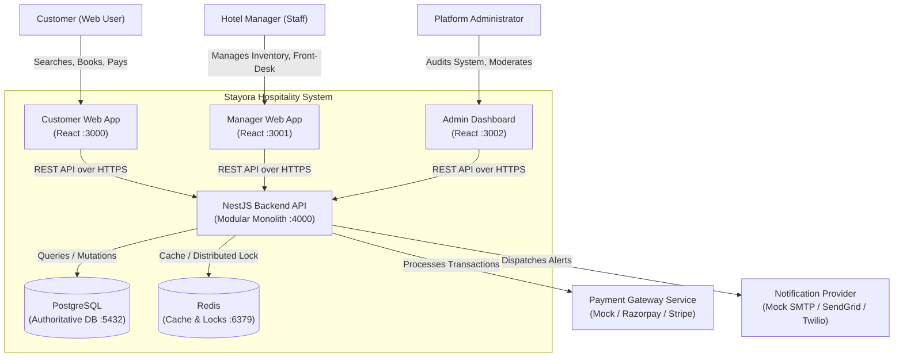
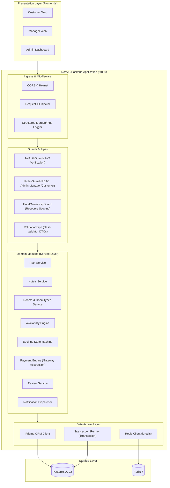
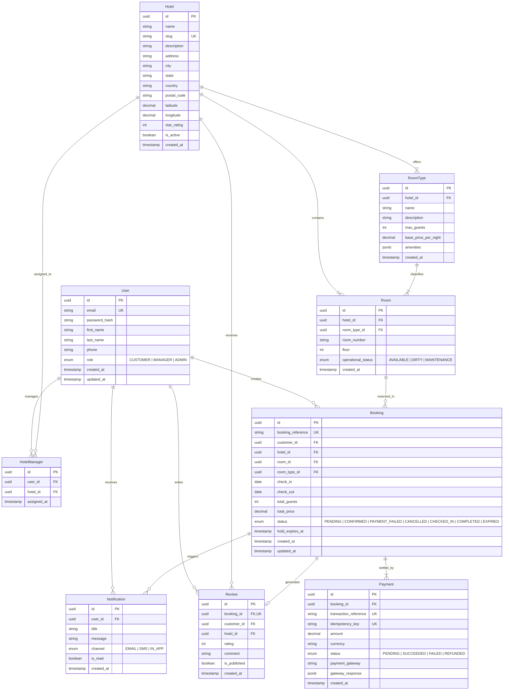
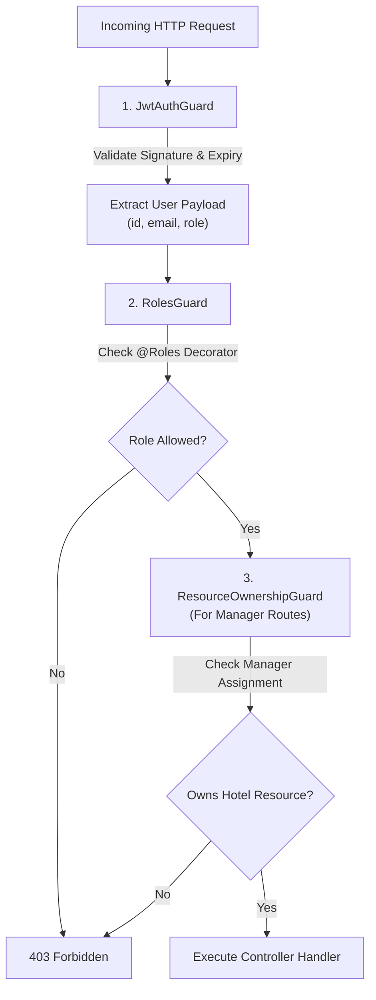
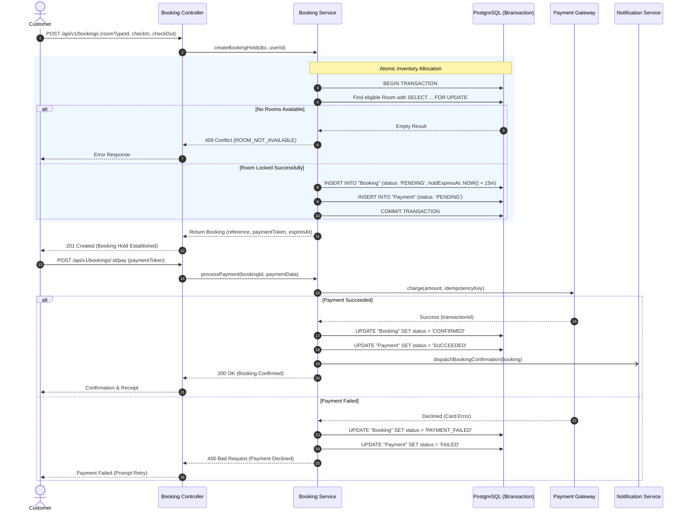
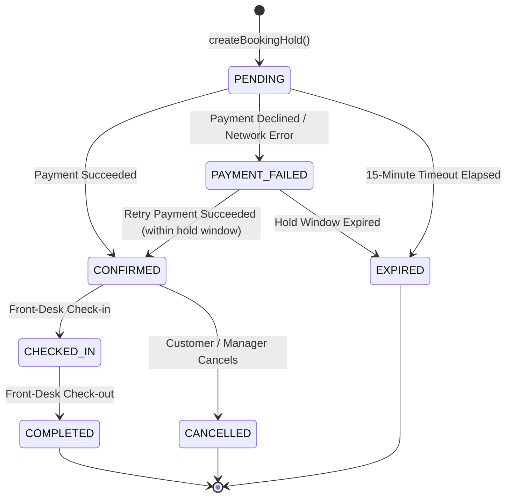
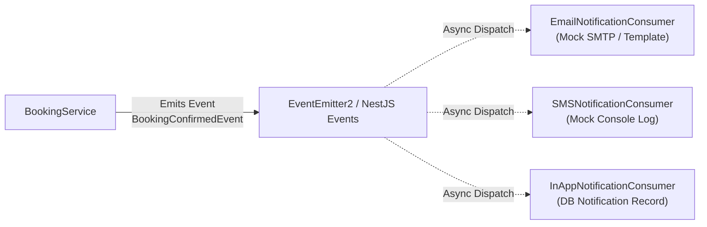
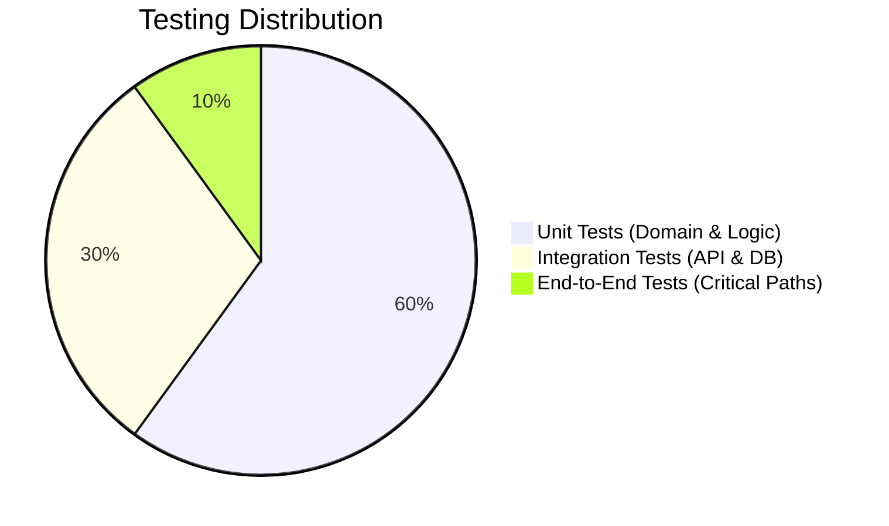
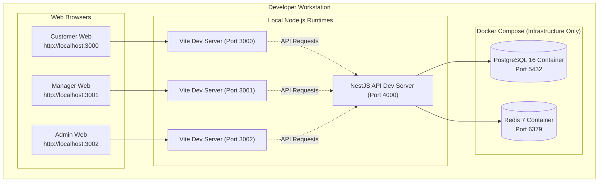

# Stayly — Hotel Booking & Reservation Platform

> **Architectural Foundation & Technical Contract**  
> **System Architecture Version:** 1.0.0-draft  
> **Target Environment:** Local Multi-Client Modular Monolith  
> **Status:** Architecture Approved for Implementation

---

## Table of Contents

- [Overview](#overview)
- [Problem Statement](#problem-statement)
- [Goals](#goals)
- [Non-Goals](#non-goals)
- [Key Features](#key-features)
- [User Roles](#user-roles)
- [Architecture Overview](#architecture-overview)
- [Architectural Style](#architectural-style)
- [System Context](#system-context)
- [High-Level Architecture](#high-level-architecture)
- [Application Architecture](#application-architecture)
  - [Customer Application](#customer-application)
  - [Manager Application](#manager-application)
  - [Admin Dashboard](#admin-dashboard)
  - [Shared Backend](#shared-backend)
- [Backend Architecture](#backend-architecture)
- [Backend Modules](#backend-modules)
- [Domain Model](#domain-model)
- [Database Architecture](#database-architecture)
- [Redis Architecture](#redis-architecture)
- [Authentication & Authorization](#authentication--authorization)
- [Hotel & Room Inventory](#hotel--room-inventory)
- [Availability Architecture](#availability-architecture)
- [Booking Architecture](#booking-architecture)
- [Booking State Machine](#booking-state-machine)
- [Concurrency & Double Booking Prevention](#concurrency--double-booking-prevention)
- [Payment Architecture](#payment-architecture)
- [Cancellation & Refund Architecture](#cancellation--refund-architecture)
- [Review Architecture](#review-architecture)
- [Notification Architecture](#notification-architecture)
- [API Architecture](#api-architecture)
- [API Conventions](#api-conventions)
- [Error Handling](#error-handling)
- [Security Architecture](#security-architecture)
- [Caching Strategy](#caching-strategy)
- [Testing Strategy](#testing-strategy)
- [Observability](#observability)
- [Local Development Architecture](#local-development-architecture)
- [Repository Structure](#repository-structure)
- [Technology Stack](#technology-stack)
- [Architectural Decisions & Trade-offs](#architectural-decisions--trade-offs)
- [Team Development Guidelines](#team-development-guidelines)
- [Future Evolution](#future-evolution)
- [Current Scope](#current-scope)
- [Architecture References](#architecture-references)

---

## Overview

**Stayora** is an end-to-end, multi-tenant hotel reservation and hospitality operations platform. Designed from first principles to mirror production-grade hospitality reservation engines, Stayora delivers frictionless discovery and booking workflows for travel consumers while providing property-level inventory management for hotel managers and global operational oversight for platform administrators.

The system is engineered as a **Modular Monolith** backend powering **three autonomous web frontends** (Customer Web, Manager Web, Admin Dashboard) over a versioned, strictly typed REST API (`/api/v1`), backed by PostgreSQL as the authoritative single source of truth and Redis for acceleration and ephemeral lock management.

---

## Problem Statement

Traditional and educational booking systems frequently suffer from core structural defects:
1. **Concurrency Race Conditions**: Naive availability checks (`SELECT` followed by `INSERT`) fail under high-concurrency search and checkout scenarios, resulting in catastrophic double-bookings of physical rooms.
2. **Conflation of Room Type vs. Physical Inventory**: Conflating a room category (e.g., "Deluxe Ocean View") with a physical asset (e.g., "Room 304") corrupts booking allocations, maintenance handling, and room assignment workflows.
3. **Monolithic UI Bloat**: Packing customer, property manager, and admin logic into a single client results in role leakage, bloated asset bundles, brittle authorization boundaries, and degraded user experience.
4. **Distributed Over-Engineering**: Prematurely decomposing an early-stage system into distributed microservices introduces distributed transactions (Sagas/2PC), network latency, partial failure modes, and high operational friction without organizational justification.

Stayora solves these challenges by combining strict physical/logical inventory modeling, atomic database-level concurrency controls, isolated client applications, and a clean domain-driven modular monolith.

---

## Goals

- **Zero Double-Bookings**: Absolute mathematical guarantee against double-booking physical rooms across overlapping calendar date intervals under concurrent traffic.
- **Strict Role-Based Multi-Client Isolation**: Complete isolation of Customer, Manager, and Admin client applications, sharing a single backend API contract.
- **Relational Integrity as Source of Truth**: Relational constraints and serializable/pessimistic-locking transactions in PostgreSQL dictate state; Redis is strictly non-authoritative.
- **Defensive Multi-Tenant Access Control**: Absolute isolation ensuring hotel managers can inspect and mutate only their explicitly assigned hotel properties.
- **Pluggable Payment Abstraction**: Clean boundary separating booking lifecycle state from payment processing gateways, supporting mock execution locally and drop-in commercial gateways (e.g., Razorpay/Stripe) without altering business logic.
- **Developer Ergonomics & Velocity**: Unified TypeScript developer experience, monorepo shared contracts, deterministic seed scripts, and zero cloud dependency for local development.

---

## Non-Goals

- **Cloud Infrastructure Deployment**: No AWS, GCP, Azure, Kubernetes, Terraform, or production load balancer configurations in the initial scope.
- **Microservices Deployment**: No distributed service meshes, gRPC inter-service networking, or distributed event buses (Kafka/RabbitMQ) for the initial baseline.
- **Dynamic Variable Pricing Algorithms**: No machine-learning-driven real-time surge pricing or external flight/OTA pricing aggregators.
- **Global Multi-Currency Exchange Engine**: Single base currency transaction processing for the initial local development scope.
- **Complex CMS / Static Content Engine**: No blog engine or heavy rich-text CMS for marketing pages.

---

## Key Features

### Customer Experience
- **Geographic & Parameterized Search**: Filter hotels by city/location, date range `[checkIn, checkOut)`, guest count, and room amenities.
- **Real-Time Availability & Pricing**: Live inspection of available room types, calculated nights, base fares, taxes, and net totals.
- **Guaranteed Reservations**: Atomic hold and checkout workflow preventing mid-flight inventory loss.
- **Self-Service Booking Lifecycle**: View full historical bookings, download receipts, manage cancellations according to hotel cancellation policies, and track refund lifecycles.
- **Post-Stay Verified Reviews**: Submit 1–5 star ratings and reviews strictly restricted to verified, completed stays.

### Hotel Manager Operations
- **Assigned Property Management**: Maintain hotel profile, descriptions, star classification, address coordinates, and visual media.
- **Inventory & Catalog Engineering**: Configure `RoomType` metadata (amenities, capacity, base rates) and map physical `Room` units (door numbers, floor assignments, operational status).
- **Front-Desk Operations**: Real-time front-desk calendar, guest manifest inspection, operational check-in, and operational check-out.
- **Direct Cancellation Handling**: Authorize and process property-level booking cancellations within policy constraints.
- **Performance & Reviews Audit**: Review guest feedback and inspect hotel-level occupancy metrics.

### Platform Administration
- **Global Identity & Role Governance**: User lifecycle management across Customers, Managers, and Admins; enforce account suspension/activation.
- **Property Portfolio Approvals**: Onboard and audit hotel listings, assign hotel managers to specific property IDs.
- **Platform Ledger & Transaction Oversight**: Inspect global booking states, audit payment intent logs, and track platform-wide refund disbursements.
- **Content & Review Moderation**: Audit and moderate customer reviews violating platform terms.
- **System Configuration**: Manage platform-wide parameters (cancellation grace periods, default currency, fee schedules).

---

## User Roles

Stayora enforces three explicit actor roles:

```text
┌─────────────────┐      ┌─────────────────┐      ┌─────────────────┐
│    CUSTOMER     │      │     MANAGER     │      │      ADMIN      │
├─────────────────┤      ├─────────────────┤      ├─────────────────┤
│ • Search Hotels │      │ • Manage Rooms  │      │ • Global Users  │
│ • Book Stays    │      │ • Update Rates  │      │ • Onboard Hotels│
│ • Pay & Cancel  │      │ • Front Desk    │      │ • Audit Ledger  │
│ • Post Reviews  │      │   Check-in/out  │      │ • Moderate Data │
└─────────────────┘      └─────────────────┘      └─────────────────┘
```

1. **`CUSTOMER`**: Public consumers searching, booking, paying, and reviewing stays. Access strictly confined to their own user profile, booking history, and public hotel inventory.
2. **`MANAGER`**: Property operators assigned to one or more specific hotel properties. Access strictly scoped to resources associated with their assigned `hotel_id`s. Cannot inspect other hotels.
3. **`ADMIN`**: Superusers possessing unrestricted platform-wide read and write capabilities across identity, inventory, financial transactions, and configuration.

---

## Architecture Overview

Stayora utilizes a client-agnostic **Shared Backend Architecture** serving three distinct, independently built web frontends. 

```
 ┌──────────────────────┐   ┌──────────────────────┐   ┌──────────────────────┐
 │ Customer Web App     │   │ Manager Web App      │   │ Admin Dashboard      │
 │ (Port 3000)          │   │ (Port 3001)          │   │ (Port 3002)          │
 └──────────┬───────────┘   └──────────┬───────────┘   └──────────┬───────────┘
            │                          │                          │
            │ HTTP / JSON REST         │ HTTP / JSON REST         │ HTTP / JSON REST
            └──────────────────┐       │       ┌──────────────────┘
                               ▼       ▼       ▼
                     ┌───────────────────────────────────┐
                     │       NestJS Backend API          │
                     │          (Port 4000)              │
                     │             /api/v1               │
                     └───────────────┬───────────────────┘
                                     │
                        ┌────────────┴────────────┐
                        ▼                         ▼
            ┌───────────────────────┐ ┌───────────────────────┐
            │  PostgreSQL (Port 5432)│ │   Redis (Port 6379)   │
            │  Authoritative State  │ │  Cache / Dist Locks   │
            └───────────────────────┘ └───────────────────────┘
```

The system is strictly centralized:
- **No peer-to-peer frontend communication**: Frontend clients never communicate directly with each other.
- **Single Source of Truth**: All applications query and mutate the shared PostgreSQL database through the NestJS backend API.
- **Uniform Authorization**: The backend authenticates all clients identically using signed JWTs and validates role/resource access guards at the route level.

---

## Architectural Style

### The Modular Monolith

Stayora is designed as a **Modular Monolith**. The application is compiled, packaged, and executed as a single unified deployable process, but internally enforced with strict boundaries around cohesive domain modules.

```text
┌────────────────────────────────────────────────────────┐
│                   NestJS Application                   │
│                                                        │
│  ┌──────────────┐   ┌──────────────┐   ┌─────────────┐ │
│  │ AuthModule   │   │ UsersModule  │   │ HotelsModule│ │
│  └──────┬───────┘   └──────┬───────┘   └──────┬──────┘ │
│         │                  │                  │        │
│  ┌──────┴───────┐   ┌──────┴───────┐   ┌──────┴──────┐ │
│  │BookingsModule│◄──┤Availability  │◄──┤RoomsModule  │ │
│  └──────┬───────┘   └──────────────┘   └─────────────┘ │
│         │                                              │
│  ┌──────┴───────┐   ┌──────────────┐   ┌─────────────┐ │
│  │PaymentsModule│   │ReviewsModule │   │Notifications│ │
│  └──────────────┘   └──────────────┘   └─────────────┘ │
│                                                        │
│             Shared Prisma ORM & Database Layer         │
└───────────────────────────┬────────────────────────────┘
                            ▼
                    PostgreSQL Engine
```

#### Justification & Trade-off Analysis
- **Transactional Consistency**: Hotel bookings require atomic operations across rooms, dates, bookings, and payment records. A monolith allows native database transactions (`BEGIN...COMMIT`) with absolute serializability guarantees without complex two-phase commits (2PC) or asynchronous Saga orchestrators.
- **Development Velocity**: A single repository and unified runtime eliminate inter-service API versioning friction, distributed tracing complexity, network hop latencies, and multi-container debugging overhead.
- **Team Collaboration**: Different engineers own distinct NestJS modules. Modules communicate via clear internal TypeScript service interfaces rather than raw HTTP/message queues, reducing interface mismatch bugs.
- **Future Migration Path**: Because domain boundaries are clean, highly loaded modules (such as `Search` or `Notifications`) can be extracted into standalone microservices in the future with minimal refactoring if organizational scaling warrants it.

---

## System Context

The C4 System Context diagram illustrates the system boundaries, human actors, and external third-party boundaries:



---

## High-Level Architecture

The internal backend runtime architecture is structured into explicit responsibility layers:



---

## Application Architecture

### Customer Application
- **Runtime**: React 18, TypeScript, Vite.
- **Port**: `http://localhost:3000`
- **Primary Workflows**: Hotel discovery, faceted filtering (price, stars, amenities), interactive date-range picker, room type gallery, reservation review, checkout simulator, booking history, PDF-like itinerary view, review submission.
- **State Partitioning**:
  - *Server State*: Managed completely via **TanStack Query** (caching, background revalidation, stale-while-revalidate).
  - *Client/UI State*: **Zustand** for transient UI states (mobile filter drawers, theme mode, search bar modal toggles).
  - *Form State*: **React Hook Form** + **Zod** (validated search criteria, guest details, review submissions).
  - *Auth State*: **Zustand** persisted via `localStorage` holding the JWT access token and logged-in user summary.

### Manager Application
- **Runtime**: React 18, TypeScript, Vite.
- **Port**: `http://localhost:3001`
- **Primary Workflows**: Hotel profile editor, RoomType configuration (base rates, guest caps, amenities), Physical Room inventory matrix (status: clean, dirty, occupied, maintenance), Live Front-Desk Arrival/Departure manifest, check-in/check-out trigger, cancellation processing.
- **State Partitioning**:
  - *Server State*: TanStack Query with rapid invalidation intervals for active front-desk operations.
  - *Client/UI State*: Zustand for active room-grid filters and drawer sidebars.
  - *Auth State*: Scoped manager session token enforcing hotel assignment checks before UI navigation.

### Admin Dashboard
- **Runtime**: React 18, TypeScript, Vite.
- **Port**: `http://localhost:3002`
- **Primary Workflows**: System-wide user directory, hotel manager assignment matrix, hotel listing approval, platform-level transaction and booking audit logs, refund approval queue, review moderation tools.
- **State Partitioning**:
  - *Server State*: TanStack Query supporting tabular server-side pagination, sorting, and filter queries.
  - *UI/Dashboard State*: Chart.js / Recharts visualization states, bulk-selection rows.

### Shared Backend
- **Runtime**: NestJS 10+, Node.js 20 LTS, TypeScript 5+.
- **Port**: `http://localhost:4000`
- **Base Route**: `/api/v1`
- **Responsibilities**: Houses all business logic, authorization policies, database transactions, concurrency guards, and scheduled maintenance tasks.

---

## Backend Architecture

The backend strictly enforces the **Layered Architecture Pattern**:

```text
HTTP Request
     │
     ▼
┌─────────────────────────┐
│       Controller        │  <-- Route binding, DTO validation, HTTP status codes.
└────────────┬────────────┘      NO BUSINESS LOGIC ALLOWED.
             │
             ▼
┌─────────────────────────┐
│     Service Layer       │  <-- Orchestration, transaction management, state machine
└────────────┬────────────┘      transitions, third-party dispatch.
             │
             ▼
┌─────────────────────────┐
│      Domain Logic       │  <-- Date overlap rules, refund calculations, pricing models.
└────────────┬────────────┘      Pure functions, high unit-test coverage.
             │
             ▼
┌─────────────────────────┐
│   Repository / Prisma   │  <-- Query composition, SQL transactions, locking clauses.
└────────────┬────────────┘
             │
             ▼
      PostgreSQL Engine
```

### Why Controllers Must NOT Contain Business Logic
1. **Separation of Concerns**: Controllers are HTTP adapters. Their only responsibility is parsing requests, delegating to services, and returning appropriate HTTP responses (HTTP 200, 201, 204, etc.).
2. **Reusability & Testability**: Business logic inside services can be unit-tested without instantiating mock HTTP requests, response headers, or cookies. It can also be called by background cron jobs or CLI tasks without HTTP overhead.
3. **Unified Validation**: Input is cleaned and validated by NestJS `ValidationPipe` using class-validator DTOs before touching any controller handler.

---

## Backend Modules

The backend is partitioned into 11 distinct domain modules:

```text
apps/api/src/modules/
├── auth/
├── users/
├── hotels/
├── room-types/
├── rooms/
├── availability/
├── bookings/
├── payments/
├── reviews/
├── notifications/
└── admin/
```

### Module Responsibilities & Specifications

| Module | Core Responsibility | Owned Entities | Upstream Dependencies | Key Exposed Endpoints | Critical Business Rules |
| :--- | :--- | :--- | :--- | :--- | :--- |
| **AuthModule** | Authentication, token issuance, password security | `User` (credentials) | None | `POST /auth/register`<br>`POST /auth/login`<br>`POST /auth/refresh` | Passwords hashed with bcrypt (cost 12); JWT access token lifetime 15m; Refresh token 7d. |
| **UsersModule** | User account management, customer profiles | `User`, `Profile` | None | `GET /users/me`<br>`PATCH /users/me` | Users cannot escalate their own roles. Email changes require uniqueness re-verification. |
| **HotelsModule** | Hotel metadata, locations, amenities, manager linkage | `Hotel`, `HotelManager` | UsersModule | `GET /hotels`<br>`POST /hotels`<br>`GET /hotels/:id` | Hotels must have at least one active manager assigned to publish rooms. Location fields indexed for search. |
| **RoomTypesModule**| Abstract room category catalog, baseline pricing | `RoomType`, `Amenity` | HotelsModule | `GET /hotels/:id/room-types`<br>`POST /room-types` | Max capacity must be >= 1; base rate cannot be negative. Soft-delete only if rooms exist. |
| **RoomsModule** | Physical room inventory and operational states | `Room` | RoomTypesModule, HotelsModule | `GET /hotels/:id/rooms`<br>`POST /rooms`<br>`PATCH /rooms/:id/status`| Room number must be unique per hotel. Physical rooms have statuses (`AVAILABLE`, `DIRTY`, `MAINTENANCE`). |
| **AvailabilityModule**| Date-interval calculation, room free/busy indexing | None (Transient) | RoomsModule, BookingsModule | `GET /hotels/search`<br>`GET /room-types/:id/availability` | Check-in <= check-out is rejected. Overlap formula evaluated strictly against active bookings. |
| **BookingsModule** | Reservation lifecycle, state transitions, holds | `Booking`, `BookingItem` | AvailabilityModule, RoomsModule, UsersModule | `POST /bookings`<br>`GET /bookings/:id`<br>`POST /bookings/:id/cancel` | Physical room selection and lock occur inside atomic database transaction. |
| **PaymentsModule** | Payment abstraction, intent verification, refunds | `Payment`, `PaymentIntent` | BookingsModule | `POST /bookings/:id/pay`<br>`POST /payments/webhook` | Idempotent via idempotency keys. Gateway decoupled via `PaymentGateway` interface. |
| **ReviewsModule** | Verified customer feedback and property ratings | `Review` | BookingsModule, HotelsModule | `POST /bookings/:id/review`<br>`GET /hotels/:id/reviews` | Reviews permitted only if booking is `COMPLETED` and authored by booking customer. Exactly 1 review per booking. |
| **NotificationsModule**| Asynchronous dispatch of transactional alerts | `Notification` | None | Internal events / `GET /notifications` | Non-blocking. Notification failures must never roll back completed booking transactions. |
| **AdminModule** | Platform-level management, moderation, analytics | System Configuration | All Modules | `GET /admin/stats`<br>`PATCH /admin/users/:id/role` | Strictly guarded by `RolesGuard(ADMIN)`. Can override booking cancellation holds in dispute. |

---

## Domain Model

Understanding the distinction between **`Hotel`**, **`RoomType`**, and **`Room`** is fundamental to the platform's domain correctness:

```text
┌────────────────────────────────────────────────────────┐
│                        Hotel                           │
│              "Grand Hyatt Chennai"                     │
└───────────┬────────────────────────────────┬───────────┘
            │ 1                              │ 1
            │ has many                       │ has many
            ▼ *                              ▼ *
┌─────────────────────────┐      ┌─────────────────────────┐
│        RoomType         │      │        RoomType         │
│  "Deluxe Sea View"      │      │     "Executive Suite"   │
│  - Capacity: 2 Guests   │      │  - Capacity: 4 Guests   │
│  - Base Price: ₹6,500   │      │  - Base Price: ₹14,000  │
└───────────┬─────────────┘      └───────────┬─────────────┘
            │ 1                              │ 1
            │ has many                       │ has many
            ▼ *                              ▼ *
   ┌─────────────────┐              ┌─────────────────┐
   │  Physical Room  │              │  Physical Room  │
   │  - Number: 301  │              │  - Number: 401  │
   │  - Floor: 3     │              │  - Floor: 4     │
   │  - Status: READY│              │  - Status: READY│
   └─────────────────┘              └─────────────────┘
   ┌─────────────────┐              ┌─────────────────┐
   │  Physical Room  │              │  Physical Room  │
   │  - Number: 302  │              │  - Number: 402  │
   │  - Floor: 3     │              │  - Floor: 4     │
   │  - Status: CLEAN│              │  - Status: MAINT│
   └─────────────────┘              └─────────────────┘
```

### Architectural Distinctions
- **`Hotel`**: The physical legal establishment offering hospitality services at a specific geographical location.
- **`RoomType` (Category / SKU)**: The commercial catalog representation. Represents a set of identical accommodations sharing common amenities, images, capacities, and pricing models. Customers browse and purchase **RoomTypes**, not individual room numbers.
- **`Room` (Physical Inventory)**: The physical asset in the hotel (e.g., Room 301, 3rd Floor). Has real-world operational states (`AVAILABLE`, `OCCUPIED`, `DIRTY`, `UNDER_MAINTENANCE`). The system reserves a specific physical room to guarantee availability while shielding the specific room assignment from the customer until check-in if desired.

---

## Database Architecture

PostgreSQL is the designated **authoritative persistent store**. Relational schema modeling is non-negotiable due to ACID transactional requirements, foreign-key integrity constraints, and strict date-overlap locking.

### Entity Relationship Diagram (ERD)



### Cardinalities & Structural Invariants
- `Hotel` 1 ─── N `RoomType`: A hotel organizes its inventory into one or more categories.
- `RoomType` 1 ─── N `Room`: A category contains multiple physical rooms.
- `Hotel` 1 ─── N `Room`: All physical rooms belong to one hotel.
- `User` (Manager) N ─── N `Hotel`: Modeled via `HotelManager` join table; a manager can manage multiple properties; a property can have multiple managers.
- `Customer` 1 ─── N `Booking`: A customer can book multiple stays over time.
- `Room` 1 ─── N `Booking`: A room can be booked across non-overlapping date ranges.
- `Booking` 1 ─── N `Payment`: A booking may have multiple payment attempts (e.g., initial failure followed by success) or refund records.
- `Booking` 1 ─── 0..1 `Review`: Exactly one review can be submitted per completed booking.

### Primary Database Indexes

```sql
-- Identity & Authorization
CREATE UNIQUE INDEX idx_users_email ON "User"(email);
CREATE INDEX idx_hotel_managers_user ON "HotelManager"(user_id, hotel_id);

-- Hotel Discovery & Filtering
CREATE INDEX idx_hotels_city_active ON "Hotel"(city, is_active);
CREATE INDEX idx_hotels_slug ON "Hotel"(slug);

-- Inventory Relationships
CREATE INDEX idx_rooms_hotel_room_type ON "Room"(hotel_id, room_type_id);
CREATE UNIQUE INDEX idx_rooms_hotel_number ON "Room"(hotel_id, room_number);

-- Critical Booking Availability Index
-- Composite index accelerates date-overlap queries filtering on room and status
CREATE INDEX idx_bookings_room_dates_status ON "Booking"(room_id, check_in, check_out, status);
CREATE INDEX idx_bookings_customer ON "Booking"(customer_id, created_at DESC);
CREATE INDEX idx_bookings_hotel ON "Booking"(hotel_id, status);

-- Financial Idempotency
CREATE UNIQUE INDEX idx_payments_idempotency ON "Payment"(idempotency_key);
CREATE INDEX idx_payments_booking ON "Payment"(booking_id);

-- Social Proof
CREATE INDEX idx_reviews_hotel ON "Review"(hotel_id) WHERE is_published = TRUE;
```

---

## Redis Architecture

Redis is incorporated strictly as a **secondary accelerator** and **transient coordinator**. 

```text
┌────────────────────────────────────────────────────────┐
│                   Redis Responsibilities               │
├─────────────────────────┬──────────────────────────────┤
│ Cache Storage           │ Ephemeral State              │
├─────────────────────────┼──────────────────────────────┤
│ • Hotel Catalog Metadata│ • API Rate-Limiting Counters │
│ • RoomType Specifications│ • Distributed Mutex Locks   │
│ • Static Amenity Lists  │ • Active WebSocket Sessions  │
└─────────────────────────┴──────────────────────────────┘
```

### Architectural Invariant: PostgreSQL is the Sole Source of Truth
> **CRITICAL ARCHITECTURAL DIRECTIVE**:  
> Redis must **NEVER** be the authoritative source for room inventory or booking status.  
> 1. Cache eviction, network partitions, or Redis service restarts must never cause inventory loss or over-allocation.
> 2. All final booking availability assertions and room reservations MUST execute inside PostgreSQL transactions using ACID locks.
> 3. If Redis crashes, the system will experience increased database query load, but **zero double-bookings** can occur.

---

## Authentication & Authorization

Stayora implements a multi-tier security pipeline enforcing **Authentication -> Role-Based Access Control (RBAC) -> Resource-Level Authorization**.



### 1. Authentication Lifecycle
- **Password Security**: Passwords salted and hashed with `bcrypt` (12 rounds) before persistence. Raw passwords never logged or returned.
- **Access Tokens**: Short-lived (15 minutes), digitally signed JSON Web Tokens (JWT) using `RS256` or `HS256` carrying claims:
  ```json
  {
    "sub": "b8f6c4d0-1234-4b6a-9f5e-7a8b9c0d1e2f",
    "email": "manager@stayora.com",
    "role": "MANAGER",
    "iat": 1727776800,
    "exp": 1727777700
  }
  ```
- **Refresh Tokens**: Long-lived (7 days), stored hashed in PostgreSQL. Used via `/api/v1/auth/refresh` to obtain new access tokens without requiring re-entry of credentials.

### 2. Role-Based Access Control (RBAC)
Routes are annotated with custom NestJS decorators:
```typescript
@UseGuards(JwtAuthGuard, RolesGuard)
@Roles(Role.MANAGER, Role.ADMIN)
@Get('hotel-stats')
getStats() { ... }
```

### 3. Resource-Level Authorization (Defeating IDOR Attacks)
A customer must not manipulate another customer's reservation. A manager must not mutate another manager's hotel properties simply by altering the route parameter `:hotelId`.

The backend enforces this via the `HotelOwnershipGuard`:
```typescript
@Injectable()
export class HotelOwnershipGuard implements CanActivate {
  constructor(private prisma: PrismaService) {}

  async canActivate(context: ExecutionContext): Promise<boolean> {
    const request = context.switchToHttp().getRequest();
    const user = request.user;
    const hotelId = request.params.hotelId || request.body.hotelId;

    if (user.role === Role.ADMIN) return true; // Admins bypass property boundaries
    if (user.role !== Role.MANAGER) return false;

    // Verify database assignment record
    const assignment = await this.prisma.hotelManager.findFirst({
      where: { user_id: user.id, hotel_id: hotelId }
    });

    if (!assignment) {
      throw new ForbiddenException('You are not authorized to manage this hotel property.');
    }
    return true;
  }
}
```

---

## Hotel & Room Inventory

Inventory is structured to preserve room operational states separate from customer reservations:

```text
Room Operational States:
  ┌─────────────┐
  │  AVAILABLE  │ ◄─── Cleaned, inspected, and ready for occupancy
  └──────┬──────┘
         │ Guest Checks In
         ▼
  ┌─────────────┐
  │  OCCUPIED   │ ◄─── Guest currently residing in room
  └──────┬──────┘
         │ Guest Checks Out
         ▼
  ┌─────────────┐
  │    DIRTY    │ ◄─── Requires housekeeping turnover
  └──────┬──────┘
         │ Inspected by Housekeeping
         ▼
  ┌─────────────┐
  │  AVAILABLE  │
  └─────────────┘
  
  * Note: A room in MAINTENANCE state is removed from bookable inventory calculations.
```

The system segregates **operational room states** (physical cleaning/maintenance) from **calendar reservation occupancy** (booked date intervals). A room may be physically `AVAILABLE` today, but booked next weekend.

---

## Availability Architecture

### Mathematical Date-Overlap Logic

Hotel reservations operate on night stays represented mathematically as the **half-open interval**:
$$\text{Interval} = [\text{checkIn}, \text{checkOut})$$

A guest checking in on **October 10** and checking out on **October 13** occupies the nights of:
- October 10
- October 11
- October 12

The room becomes available for a new guest to check in on the afternoon of **October 13**.

### The Overlap Condition
Two booking intervals $[A_{\text{start}}, A_{\text{end}})$ and $[B_{\text{start}}, B_{\text{end}})$ conflict **if and only if**:

$$A_{\text{start}} < B_{\text{end}} \quad \land \quad A_{\text{end}} > B_{\text{start}}$$

```text
Requested:        |===================|
               checkIn             checkOut

Case 1 (Conflict: Overlaps Front):
             |============|
        existing.in   existing.out

Case 2 (Conflict: Overlaps Back):
                                |============|
                           existing.in   existing.out

Case 3 (Conflict: Fully Enclosed):
                   |=========|
              existing.in  existing.out

Case 4 (Valid: Adjacent Checkout/Check-in):
  |================|
             existing.out == requested.checkIn  --> NO OVERLAP (Valid!)

Case 5 (Valid: Adjacent Check-in/Checkout):
                                      |================|
                       requested.checkOut == existing.in --> NO OVERLAP (Valid!)
```

### SQL Verification Query
To determine which physical rooms of a given `room_type_id` are already occupied during requested dates:

```sql
SELECT DISTINCT room_id
FROM "Booking"
WHERE room_type_id = :requestedRoomTypeId
  AND status IN ('CONFIRMED', 'CHECKED_IN', 'PENDING')
  AND check_in < :requestedCheckOut
  AND check_out > :requestedCheckIn;
```

Any room ID returned by this query is **unavailable**. Any room ID of that `room_type_id` *not* in this result set is **available**.

---

## Booking Architecture

The booking pipeline is structured as a two-phase process: **Inventory Hold Creation** followed by **Payment Settlement Confirmation**.



---

## Booking State Machine

Booking state transitions are strictly governed by a deterministic Finite State Machine (FSM):



### State Transition Validation Matrix

| Current State | Target State | Permitted Trigger / Actor | Invariant Constraints |
| :--- | :--- | :--- | :--- |
| `[*] (None)` | `PENDING` | Customer requests booking | Physical room identified and locked within transaction. Hold timer set for 15 min. |
| `PENDING` | `CONFIRMED` | Payment gateway webhook / callback | Payment record marked `SUCCEEDED`. Room remains locked. |
| `PENDING` | `PAYMENT_FAILED` | Payment gateway rejection | Customer may retry with different card if `NOW() < hold_expires_at`. |
| `PENDING` | `EXPIRED` | Background cleanup worker / cron | Triggered when `NOW() > hold_expires_at`. Room released back to general pool. |
| `CONFIRMED` | `CHECKED_IN` | Hotel Manager | Triggered on arrival date. Room operational status marked `OCCUPIED`. |
| `CONFIRMED` | `CANCELLED` | Customer or Hotel Manager | Permitted only if `NOW() < check_in - policy_cancellation_hours`. Triggers refund logic. |
| `CHECKED_IN` | `COMPLETED` | Hotel Manager | Triggered at check-out. Room marked `DIRTY`. Unlocks customer review eligibility. |

---

## Concurrency & Double Booking Prevention

### The Race Condition Scenario
Two customers simultaneously attempt to book the single remaining "Deluxe Room" at the Grand Hyatt for the exact same dates:

```text
Time   Customer A                                Customer B
 │
 0ms   GET /availability (Room 101 free)         GET /availability (Room 101 free)
10ms   POST /bookings (wants Room 101)           POST /bookings (wants Room 101)
15ms   Reads DB: Room 101 is free                Reads DB: Room 101 is free
20ms   Writes DB: Booking A confirmed            Writes DB: Booking B confirmed
       ================== DISASTER: DOUBLE BOOKING ==================
```

### The Architectural Solution: Pessimistic Row-Level Locking Inside Transactions

Checking availability in application code prior to inserting is fundamentally broken because it leaves an uncoordinated time window (Time-of-Check to Time-of-Use). 

Stayora solves this by acquiring a **pessimistic row-level exclusive lock** (`SELECT ... FOR UPDATE`) on the candidate physical room inside an atomic PostgreSQL transaction with the `READ COMMITTED` or `REPEATABLE READ` isolation level:

```typescript
@Injectable()
export class BookingAllocationService {
  constructor(private prisma: PrismaService) {}

  async reserveRoom(
    hotelId: string,
    roomTypeId: string,
    checkIn: Date,
    checkOut: Date,
    customerId: string,
  ): Promise<Booking> {
    return await this.prisma.$transaction(async (tx) => {
      // 1. Query for an available physical room and LOCK the candidate row.
      // SKIP LOCKED prevents concurrent transactions from stalling behind one another;
      // it immediately skips locked rooms and acquires the next free one.
      const availableRooms: { id: string }[] = await tx.$queryRaw`
        SELECT r.id 
        FROM "Room" r
        WHERE r.hotel_id = ${hotelId}::uuid
          AND r.room_type_id = ${roomTypeId}::uuid
          AND r.operational_status = 'AVAILABLE'
          AND r.id NOT IN (
            SELECT b.room_id 
            FROM "Booking" b
            WHERE b.status IN ('CONFIRMED', 'CHECKED_IN', 'PENDING')
              AND b.check_in < ${checkOut}::date
              AND b.check_out > ${checkIn}::date
          )
        ORDER BY r.room_number ASC
        LIMIT 1
        FOR UPDATE OF r SKIP LOCKED;
      `;

      if (!availableRooms || availableRooms.length === 0) {
        throw new ConflictException({
          code: 'ROOM_NOT_AVAILABLE',
          message: 'No available rooms remain for the selected dates.',
        });
      }

      const assignedRoomId = availableRooms[0].id;

      // 2. Insert the booking hold within the safe transaction boundary
      const booking = await tx.booking.create({
        data: {
          booking_reference: generateReference('BK'),
          customer_id: customerId,
          hotel_id: hotelId,
          room_type_id: roomTypeId,
          room_id: assignedRoomId,
          check_in: checkIn,
          check_out: checkOut,
          status: BookingStatus.PENDING,
          hold_expires_at: new Date(Date.now() + 15 * 60 * 1000), // 15-minute hold
        },
      });

      return booking;
    });
  }
}
```

### Why This Is Bulletproof
1. **Serialization**: When Transaction A executes `SELECT ... FOR UPDATE`, PostgreSQL locks the selected physical room row.
2. **Instant Alternative or Rejection**: Transaction B executing concurrently uses `SKIP LOCKED`. If Room 101 is locked by A, Transaction B immediately evaluates Room 102. If no other rooms exist, Transaction B returns an empty set and fails cleanly with a `409 Conflict`, entirely avoiding race conditions.
3. **Rollback Safety**: If Customer A's transaction encounters an error or network drop before commit, PostgreSQL automatically releases the row lock without leaving orphan records.

---

## Payment Architecture

### Provider-Agnostic Payment Abstraction
To keep the core booking engine isolated from external vendor SDK changes, payments are hidden behind the `PaymentGateway` interface:

```text
                     ┌────────────────────────┐
                     │     PaymentService     │
                     └───────────┬────────────┘
                                 │ invokes interface
                                 ▼
                     ┌────────────────────────┐
                     │   <<interface>>        │
                     │   PaymentGateway       │
                     └───────────┬────────────┘
                                 │
           ┌─────────────────────┴─────────────────────┐
           ▼                                           ▼
┌─────────────────────────┐                 ┌─────────────────────────┐
│   MockPaymentGateway    │                 │   RazorpayGateway       │
│   (Local Dev / Tests)   │                 │   (Production Target)   │
└─────────────────────────┘                 └─────────────────────────┘
```

```typescript
export interface ChargeRequest {
  bookingId: string;
  amount: number;
  currency: string;
  idempotencyKey: string;
  paymentMethodToken: string;
}

export interface ChargeResponse {
  success: boolean;
  transactionReference: string;
  gatewayResponseCode: string;
  rawPayload: Record<string, any>;
}

export interface RefundRequest {
  transactionReference: string;
  amount: number;
  reason: string;
  idempotencyKey: string;
}

export interface PaymentGateway {
  createPaymentIntent(bookingId: string, amount: number): Promise<{ clientSecret: string }>;
  charge(request: ChargeRequest): Promise<ChargeResponse>;
  refund(request: RefundRequest): Promise<{ refundReference: string; status: string }>;
}
```

### Critical Payment Design Rules
1. **Separation of Transactions**: The **Booking Reservation** transaction and the **Payment Gateway Execution** must NOT run inside the same database transaction. Network calls to third-party payment APIs can take 2–10 seconds. Holding an open database transaction during an external HTTP call exhausts the database connection pool.
2. **Idempotency**: All payment charge attempts require an `idempotency_key` generated by the client (UUIDv4). If a customer double-clicks "Submit Payment" or network latency causes a retry, the backend and gateway recognize the existing key and return the original transaction without double-charging.
3. **Asynchronous Webhook Settlement**: While local mock development allows immediate synchronous confirmation, real payment providers notify systems asynchronously via webhooks. The state machine transitions `PENDING -> CONFIRMED` only upon cryptographic signature verification of the webhook event.

---

## Cancellation & Refund Architecture

### Cancellation Rules Engine
Cancellations are governed by strict business logic rather than ad-hoc updates:
1. **Status Pre-Condition**: Only bookings in the `CONFIRMED` state can be cancelled. `CHECKED_IN` or `COMPLETED` bookings cannot be cancelled.
2. **Time Policy Constraint**: Customers may cancel up to **48 hours** prior to `check_in` (at 00:00:00 hours on the check-in date) for a full refund. Cancellations inside 48 hours incur a 1-night cancellation penalty.
3. **Refund Processing**:
   - The booking status transitions immediately to `CANCELLED`.
   - The associated physical room is immediately unlocked for future booking dates.
   - An asynchronous refund task is dispatched through the `PaymentGateway.refund()` interface.
   - A `Payment` audit record is created with status `REFUNDED`.

---

## Review Architecture

Reviews represent the social proof mechanism of the platform and must maintain strict integrity:

### The Verified Stay Contract
To prevent spam and fraudulent reputation attacks:
1. **Verified Stay Invariant**: A review can **only** be created if a booking exists in the `COMPLETED` state.
2. **One-to-One Invariant**: A unique database constraint on `Review.booking_id` enforces that each reservation can produce exactly one review.
3. **Author Identity**: The authenticated user creating the review must match `Booking.customer_id`.
4. **Moderation Pipeline**: Reviews are created with `is_published = TRUE` by default, but flaggable by platform admins via `/api/v1/admin/reviews/:id/moderate`.

---

## Notification Architecture

Notifications are decoupled from the core transaction loop using the **Domain Event Dispatcher Pattern**:



### Decoupling Invariants
- **Non-Fatal Operations**: If an external email provider fails or times out, the booking MUST remain confirmed. Notification failures are logged as errors but never roll back database state.
- **Pluggable Transports**: In local development, the `NotificationService` outputs rendered notification bodies to the terminal stdout and records rows in the `Notification` table for inspection via UI.

---

## API Architecture

### RESTful Route Map

#### Authentication (`/api/v1/auth`)
- `POST /api/v1/auth/register` — Register new Customer.
- `POST /api/v1/auth/login` — Authenticate and receive Access + Refresh tokens.
- `POST /api/v1/auth/refresh` — Refresh expired access token.
- `POST /api/v1/auth/logout` — Revoke active session tokens.

#### Hotels & Discovery (`/api/v1/hotels`)
- `GET /api/v1/hotels/search` — Filter hotels by query parameters.
- `GET /api/v1/hotels` — List active hotels (paginated).
- `GET /api/v1/hotels/:id` — Detailed hotel profile with room types.
- `POST /api/v1/hotels` — Create hotel listing (`ADMIN` only).
- `PATCH /api/v1/hotels/:id` — Update hotel profile (`MANAGER`, `ADMIN`).

#### Inventory & Room Management (`/api/v1/hotels/:hotelId/rooms`)
- `GET /api/v1/hotels/:hotelId/room-types` — List room categories for property.
- `POST /api/v1/hotels/:hotelId/room-types` — Add room category (`MANAGER`, `ADMIN`).
- `GET /api/v1/hotels/:hotelId/rooms` — List physical rooms and operational statuses (`MANAGER`, `ADMIN`).
- `POST /api/v1/hotels/:hotelId/rooms` — Provision physical room door numbers (`MANAGER`, `ADMIN`).
- `PATCH /api/v1/hotels/:hotelId/rooms/:roomId/status` — Mutate operational status (`MANAGER`).

#### Booking Lifecycle (`/api/v1/bookings`)
- `POST /api/v1/bookings` — Create a 15-minute booking hold (`CUSTOMER`).
- `GET /api/v1/bookings` — List authenticated user's bookings.
- `GET /api/v1/bookings/:id` — Retrieve full booking details by ID.
- `POST /api/v1/bookings/:id/pay` — Submit payment intent settlement.
- `POST /api/v1/bookings/:id/cancel` — Cancel booking and initiate refund.
- `POST /api/v1/bookings/:id/check-in` — Perform front-desk guest check-in (`MANAGER`).
- `POST /api/v1/bookings/:id/check-out` — Perform front-desk guest check-out (`MANAGER`).

#### Reviews (`/api/v1/reviews`)
- `POST /api/v1/bookings/:id/review` — Submit review for completed stay (`CUSTOMER`).
- `GET /api/v1/hotels/:hotelId/reviews` — Fetch published reviews for a hotel.

#### Administration (`/api/v1/admin`)
- `GET /api/v1/admin/users` — Audit user directory (`ADMIN`).
- `PATCH /api/v1/admin/users/:id/role` — Update user permissions (`ADMIN`).
- `POST /api/v1/admin/managers/assign` — Assign manager to hotel property (`ADMIN`).
- `GET /api/v1/admin/ledger` — Audit system financial transactions (`ADMIN`).

---

## API Conventions

### HTTP Verbs
- `GET`: Safe, idempotent read operations. Never mutates server state.
- `POST`: Create resource or execute non-idempotent lifecycle trigger (e.g., `/pay`, `/check-in`).
- `PATCH`: Partial resource updates.
- `DELETE`: Safe soft-deletions.

### Standard Paginated Response Envelope
All multi-record endpoints return a standard pagination contract:

```json
{
  "success": true,
  "data": [
    {
      "id": "e5c2b0c1-3f4a-4a8b-9e2e-8d7c6b5a4f3e",
      "name": "Grand Hyatt Chennai",
      "city": "Chennai",
      "starRating": 5
    }
  ],
  "meta": {
    "page": 1,
    "limit": 20,
    "totalItems": 142,
    "totalPages": 8,
    "hasNextPage": true,
    "hasPreviousPage": false
  }
}
```

---

## Error Handling

All uncaught exceptions are intercepted by a centralized NestJS **Global Exception Filter** ensuring uniform error payloads.

### Standard Error Schema

```json
{
  "success": false,
  "error": {
    "code": "ROOM_NOT_AVAILABLE",
    "message": "The selected room type is no longer available for the requested date interval.",
    "details": [
      {
        "field": "roomTypeId",
        "reason": "Inventory exhausted"
      }
    ]
  },
  "timestamp": "2026-10-01T10:30:00.000Z",
  "path": "/api/v1/bookings"
}
```

### Standard Error Categories & HTTP Mapping

| Error Code | HTTP Status | Meaning |
| :--- | :--- | :--- |
| `VALIDATION_ERROR` | `400 Bad Request` | DTO validation failure (e.g., `checkIn` is in the past). |
| `UNAUTHORIZED` | `401 Unauthorized` | Missing, expired, or cryptographically invalid JWT. |
| `FORBIDDEN` | `403 Forbidden` | Authenticated user lacks permission or does not manage property. |
| `NOT_FOUND` | `404 Not Found` | Requested entity ID does not exist. |
| `CONFLICT` | `409 Conflict` | Unique constraint violation or state transition invariant failed. |
| `ROOM_NOT_AVAILABLE`| `409 Conflict` | Target room is already booked across overlapping dates. |
| `BOOKING_NOT_CANCELLABLE` | `422 Unprocessable`| Booking has passed the cancellation deadline or is already completed. |
| `PAYMENT_FAILED` | `402 Payment Required`| Card declined, insufficient funds, or gateway gateway error. |
| `INTERNAL_SERVER_ERROR` | `500 Internal Error`| Unhandled server exception (sanitized in client response). |

---

## Security Architecture

### Defense in Depth Matrix

| Security Layer | Implementation Mechanism | Purpose |
| :--- | :--- | :--- |
| **Transport Security** | TLS Termination / Helmet headers | Prevents packet sniffing, enforces HSTS, disables X-Powered-By. |
| **Cross-Origin Policy** | CORS configured in NestJS `main.ts` | Allows only authorized origins (`http://localhost:3000, 3001, 3002`). |
| **Injection Defense** | Prisma ORM Parameterized Queries | Guarantees immunity against SQL injection vulnerabilities. |
| **Input Sanitization** | `ValidationPipe` with `whitelist: true` | Strips unexpected properties from incoming payloads. |
| **Brute-Force Guard** | `@nestjs/throttler` (Redis-backed) | Rate limits sensitive routes (e.g., max 5 login requests/min per IP). |
| **Resource Isolation** | `HotelOwnershipGuard` | Prevents IDOR attacks on multi-tenant manager routes. |
| **Secret Management** | Centralized `@nestjs/config` validation | Enforces strongly typed `.env` variables via Joi validation schema. |

---

## Caching Strategy

```text
┌────────────────────────────────────────────────────────┐
│                   Caching Topology                     │
├──────────────────────────┬─────────────────────────────┤
│ Aggressively Cached      │ NEVER Cached                │
├──────────────────────────┼─────────────────────────────┤
│ • Hotel Details & Media  │ • Final Room Availability   │
│ • RoomType Specifications│ • Booking Lifecycle State   │
│ • Static Amenities List  │ • Payment Intent States     │
│ • City & Location Lists  │ • User Profile Credentials  │
└──────────────────────────┴─────────────────────────────┘
```

### Cache Key Design & Invalidation Rules
- **Key Hierarchy**: Keys follow strict namespaces: `cache:hotels:detail:<hotelId>`, `cache:hotels:list:<city>`.
- **TTL Bounds**: Metadata cache TTLs are capped at **1 hour**.
- **Event-Driven Invalidation**: Any mutating operation by a Hotel Manager (e.g., `PATCH /hotels/:id`) fires an invalidation hook clearing the corresponding Redis cache keys immediately.

---

## Testing Strategy

Stayora mandates the standard **Testing Pyramid**:



### 1. Unit Tests (`Jest`)
- **Coverage**: Pure functions, mathematical date overlap calculations, state machine transition validators, and DTO transformations.
- **Isolation**: Executed in-memory with zero network or database dependencies.
- **Critical Test Target**: Date overlap boundary conditions (e.g., same-day checkout/check-in, adjacent bookings).

### 2. Integration Tests (`Supertest` + Test Database)
- **Coverage**: Controller-to-Database pipelines using a dedicated PostgreSQL test container.
- **Verification**: Tests verify rollback integrity, foreign-key cascade behaviors, and lock acquisition behaviors (`SKIP LOCKED`).

### 3. End-to-End (E2E) Test Scenarios
- **Scenario A**: Full Customer Booking Workflow (`Search -> Select RoomType -> Reserve Hold -> Settle Mock Payment -> Receive Confirmation`).
- **Scenario B**: High-Concurrency Race Test (Simultaneously launch 10 parallel booking requests against 1 remaining physical room; assert exactly 1 succeeds and 9 fail with `409 Conflict`).
- **Scenario C**: Manager Operations Lifecycle (`Manager Login -> Provision Room -> Front-Desk Check-in -> Front-Desk Check-out -> Verify Room marked DIRTY`).

---

## Observability

Lightweight, production-grade observability designed for local transparency without heavy infrastructure:

```text
[2026-10-01 10:30:15.124] INFO  [req_a1b2c3d4] POST /api/v1/bookings 201 +42ms
[2026-10-01 10:30:15.125] DEBUG [req_a1b2c3d4] Locked Room [uuid] for Booking [BK-98421]
```

- **Correlation ID**: Every HTTP request receives a unique `X-Request-ID` header, injected via middleware and propagated across all logs.
- **Structured JSON Logging**: Winston or Pino outputs structured logs to stdout with contextual fields (module, duration, requestId, userId).
- **Health Check Endpoint**: `GET /api/v1/health` reports status of PostgreSQL connection, Redis ping, and memory utilization using `@nestjs/terminus`.

---

## Local Development Architecture

The development architecture is engineered for immediate local bootstrapping using **Docker Compose** exclusively for infrastructure dependencies:



### Standard Port Allocations

| Service | Environment | Port | Protocol |
| :--- | :--- | :--- | :--- |
| **Customer Web** | Local Vite Dev Server | `3000` | HTTP |
| **Manager Web** | Local Vite Dev Server | `3001` | HTTP |
| **Admin Dashboard** | Local Vite Dev Server | `3002` | HTTP |
| **NestJS Backend API** | Local NestJS CLI Dev Server | `4000` | HTTP / REST |
| **PostgreSQL Engine** | Docker Compose Service | `5432` | TCP / PostgreSQL Wire |
| **Redis Cache** | Docker Compose Service | `6379` | TCP / Redis RESP |

---

## Repository Structure

Stayora is organized as a unified **Monorepo** using npm/pnpm workspaces:

```text
stayora/
├── apps/
│   ├── customer-web/            # Customer Portal (React + Vite)
│   │   ├── src/
│   │   │   ├── app/             # Application shell & routing
│   │   │   ├── features/        # Feature slices (search, booking, reviews)
│   │   │   ├── components/      # Shared UI design system
│   │   │   ├── hooks/           # Custom React hooks
│   │   │   └── services/        # API client bindings
│   │   ├── package.json
│   │   └── vite.config.ts
│   │
│   ├── manager-web/             # Property Management Portal (React + Vite)
│   │   ├── src/
│   │   │   ├── features/        # Front-desk, room inventory, pricing
│   │   │   └── ...
│   │   └── package.json
│   │
│   ├── admin-web/               # Platform Admin Dashboard (React + Vite)
│   │   ├── src/
│   │   │   ├── features/        # User audit, property onboarding, ledger
│   │   │   └── ...
│   │   └── package.json
│   │
│   └── api/                     # NestJS Backend Modular Monolith
│       ├── src/
│       │   ├── common/          # Filters, guards, decorators, interceptors
│       │   ├── config/          # Environment configuration
│       │   ├── database/        # Prisma service & extension
│       │   └── modules/         # 11 Domain modules (Auth, Bookings, etc.)
│       ├── test/                # E2E integration test suites
│       ├── package.json
│       └── tsconfig.json
│
├── packages/
│   ├── shared-types/            # Shared TypeScript DTOs & API Contracts
│   ├── shared-validation/       # Common validation schemas & regexes
│   └── shared-config/           # Shared ESLint, Prettier, TS configs
│
├── prisma/
│   ├── schema.prisma            # Master database schema definition
│   ├── migrations/              # Versioned SQL migration files
│   └── seed.ts                  # Deterministic database seeding script
│
├── docs/                        # Architectural specifications & guides
├── docker-compose.yml           # Local infrastructure definition (PG & Redis)
├── package.json                 # Workspace root package.json
└── README.md                    # System Architectural Foundation (This file)
```

---

## Technology Stack

| Layer | Chosen Technology | Architectural Purpose & Justification |
| :--- | :--- | :--- |
| **Customer Frontend** | React 18 + TypeScript | Component-driven, declarative user experience for responsive search and booking. |
| **Manager Frontend** | React 18 + TypeScript | High-density dashboard interface for operational room manifests and front-desk tasks. |
| **Admin Frontend** | React 18 + TypeScript | Data-grid intensive administration console for global platform governance. |
| **Build & Tooling** | Vite | Sub-second HMR and instant local development compilation. |
| **Styling** | Tailwind CSS | Utility-first, zero runtime CSS overhead with consistent design tokens. |
| **Server State** | TanStack Query v5 | Automated caching, background synchronization, and optimistic UI updates. |
| **Client Global State**| Zustand | Minimalist, unopinionated client state for transient modals, drawers, and active filters. |
| **Backend Framework** | NestJS 10+ | Enterprise-grade architectural structure, dependency injection, and modular encapsulation. |
| **Runtime Engine** | Node.js 20 LTS | Stable, long-term supported asynchronous JavaScript runtime. |
| **Language** | TypeScript 5+ | End-to-end type safety spanning backend DTOs, API responses, and frontend clients. |
| **ORM** | Prisma ORM | Type-safe query building, declarative schema migrations, and intuitive relation loading. |
| **Primary Database** | PostgreSQL 16 | ACID-compliant relational persistence, serializable locking, and strict referential integrity. |
| **Cache & Ephemeral** | Redis 7 | High-performance in-memory caching, rate-limiting counters, and mutex coordinates. |
| **Authentication** | JWT (`@nestjs/jwt`) | Stateless cryptographic claims verification across all three client applications. |
| **Input Validation** | `class-validator` | Declarative, runtime DTO constraint validation. |
| **Testing** | Jest + Supertest | Unit test runners and HTTP-level API integration testing. |
| **Local Infrastructure**| Docker Compose | Standardized, deterministic local provisioning for PostgreSQL and Redis. |

---

## Architectural Decisions & Trade-offs

### 1. Modular Monolith vs. Microservices
- **Decision**: Adopt a **Modular Monolith** architecture for the backend API.
- **Why We Chose It**: Eliminates distributed data integrity problems. Room availability checks and reservation creation require atomic database transactions. In a monolith, this is achieved natively via PostgreSQL ACID guarantees.
- **Alternative Considered**: Independent microservices (`AuthService`, `HotelService`, `BookingService`, `PaymentService`).
- **Why Alternative Was Rejected**: Introduces the dual-write problem, network latency hops, high operational cognitive load, and necessitates distributed Saga orchestrators for simple reservations.
- **Trade-off**: Requires strict internal discipline to prevent circular module dependencies; requires shared database connection pools.

### 2. PostgreSQL vs. Document Store (MongoDB)
- **Decision**: Adopt **PostgreSQL** as the sole persistent source of truth.
- **Why We Chose It**: Reservations, financial transactions, room inventory, and foreign-key constraints are deeply relational. PostgreSQL provides strict schema enforcement, multi-row ACID transactions, and row-level locking (`FOR UPDATE`).
- **Alternative Considered**: MongoDB or DynamoDB.
- **Why Alternative Was Rejected**: Document stores lack out-of-the-box relational referential integrity. Handling date-range overlap locks across concurrent requests in document databases requires complex application-level two-phase locking.
- **Trade-off**: Requires structured schema migrations and careful index planning compared to schemaless document stores.

### 3. Redis as Cache vs. Redis as Availability Authority
- **Decision**: Redis is restricted to caching catalog metadata; **PostgreSQL is the sole authority for availability**.
- **Why We Chose It**: Redis is an in-memory data store. If room inventory were tracked solely in Redis bitmap or key structures, any Redis restart, cache eviction, or desynchronization would cause catastrophic double-bookings.
- **Alternative Considered**: Storing active room availability in Redis Bitmaps or sets.
- **Why Alternative Was Rejected**: Introduces state synchronization bugs between PostgreSQL and Redis; risk of inventory drift during transaction rollbacks.
- **Trade-off**: Availability queries place read load on PostgreSQL, requiring optimized composite indexes.

### 4. REST vs. GraphQL
- **Decision**: Adopt a standardized **RESTful API** (`/api/v1`).
- **Why We Chose It**: REST provides well-understood semantic caching, simple HTTP status code mapping, straightforward controller authorization guards, and native file/image handling.
- **Alternative Considered**: GraphQL.
- **Why Alternative Was Rejected**: GraphQL introduces query complexity analysis overhead, N+1 query prevention challenges (DataLoader overhead), and complicates route-level RBAC guards.
- **Trade-off**: Potential over-fetching on mobile or constrained networks compared to fine-grained GraphQL field selection.

### 5. Monorepo vs. Multi-Repo
- **Decision**: House all applications in a unified **npm/pnpm Monorepo**.
- **Why We Chose It**: Allows sharing TypeScript interfaces, validation schemas, and constants between backend and frontends without publishing private packages. Atomic Git commits can span both API and client changes.
- **Alternative Considered**: Four distinct repositories (`api`, `customer-web`, `manager-web`, `admin-web`).
- **Why Alternative Was Rejected**: Severe friction synchronizing API contract changes across repositories during active development.
- **Trade-off**: Larger repository checkout size; requires monorepo workspace tooling.

### 6. Prisma ORM vs. Raw SQL / TypeORM
- **Decision**: Adopt **Prisma ORM**.
- **Why We Chose It**: Generates fully type-safe database clients directly from the schema, provides declarative migrations, and reduces SQL boilerplate while allowing raw SQL escapes (`$queryRaw`) for complex locking clauses (`FOR UPDATE SKIP LOCKED`).
- **Alternative Considered**: TypeORM or Knex.js.
- **Why Alternative Was Rejected**: TypeORM has inconsistent active maintenance and fragile entity decorator behaviors. Knex lacks type generation.
- **Trade-off**: Slightly higher abstraction overhead on complex subqueries, requiring raw SQL for advanced locking statements.

### 7. TanStack Query vs. Universal Global State (Redux)
- **Decision**: Use **TanStack Query** for server state; **Zustand** only for local UI state.
- **Why We Chose It**: Over 90% of state in hotel booking applications is asynchronous server cache (hotel lists, search results, booking details). TanStack Query provides out-of-the-box caching, deduplication, loading states, and background revalidation.
- **Alternative Considered**: Storing all server data in a giant Redux store.
- **Why Alternative Was Rejected**: Leads to massive boilerplate (reducers, actions, selectors) and manual cache invalidation bugs.
- **Trade-off**: Requires mental separation between server-synced state and local client UI state.

---

## Team Development Guidelines

To facilitate parallel engineering across multiple developers without merge conflicts or architectural divergence:

### Suggested Domain Ownership Breakdown

```text
┌─────────────────┐ ┌─────────────────┐ ┌─────────────────┐
│     Team A      │ │     Team B      │ │     Team C      │
│  Auth + Users   │ │ Hotels + Rooms  │ │ Availability +  │
│     + RBAC      │ │  + RoomTypes    │ │    Bookings     │
└─────────────────┘ └─────────────────┘ └─────────────────┘
┌─────────────────┐ ┌─────────────────┐ ┌─────────────────┐
│     Team D      │ │     Team E      │ │     Team F      │
│   Payments +    │ │  Customer Web   │ │  Manager Web +  │
│ Reviews + Notif │ │   Application   │ │ Admin Dashboard │
└─────────────────┘ └─────────────────┘ └─────────────────┘
```

### Shared Engineering Conventions
1. **Branch Naming**: Feature branches follow strict conventions:
   - `feat/api/booking-fsm`
   - `feat/customer/search-page`
   - `fix/api/overlap-calc`
2. **Commit Message Format**: Conventional Commits standard:
   - `feat(bookings): implement optimistic room allocation`
   - `fix(hotels): correct city index casing`
   - `docs(readme): expand concurrency sequence diagram`
3. **API Contract Freeze First**: Before implementing frontend or backend code, teams must agree on DTOs inside `packages/shared-types`. The backend controller and frontend service mock against these frozen types.
4. **Database Migrations Protocol**:
   - Never edit an existing migration file that has been merged.
   - Always create a new migration via `npx prisma migrate dev --name <descriptive_name>`.
   - Seed scripts must remain idempotent.
5. **Code Review Gate**: Every Pull Request requires passing automated tests (`npm run test`) and zero lint errors (`npm run lint`).

---

## Future Evolution

While Stayora begins intentionally as a streamlined local Modular Monolith, its module boundaries provide a clear evolutionary path as scale increases:

```text
Modular Monolith (Current State)
  │
  ├── High Search Traffic ─────────► [Future: Dedicated Search Microservice with OpenSearch]
  │
  ├── High Transaction Volume ─────► [Future: Autonomous Payment & Ledger Service]
  │
  ├── Asynchronous Processing ─────► [Future: Apache Kafka / RabbitMQ Distributed Event Bus]
  │
  └── Machine Learning Demand ─────► [Future: Dynamic Pricing & Recommender Engine]
```

*Note: These represent conceptual future scaling patterns and are intentionally excluded from the current scope.*

---

## Current Scope

- **Runtime Target**: 100% Localhost multi-client environment.
- **Frontends**: 3 Distinct SPAs (Customer, Manager, Admin).
- **Backend**: 1 NestJS Modular Monolith API with 11 domain modules.
- **Persistence**: Local PostgreSQL 16 & Redis 7 orchestrated via Docker Compose.
- **Payments**: Local Mock Payment Gateway simulating instant charges, declines, and refunds.
- **Notifications**: Local In-App table records + Terminal Console Logger.

---

## Architecture References

1. **Martin Fowler**: *MonolithFirst & Modular Monolith Patterns* — [martinfowler.com/bliki/MonolithFirst.html](https://martinfowler.com/bliki/MonolithFirst.html)
2. **PostgreSQL Documentation**: *Explicit Locking & Row-Level Locking (`FOR UPDATE SKIP LOCKED`)* — [postgresql.org/docs/current/explicit-locking.html](https://www.postgresql.org/docs/current/explicit-locking.html)
3. **OpenTravel Alliance (OTA)**: *Hospitality Data Model & Inventory Specifications* — [opentravel.org](https://opentravel.org)
4. **NestJS Documentation**: *Modular Architecture, Dependency Injection & Request Lifecycle* — [docs.nestjs.com](https://docs.nestjs.com)
5. **Prisma ORM Reference**: *Transactions and Concurrency Control* — [prisma.io/docs/concepts/components/prisma-client/transactions](https://www.prisma.io/docs/concepts/components/prisma-client/transactions)
6. **IETF RFC 7519**: *JSON Web Token (JWT) Architecture* — [datatracker.ietf.org/doc/html/rfc7519](https://datatracker.ietf.org/doc/html/rfc7519)
7. **TanStack Query Architecture**: *Server State Management in Modern Web Applications* — [tanstack.com/query/latest](https://tanstack.com/query/latest)
