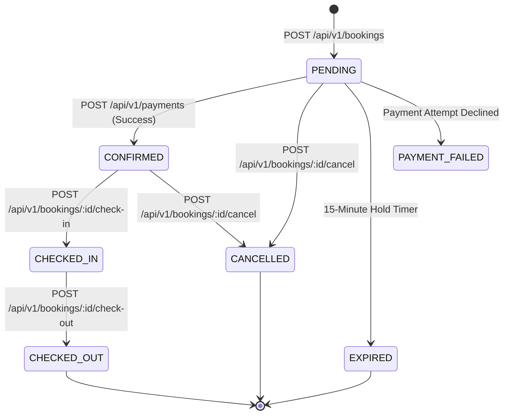

# Stayora — Unified API Contract & Integration Guide

> **Production REST API Specification (Phase 18 Hardened)**  
> **Base URL:** `http://localhost:4000/api/v1`  
> **Interactive Documentation:** `http://localhost:4000/api/docs` (Swagger / OpenAPI 3.0)  
> **Supported Consuming Clients:**
> * **Customer Web App:** `http://localhost:3000`
> * **Manager Web App:** `http://localhost:3001`
> * **Admin Dashboard:** `http://localhost:3002`

---

## 1. Architectural Philosophy & Client Integration

Stayora operates a **single, centralized NestJS modular monolith API** backed by PostgreSQL (Prisma ORM), Redis 7, BullMQ, and Server-Sent Events (SSE). 

There are no frontend-specific backends (e.g. no `/customer-backend` or `/manager-backend`). All three frontend applications consume the identical REST API under `/api/v1`. Access control, authorization scoping, and data visibility are strictly enforced server-side based on the authenticated user's role and verified resource assignments.

A frontend engineer can completely integrate customer, manager, or admin applications by referencing this document and the live OpenAPI specification at `/api/docs`.

---

## 2. API Versioning & Routing

All REST endpoints are strictly mounted under the versioned prefix:

```text
/api/v1
```

* **No Unversioned Endpoints:** Requests missing `/api/v1` return `404 Not Found` with the standard error envelope.
* **Stability Guarantee:** Breaking schema changes will not be introduced under `/api/v1`.
* **No Premature `/api/v2`:** Features evolve additively under `/api/v1` with backward compatibility.

---

## 3. Standard Request & Response Envelopes

Every non-SSE HTTP response emitted by the Stayora API adheres to predictable JSON envelopes.

### 3.1 Success Envelope (Single Entity or Mutation)

```json
{
  "success": true,
  "data": {
    "id": "44444444-4444-4444-8444-444444444444",
    "name": "Stayora Grand Palace",
    "status": "ACTIVE"
  }
}
```

### 3.2 Success Envelope (Paginated Collections)

All collection endpoints return items with metadata:

```json
{
  "success": true,
  "data": {
    "items": [
      {
        "id": "44444444-4444-4444-8444-444444444444",
        "name": "Stayora Grand Palace"
      }
    ],
    "meta": {
      "page": 1,
      "limit": 20,
      "total": 150,
      "totalPages": 8
    }
  }
}
```

### 3.3 Standard Error Envelope

```json
{
  "success": false,
  "error": {
    "code": "ROOM_NOT_AVAILABLE",
    "message": "The selected room category does not have enough available physical rooms for the specified dates.",
    "details": [
      "No physical rooms available between 2026-10-10 and 2026-10-12"
    ]
  },
  "timestamp": "2026-10-02T12:00:00.000Z",
  "path": "/api/v1/bookings"
}
```

* Errors never expose database query strings, Prisma error codes (e.g. `P2002`), internal stack traces, or credentials.
* Machine-readable error codes are cataloged in [`docs/API_ERROR_CODES.md`](./API_ERROR_CODES.md).

---

## 4. HTTP Status Codes & REST Conventions

### 4.1 Status Code Mapping

| Status Code | Usage in Stayora |
| :--- | :--- |
| `200 OK` | Successful `GET`, `PATCH`, or action-oriented `POST` (e.g. login, check-in, check-out, cancel). |
| `201 Created` | Successful resource creation (`POST /auth/customer/register`, `POST /bookings`, `POST /payments`). |
| `204 No Content` | CORS preflight `OPTIONS` requests. |
| `400 Bad Request` | Request validation failure (`VALIDATION_ERROR`), illegal date bounds, or invalid query parameters. |
| `401 Unauthorized` | Missing, expired, or invalid JWT Bearer token; invalid login credentials. |
| `403 Forbidden` | Authenticated caller lacks required role or is not assigned to the requested hotel property. |
| `404 Not Found` | Target resource does not exist (or IDOR protection returning 404 to prevent enumeration). |
| `409 Conflict` | Unique slug collision, double-booking race condition, or payment idempotency key mismatch. |
| `422 Unprocessable` | Well-formed JSON violating business invariants. |
| `500 Internal Error`| Unhandled server fault. Sanitized message emitted. |

### 4.2 REST Naming Conventions

* **Resource Collections:** Pluralized nouns (`/hotels`, `/room-types`, `/rooms`, `/bookings`, `/payments`, `/reviews`, `/notifications`).
* **Nested Sub-resources:** Direct relationship hierarchies (`/hotels/:hotelId/reviews`, `/availability/hotels/:hotelId`).
* **Permissible Action Endpoints:** Explicit lifecycle operations use intuitive action sub-paths:
  * `POST /api/v1/bookings/:id/cancel`
  * `POST /api/v1/bookings/:id/check-in`
  * `POST /api/v1/bookings/:id/check-out`
  * `PATCH /api/v1/notifications/read-all`
  * `PATCH /api/v1/notifications/:id/read`

---

## 5. Pagination, Filtering, and Sorting

### 5.1 Pagination Standards
* **Query Parameters:**
  * `page`: integer $\ge 1$ (default: `1`)
  * `limit`: integer between $1$ and $100$ (default: `20`)
* **Strict Rejection:** Providing `page < 1` or `limit > 100` triggers `400 VALIDATION_ERROR`.
* **Collection Response:** Always wraps records in `items: []` and pagination state in `meta: { page, limit, total, totalPages }`.

### 5.2 Safe Sorting & Allowlists
Arbitrary database column names from client input are strictly forbidden. Every collection endpoint validates `sortBy` against an explicit domain allowlist:
* **Hotels:** `createdAt`, `name`, `starRating`, `city`
* **Room Types:** `createdAt`, `basePriceCents`, `name`, `maxOccupancy`
* **Rooms:** `roomNumber`, `floor`, `createdAt`
* **Reviews:** `newest`, `oldest`, `highest`, `lowest`, `highest_rating`, `lowest_rating`
* **Notifications:** `newest`, `oldest`
* **Admin Users:** `createdAt`, `email`, `firstName`, `lastName`, `role`, `status`
* **Admin Audit Logs:** `createdAt`

Direction is restricted to `asc` or `desc` (default: `desc`).

---

## 6. Authentication Contract

Stayora issues cryptographically signed JSON Web Tokens (JWT) containing user identity, role, and status.

### 6.1 Authentication Portals

| Portal / Frontend | Login Endpoint | Permitted Role | Target Audience |
| :--- | :--- | :--- | :--- |
| **Public Customer Web** (`:3000`) | `POST /api/v1/auth/customer/login` | `CUSTOMER` | Public travelers & guests |
| **Customer Registration** | `POST /api/v1/auth/customer/register` | `CUSTOMER` | Creates customer account |
| **Manager Web** (`:3001`) | `POST /api/v1/auth/manager/login` | `HOTEL_MANAGER` | Hotel managers & operational staff |
| **Admin Dashboard** (`:3002`) | `POST /api/v1/auth/admin/login` | `ADMIN` | System administrators |
| **Current User Profile** | `GET /api/v1/auth/me` | Any valid JWT | Retrieves sanitized user profile |
| **Session Termination** | `POST /api/v1/auth/logout` | Any valid JWT | Directs client to discard local JWT |

### 6.2 Token Usage in Client Requests
All authenticated endpoints require an `Authorization` header:

```http
Authorization: Bearer <accessToken>
```

### 6.3 Sensitive Field Protection
* **Password Hashes:** `passwordHash` is never selected from Prisma during profile serialization.
* **Token Hashes:** Refresh token hashes (`tokenHash`) are never emitted to HTTP clients.
* **Sanitized Responses:** User objects emit only `id`, `email`, `firstName`, `lastName`, `phone`, `role`, `status`, and timestamps.

---

## 7. Authorization & Tenant Isolation (RBAC)

### 7.1 Role Hierarchy

```text
ADMIN
  └── Full system oversight, audit logs, property activation, user status
HOTEL_MANAGER
  └── Property management, room types, rooms, check-in/out for ASSIGNED hotels
CUSTOMER
  └── Search hotels, create reservations, pay, review completed stays
```

### 7.2 Resource-Level Isolation (Manager Tenant Boundary)
Hotel managers cannot access or modify hotel properties simply by holding the `HOTEL_MANAGER` role. Access is governed by explicit assignments in the `hotel_managers` database table:

$$\text{Manager Access} \iff (\text{user.role} == \text{HOTEL\_MANAGER}) \land (\exists \text{ assignment for } \text{hotelId})$$

Cross-property modifications trigger `403 FORBIDDEN` or `404 NOT_FOUND`.

---

## 8. Date and Time Contract

### 8.1 Timestamps
All system timestamps (`createdAt`, `updatedAt`, `cancelledAt`, `settledAt`, `readAt`) use **ISO 8601 UTC representation**:

```text
2026-10-02T12:30:00.000Z
```

### 8.2 Booking Date Semantics (Half-Open Interval)
Reservations distinguish calendar dates from timestamps:
* **Input Format:** `YYYY-MM-DD` (e.g. `2026-10-10`)
* **Interval Representation:** $[checkInDate, checkOutDate)$
  * `checkInDate` is **inclusive** (guest arrives on check-in day).
  * `checkOutDate` is **exclusive** (guest departs in the morning of check-out day).
* **Nights Calculation:**
  $$\text{totalNights} = \text{checkOutDate} - \text{checkInDate}$$
  *Example:* `2026-10-10` to `2026-10-12` represents **2 nights** (the nights of Oct 10 and Oct 11), with check-out on Oct 12.
* **Validation:** Requests with `checkOutDate <= checkInDate` or `checkInDate < today` are rejected with `400 VALIDATION_ERROR`.

---

## 9. Monetary Contract & Precision

### 9.1 Storage & Arithmetic
To avoid catastrophic floating-point rounding errors (e.g. `0.1 + 0.2 = 0.30000000000000004`), Stayora adheres to strict financial invariants:
1. **Database:** All monetary amounts are stored as integer cents using PostgreSQL `BIGINT` (`total_amount_cents`, `base_price_cents`, `net_amount_cents`).
2. **Calculations:** Internal calculations, taxes, fees, and discounts are performed exclusively in integer cents.
3. **API Serialization:** Response payloads expose amounts as fixed-point 2-decimal strings:
   ```json
   {
     "totalAmount": "12500.00",
     "totalAmountCents": "1250000",
     "currency": "INR"
   }
   ```
4. **Authoritative Amount:** The client **never** specifies payment amounts. The backend derives the payable amount strictly from the authoritative database `Booking.totalAmountCents`.

---

## 10. Booking Lifecycle & State Transitions

### 10.1 Booking State Machine



### 10.2 Booking Rules
* **15-Minute Temporary Hold:** When created, a booking enters `PENDING` status. Physical rooms are locked to prevent concurrent double-booking. If uncompleted after 15 minutes, background BullMQ workers transition the booking to `EXPIRED` and release the room locks.
* **Room Allocation:** Allocation maps physical rooms to the booking. On cancellation, physical rooms are atomically released without deleting historical reservation records.

---

## 11. Payments & Idempotency Contract

### 11.1 Idempotent Payment Processing
Every payment processing request (`POST /api/v1/payments`) requires an `Idempotency-Key` header:

```http
POST /api/v1/payments HTTP/1.1
Host: localhost:4000
Authorization: Bearer <customerToken>
Content-Type: application/json
Idempotency-Key: 9b1deb4d-3b7d-4bad-9bdd-2b0d7b3dcb6d

{
  "bookingId": "10594466-e472-4e5b-887f-1e624e255292",
  "paymentMethod": "CREDIT_CARD"
}
```

### 11.2 Behavior Guarantees:
* **First Attempt:** Processes the payment against the authoritative booking total and creates a `PaymentAttempt` with status `SUCCESS` or `FAILED`.
* **Safe Replay:** Subsequent identical requests with the same `Idempotency-Key` return the original cached response without duplicate billing.
* **Key Mismatch Protection:** Reusing an `Idempotency-Key` across different `bookingId` parameters triggers `409 IDEMPOTENCY_CONFLICT`.

---

## 12. Reviews & Rating System

* **Review Eligibility:** Guests can submit reviews (`POST /api/v1/reviews`) only for completed stays (`status == CHECKED_OUT`).
* **Pre-flight Check:** Clients can query `GET /api/v1/bookings/:bookingId/review-eligibility` before rendering review forms.
* **One-Review Invariant:** Each booking allows exactly one review (`bookingId` is unique). Duplicate attempts return `409 REVIEW_ALREADY_EXISTS`.
* **Rating Range:** Ratings must be integers between 1 and 5.
* **Moderation:** Administrators can hide or publish reviews via `PATCH /api/v1/admin/reviews/:id/moderation`.

---

## 13. In-App Notifications

* **User Inbox:** `GET /api/v1/notifications` retrieves paginated notifications for the calling user.
* **Unread Counter:** `GET /api/v1/notifications/unread-count` returns unread notification count for badge rendering.
* **Mark Read:** `PATCH /api/v1/notifications/:id/read` marks a single notification as read.
* **Mark All Read:** `PATCH /api/v1/notifications/read-all` idempotently marks all unread notifications as read.

---

## 14. Server-Sent Events (SSE) Real-Time Contract

### 14.1 Stream Endpoint

```http
GET /api/v1/events/stream HTTP/1.1
Host: localhost:4000
Authorization: Bearer <JWT>
Accept: text/event-stream
```

*For browser environments where standard `EventSource` cannot supply HTTP headers, the token may be passed as a query parameter:*

```text
GET /api/v1/events/stream?token=<JWT>
```

### 14.2 Stream Event Payload Format

```text
id: evt_7af576f3-84fe-410a-84ce-1bd9ba47e8c2
event: BOOKING_CONFIRMED
data: {"bookingId":"10594466-e472-4e5b-887f-1e624e255292","status":"CONFIRMED","timestamp":"2026-10-02T12:00:00.000Z"}

: heartbeat
```

### 14.3 Stream Invariants:
* **Heartbeat:** Comment line `: heartbeat` is pushed every 30 seconds to maintain connection through HTTP proxies and firewalls.
* **Role Scoping:**
  * Customers receive only events regarding their own bookings and notifications.
  * Managers receive operational events for their assigned hotel properties.
  * Administrators receive platform-level event broadcasts.
* **Advisory Status:** SSE is advisory and real-time. Upon network reconnect or page reload, frontends must perform REST queries to establish authoritative state.

---

## 15. Admin Operations & Platform Management

Accessible strictly to users with the `ADMIN` role.

| Method | Endpoint | Description |
| :--- | :--- | :--- |
| `GET` | `/api/v1/admin/dashboard` | Platform metrics across users, hotels, inventory, bookings, revenue, and reviews. |
| `GET` | `/api/v1/admin/users` | Paginated user accounts with role, status, and search filters. |
| `GET` | `/api/v1/admin/users/:id` | Detailed user account inspection. |
| `PATCH` | `/api/v1/admin/users/:id/status` | Update user status (`ACTIVE`, `SUSPENDED`, `DISABLED`). Self-deactivation blocked. |
| `GET` | `/api/v1/admin/managers` | Paginated managers and their assigned hotel counts. |
| `GET` | `/api/v1/admin/managers/:id` | Manager profile with full hotel property assignment records. |
| `PATCH` | `/api/v1/admin/managers/:id/status` | Update manager status. |
| `POST` | `/api/v1/admin/hotels/:hotelId/managers/:managerId` | Assign manager to hotel property idempotently. |
| `DELETE`| `/api/v1/admin/hotels/:hotelId/managers/:managerId` | Revoke manager assignment from hotel. |
| `GET` | `/api/v1/admin/hotels` | Platform-wide hotel listing including active and inactive properties. |
| `GET` | `/api/v1/admin/hotels/:id` | Full hotel detail inspection with rooms and staff. |
| `PATCH` | `/api/v1/admin/hotels/:id/status` | Activate or deactivate hotel property. |
| `GET` | `/api/v1/admin/bookings` | Platform-wide booking ledger inspection. |
| `GET` | `/api/v1/admin/bookings/:id` | Inspect single booking ledger with room allocations and payment details. |
| `GET` | `/api/v1/admin/payments` | Platform-wide payment transaction ledger with gateway attempts. |
| `GET` | `/api/v1/admin/payments/:id` | Inspect payment details with sanitized attempts. |
| `GET` | `/api/v1/admin/reviews` | Platform-wide review listing with publication status. |
| `GET` | `/api/v1/admin/reviews/:id` | Inspect review details. |
| `PATCH` | `/api/v1/admin/reviews/:id/moderation` | Publish or conceal review. |
| `GET` | `/api/v1/admin/notifications` | Platform-wide dispatched notification audit trail. |
| `GET` | `/api/v1/admin/audit-logs` | Immutable platform audit trail with actor, action, and before/after values. |
| `GET` | `/api/v1/admin/audit-logs/:id` | Inspect specific audit log record. |

---

## 16. Platform Audit Log Contract

Audit records in Stayora are **append-only and immutable**. They are created by system transactions and cannot be altered or deleted through the API.

* **List Audit Logs:** `GET /api/v1/admin/audit-logs?page=1&limit=20`
* **Filter Options:** `actorId`, `entityType`, `entityId`, `action`, `search`
* **Audit Record Schema:**
  ```json
  {
    "id": "7b1deb4d-3b7d-4bad-9bdd-2b0d7b3dcb6d",
    "actorId": "11111111-1111-4111-8111-111111111111",
    "action": "admin.hotel.status_updated",
    "entityType": "Hotel",
    "entityId": "44444444-4444-4444-8444-444444444444",
    "oldValues": { "isActive": true },
    "newValues": { "isActive": false, "reason": "Seasonal renovation" },
    "ipAddress": "127.0.0.1",
    "userAgent": "Mozilla/5.0 ...",
    "createdAt": "2026-10-02T12:00:00.000Z",
    "actor": {
      "id": "11111111-1111-4111-8111-111111111111",
      "email": "admin@stayora.com",
      "firstName": "System",
      "lastName": "Admin",
      "role": "ADMIN"
    }
  }
  ```

---

## 17. CORS Policy & Permitted Headers

Stayora enables Cross-Origin Resource Sharing (CORS) configured for official client origins (`localhost:3000`, `localhost:3001`, `localhost:3002`).

Permitted Request Headers:
* `Content-Type`
* `Authorization`
* `X-Requested-With`
* `X-Request-ID`
* `Idempotency-Key` / `idempotency-key`
* `Last-Event-ID`
