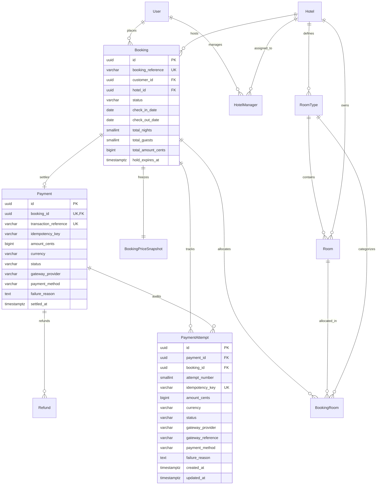

# Stayora — Database Architecture & Relational Schema

> **Authoritative PostgreSQL Relational Architecture**  
> **ORM Layer:** Prisma v6.19  
> **Database Engine:** PostgreSQL 16  
> **Status:** Phase 9 (Payments & Payment Attempts) Complete

---

## 1. Architectural Philosophy

The Stayora database architecture adheres to strict enterprise relational principles:

1. **PostgreSQL as Sole Authoritative Source of Truth**: All invariants, uniqueness rules, referential integrity, and concurrency controls are guaranteed at the storage engine level.
2. **Normalized Core Relational Model (3NF/BCNF)**: Eliminates update anomalies while using targeted denormalization (such as `booking_price_snapshots` and pre-calculated `total_amount_cents`) strictly for historical point-in-time rate freezing.
3. **Pessimistic Concurrency & Exclusion Constraints**: Physical inventory double-booking is impossible due to PostgreSQL GiST exclusion constraints (`exclude_overlapping_room_allocations`). Payments concurrency is serialized using pessimistic row-level locking (`SELECT ... FOR UPDATE`).
4. **Integer Minor Currency Units**: Persisted monetary values are stored strictly as `BIGINT` minor units (`amount_cents`), completely eliminating IEEE-754 floating-point drift.
5. **Decoupled Financial Ledger**: Clear structural separation between logical payments (`payments`) and gateway execution attempts (`payment_attempts`).

---

## 2. Core Entity-Relationship Diagram



---

## 3. Payments & Payment Attempts Architecture (Phase 9)

### 3.1 Structural Ledger Separation

| Aspect | `Payment` (Logical Contract) | `PaymentAttempt` (Gateway Execution) |
| :--- | :--- | :--- |
| **Cardinality to Booking** | Exactly 1 per booking (`booking_id UNIQUE`) | 1-to-many per payment/booking |
| **Lifecycle Semantics** | Represents the overall booking payment status (`PENDING`, `SUCCEEDED`, `FAILED`) | Represents a point-in-time gateway processing attempt |
| **Retry Behavior** | Reused across retries; status transitions `FAILED` → `PENDING` → `SUCCEEDED` | Immutable; failed attempts remain permanently recorded for auditability |
| **Idempotency Scope** | Holds initial/settled transaction reference | Holds unique `idempotency_key` preventing duplicate execution |

### 3.2 Table Definitions & Constraints

#### Table: `payments`
```sql
CREATE TABLE "payments" (
    "id" UUID NOT NULL DEFAULT gen_random_uuid(),
    "booking_id" UUID NOT NULL,
    "transaction_reference" VARCHAR(100) NOT NULL,
    "idempotency_key" VARCHAR(100),
    "amount_cents" BIGINT NOT NULL,
    "currency" VARCHAR(3) NOT NULL DEFAULT 'INR',
    "status" VARCHAR(20) NOT NULL DEFAULT 'PENDING',
    "gateway_provider" VARCHAR(50) NOT NULL DEFAULT 'MOCK',
    "payment_method" VARCHAR(50),
    "failure_reason" TEXT,
    "created_at" TIMESTAMPTZ NOT NULL DEFAULT CURRENT_TIMESTAMP,
    "settled_at" TIMESTAMPTZ,

    CONSTRAINT "payments_pkey" PRIMARY KEY ("id"),
    CONSTRAINT "payments_booking_id_fkey" FOREIGN KEY ("booking_id") REFERENCES "bookings"("id") ON DELETE RESTRICT ON UPDATE CASCADE,
    CONSTRAINT "chk_payments_status" CHECK ("status" IN ('PENDING', 'SUCCEEDED', 'FAILED', 'REFUNDED', 'PARTIALLY_REFUNDED')),
    CONSTRAINT "chk_payments_amount" CHECK ("amount_cents" >= 0)
);

CREATE UNIQUE INDEX "payments_booking_id_key" ON "payments"("booking_id");
CREATE UNIQUE INDEX "payments_transaction_reference_key" ON "payments"("transaction_reference");
```

#### Table: `payment_attempts`
```sql
CREATE TABLE "payment_attempts" (
    "id" UUID NOT NULL DEFAULT gen_random_uuid(),
    "payment_id" UUID NOT NULL,
    "booking_id" UUID NOT NULL,
    "attempt_number" SMALLINT NOT NULL,
    "idempotency_key" VARCHAR(100) NOT NULL,
    "amount_cents" BIGINT NOT NULL,
    "currency" VARCHAR(3) NOT NULL DEFAULT 'INR',
    "status" VARCHAR(20) NOT NULL DEFAULT 'CREATED',
    "gateway_provider" VARCHAR(50) NOT NULL DEFAULT 'MOCK',
    "gateway_reference" VARCHAR(100),
    "payment_method" VARCHAR(50),
    "failure_reason" TEXT,
    "metadata" JSONB,
    "created_at" TIMESTAMPTZ NOT NULL DEFAULT CURRENT_TIMESTAMP,
    "updated_at" TIMESTAMPTZ NOT NULL DEFAULT CURRENT_TIMESTAMP,

    CONSTRAINT "payment_attempts_pkey" PRIMARY KEY ("id"),
    CONSTRAINT "payment_attempts_payment_id_fkey" FOREIGN KEY ("payment_id") REFERENCES "payments"("id") ON DELETE RESTRICT ON UPDATE CASCADE,
    CONSTRAINT "payment_attempts_booking_id_fkey" FOREIGN KEY ("booking_id") REFERENCES "bookings"("id") ON DELETE RESTRICT ON UPDATE CASCADE,
    CONSTRAINT "chk_payment_attempts_status" CHECK ("status" IN ('CREATED', 'PROCESSING', 'SUCCEEDED', 'FAILED')),
    CONSTRAINT "chk_payment_attempts_amount" CHECK ("amount_cents" >= 0)
);

CREATE UNIQUE INDEX "payment_attempts_idempotency_key_key" ON "payment_attempts"("idempotency_key");
CREATE UNIQUE INDEX "payment_attempts_payment_id_attempt_number_key" ON "payment_attempts"("payment_id", "attempt_number");
CREATE INDEX "payment_attempts_payment_id_idx" ON "payment_attempts"("payment_id");
CREATE INDEX "payment_attempts_booking_id_idx" ON "payment_attempts"("booking_id");
```

---

## 4. Concurrency & Idempotency Guarantees

### 4.1 Exactly-Once Execution
* The unique database index `payment_attempts_idempotency_key_key` ensures that two concurrent requests with identical idempotency keys cannot create duplicate attempts.
* Transactional attempt creation uses row-level locking (`SELECT ... FOR UPDATE` on `bookings`), preventing race conditions.
* In the event of a simultaneous key race, PostgreSQL raises error code `23505` (`P2002`), which is intercepted by `PaymentsService` to safely return the replayed payment state.

### 4.2 Multi-Key Conflict Serialization
* If multiple concurrent requests with **different** idempotency keys target the same booking:
  1. The first request locks the `bookings` record and inserts an attempt with `status = PROCESSING`.
  2. The second request detects the in-flight attempt and yields outside the transaction, waiting briefly for settlement.
  3. When the first request settles, `booking.status` transitions to `CONFIRMED`.
  4. The second request re-checks the booking state and is rejected with `409 CONFLICT` (`PAYMENT_ALREADY_COMPLETED`), preventing double payment.

---

## 5. Mock Payment Gateway

The payment processing layer uses a clean gateway abstraction:
```text
PaymentsService ──► PaymentGateway Interface ──► MockPaymentGateway
```
* **Development & Test Environment**: Handled deterministically by `MockPaymentGateway`. Supports simulation flags (`simulateResult: 'SUCCESS' | 'FAILED'`) without flaky random timers or network calls.
* **Production Readiness**: Integrating real processors (Stripe, Razorpay) only requires implementing `PaymentGateway` without touching core domain services or database models.
