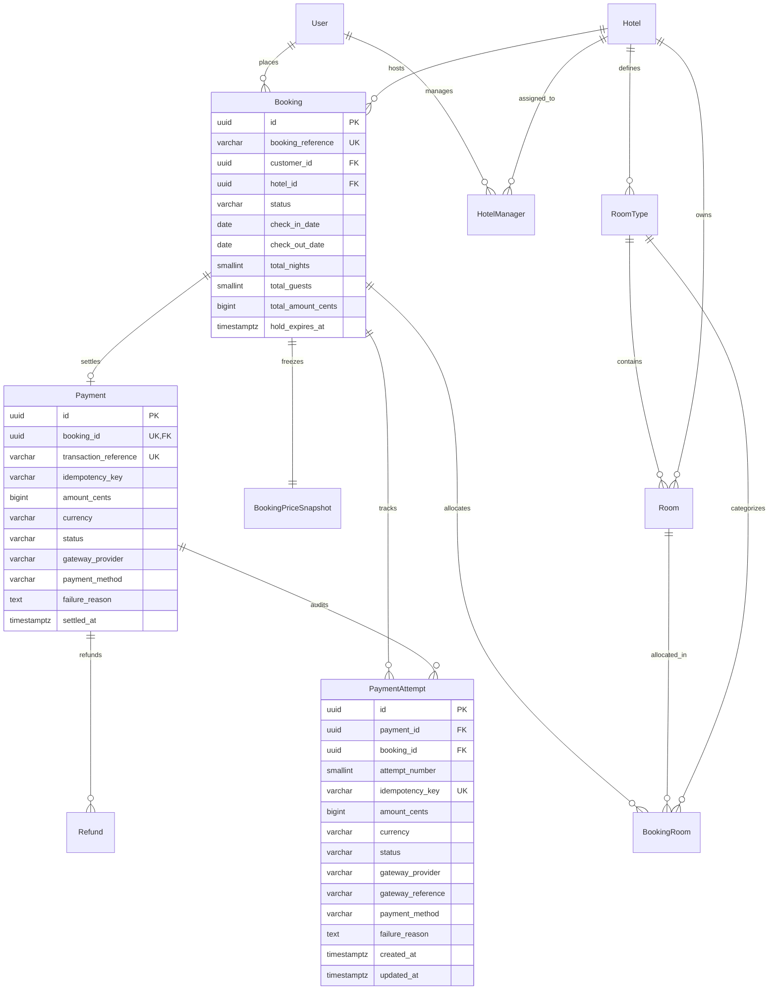

# Stayora — Database Architecture & Relational Schema

> **Authoritative PostgreSQL Relational Architecture**  
> **ORM Layer:** Prisma v6.19  
> **Database Engine:** PostgreSQL 16  
> **Status:** Phase 13 (Redis Infrastructure) Complete

---

## 1. Architectural Philosophy

The Stayora database architecture adheres to strict enterprise relational principles:

1. **PostgreSQL as Sole Authoritative Source of Truth**: All invariants, uniqueness rules, referential integrity, and concurrency controls are guaranteed at the storage engine level.
2. **Normalized Core Relational Model (3NF/BCNF)**: Eliminates update anomalies while using targeted denormalization (such as `booking_price_snapshots` and pre-calculated `total_amount_cents`) strictly for historical point-in-time rate freezing.
3. **Pessimistic Concurrency & Exclusion Constraints**: Physical inventory double-booking is impossible due to PostgreSQL GiST exclusion constraints (`exclude_overlapping_room_allocations`). Payments concurrency is serialized using pessimistic row-level locking (`SELECT ... FOR UPDATE`).
4. **Integer Minor Currency Units**: Persisted monetary values are stored strictly as `BIGINT` minor units (`amount_cents`), completely eliminating IEEE-754 floating-point drift.
5. **Decoupled Financial Ledger**: Clear structural separation between logical payments (`payments`) and gateway execution attempts (`payment_attempts`).

---

## 2. Core Entity-Relationship Diagram



---

## 3. Payments & Payment Attempts Architecture (Phase 9)

### 3.1 Structural Ledger Separation

| Aspect | `Payment` (Logical Contract) | `PaymentAttempt` (Gateway Execution) |
| :--- | :--- | :--- |
| **Cardinality to Booking** | Exactly 1 per booking (`booking_id UNIQUE`) | 1-to-many per payment/booking |
| **Lifecycle Semantics** | Represents the overall booking payment status (`PENDING`, `SUCCEEDED`, `FAILED`) | Represents a point-in-time gateway processing attempt |
| **Retry Behavior** | Reused across retries; status transitions `FAILED` → `PENDING` → `SUCCEEDED` | Immutable; failed attempts remain permanently recorded for auditability |
| **Idempotency Scope** | Holds initial/settled transaction reference | Holds unique `idempotency_key` preventing duplicate execution |

### 3.2 Table Definitions & Constraints

#### Table: `payments`
```sql
CREATE TABLE "payments" (
    "id" UUID NOT NULL DEFAULT gen_random_uuid(),
    "booking_id" UUID NOT NULL,
    "transaction_reference" VARCHAR(100) NOT NULL,
    "idempotency_key" VARCHAR(100),
    "amount_cents" BIGINT NOT NULL,
    "currency" VARCHAR(3) NOT NULL DEFAULT 'INR',
    "status" VARCHAR(20) NOT NULL DEFAULT 'PENDING',
    "gateway_provider" VARCHAR(50) NOT NULL DEFAULT 'MOCK',
    "payment_method" VARCHAR(50),
    "failure_reason" TEXT,
    "created_at" TIMESTAMPTZ NOT NULL DEFAULT CURRENT_TIMESTAMP,
    "settled_at" TIMESTAMPTZ,

    CONSTRAINT "payments_pkey" PRIMARY KEY ("id"),
    CONSTRAINT "payments_booking_id_fkey" FOREIGN KEY ("booking_id") REFERENCES "bookings"("id") ON DELETE RESTRICT ON UPDATE CASCADE,
    CONSTRAINT "chk_payments_status" CHECK ("status" IN ('PENDING', 'SUCCEEDED', 'FAILED', 'REFUNDED', 'PARTIALLY_REFUNDED')),
    CONSTRAINT "chk_payments_amount" CHECK ("amount_cents" >= 0)
);

CREATE UNIQUE INDEX "payments_booking_id_key" ON "payments"("booking_id");
CREATE UNIQUE INDEX "payments_transaction_reference_key" ON "payments"("transaction_reference");
```

#### Table: `payment_attempts`
```sql
CREATE TABLE "payment_attempts" (
    "id" UUID NOT NULL DEFAULT gen_random_uuid(),
    "payment_id" UUID NOT NULL,
    "booking_id" UUID NOT NULL,
    "attempt_number" SMALLINT NOT NULL,
    "idempotency_key" VARCHAR(100) NOT NULL,
    "amount_cents" BIGINT NOT NULL,
    "currency" VARCHAR(3) NOT NULL DEFAULT 'INR',
    "status" VARCHAR(20) NOT NULL DEFAULT 'CREATED',
    "gateway_provider" VARCHAR(50) NOT NULL DEFAULT 'MOCK',
    "gateway_reference" VARCHAR(100),
    "payment_method" VARCHAR(50),
    "failure_reason" TEXT,
    "metadata" JSONB,
    "created_at" TIMESTAMPTZ NOT NULL DEFAULT CURRENT_TIMESTAMP,
    "updated_at" TIMESTAMPTZ NOT NULL DEFAULT CURRENT_TIMESTAMP,

    CONSTRAINT "payment_attempts_pkey" PRIMARY KEY ("id"),
    CONSTRAINT "payment_attempts_payment_id_fkey" FOREIGN KEY ("payment_id") REFERENCES "payments"("id") ON DELETE RESTRICT ON UPDATE CASCADE,
    CONSTRAINT "payment_attempts_booking_id_fkey" FOREIGN KEY ("booking_id") REFERENCES "bookings"("id") ON DELETE RESTRICT ON UPDATE CASCADE,
    CONSTRAINT "chk_payment_attempts_status" CHECK ("status" IN ('CREATED', 'PROCESSING', 'SUCCEEDED', 'FAILED')),
    CONSTRAINT "chk_payment_attempts_amount" CHECK ("amount_cents" >= 0)
);

CREATE UNIQUE INDEX "payment_attempts_idempotency_key_key" ON "payment_attempts"("idempotency_key");
CREATE UNIQUE INDEX "payment_attempts_payment_id_attempt_number_key" ON "payment_attempts"("payment_id", "attempt_number");
CREATE INDEX "payment_attempts_payment_id_idx" ON "payment_attempts"("payment_id");
CREATE INDEX "payment_attempts_booking_id_idx" ON "payment_attempts"("booking_id");
```

---

## 4. Concurrency & Idempotency Guarantees

### 4.1 Exactly-Once Execution
* The unique database index `payment_attempts_idempotency_key_key` ensures that two concurrent requests with identical idempotency keys cannot create duplicate attempts.
* Transactional attempt creation uses row-level locking (`SELECT ... FOR UPDATE` on `bookings`), preventing race conditions.
* In the event of a simultaneous key race, PostgreSQL raises error code `23505` (`P2002`), which is intercepted by `PaymentsService` to safely return the replayed payment state.

### 4.2 Multi-Key Conflict Serialization
* If multiple concurrent requests with **different** idempotency keys target the same booking:
  1. The first request locks the `bookings` record and inserts an attempt with `status = PROCESSING`.
  2. The second request detects the in-flight attempt and yields outside the transaction, waiting briefly for settlement.
  3. When the first request settles, `booking.status` transitions to `CONFIRMED`.
  4. The second request re-checks the booking state and is rejected with `409 CONFLICT` (`PAYMENT_ALREADY_COMPLETED`), preventing double payment.

---

## 5. Mock Payment Gateway

The payment processing layer uses a clean gateway abstraction:
```text
PaymentsService ──► PaymentGateway Interface ──► MockPaymentGateway
```
* **Development & Test Environment**: Handled deterministically by `MockPaymentGateway`. Supports simulation flags (`simulateResult: 'SUCCESS' | 'FAILED'`) without flaky random timers or network calls.
* **Production Readiness**: Integrating real processors (Stripe, Razorpay) only requires implementing `PaymentGateway` without touching core domain services or database models.

---

## 6. Booking Lifecycle, Historical Preservation & Inventory Release (Phase 10)

### 6.1 Historical Record Preservation (Zero Deletion Invariant)
* Cancelled, completed, and expired bookings are **never hard-deleted** from `bookings` or `booking_rooms`.
* Preserving records guarantees historical auditability for financial reconciliation, guest stay histories, legal compliance, and operational analytics.

### 6.2 Availability Evaluation Logic
Real-time availability calculations in `AvailabilityService` dynamically determine blocking allocations using status checks:
```sql
SELECT room_id FROM booking_rooms br
JOIN bookings b ON b.id = br.booking_id
WHERE br.room_id IN (:operationalRoomIds)
  AND br.status IN ('RESERVED', 'OCCUPIED')
  AND br.check_in_date < :requestedCheckOut
  AND br.check_out_date > :requestedCheckIn
  AND b.status IN ('PENDING', 'CONFIRMED', 'CHECKED_IN')
  AND (b.hold_expires_at IS NULL OR b.hold_expires_at > CURRENT_TIMESTAMP);
```
* **Cancellation**: `br.status` is set to `CANCELLED` and `b.status` to `CANCELLED`. The allocation immediately ceases to match `br.status IN ('RESERVED', 'OCCUPIED')`, freeing inventory for new reservations.
* **Check-Out / Completion**: `br.status` is set to `RELEASED` and `b.status` to `CHECKED_OUT`. Past dates naturally fall outside search windows, and allocations cease to block future dates.
* **Physical Room Decoupling**: Physical rooms maintain independent `Room.operationalStatus` (`AVAILABLE`, `MAINTENANCE`, `OUT_OF_SERVICE`). Lifecycle operations never alter `Room.operationalStatus`.

### 6.3 Audit Ledger Integration
All lifecycle events are recorded in `audit_logs` with actor UUID, action name (`booking.cancelled`, `booking.checked_in`, `booking.checked_out`, `booking.expired`), timestamp, entity UUID, and state changes (`oldValues`, `newValues`).

---

## 7. Reviews & Ratings Architecture (Phase 11)

### 7.1 Relational Schema (`reviews` Table)
```sql
CREATE TABLE reviews (
    id UUID PRIMARY KEY DEFAULT gen_random_uuid(),
    booking_id UUID NOT NULL UNIQUE REFERENCES bookings(id) ON DELETE CASCADE,
    customer_id UUID NOT NULL REFERENCES users(id) ON DELETE RESTRICT,
    hotel_id UUID NOT NULL REFERENCES hotels(id) ON DELETE CASCADE,
    rating SMALLINT NOT NULL CHECK ("rating" BETWEEN 1 AND 5),
    title VARCHAR(150),
    comment TEXT NOT NULL,
    is_published BOOLEAN NOT NULL DEFAULT true,
    created_at TIMESTAMPTZ NOT NULL DEFAULT CURRENT_TIMESTAMP,
    updated_at TIMESTAMPTZ NOT NULL DEFAULT CURRENT_TIMESTAMP
);
```

### 7.2 Database Invariants & Storage Integrity
1. **One-Review-Per-Booking Uniqueness (`reviews_booking_id_key`)**:
   - Backed by a strict PostgreSQL unique B-Tree index on `booking_id`.
   - Protects against simultaneous concurrent API requests. When two requests race, the database serializes the insert and rejects the second with a unique constraint violation (`P2002`), which the application safely converts to `409 REVIEW_ALREADY_EXISTS`.
2. **Rating Range Integrity (`chk_reviews_rating`)**:
   - Check constraint `CHECK ("rating" BETWEEN 1 AND 5)` enforces that ratings can never be negative, zero, or exceed 5 stars at the database level.
3. **Immutable Relational Anchors**:
   - `booking_id`, `customer_id`, and `hotel_id` cannot be altered after creation. Only `rating`, `title`, and `comment` are editable.

### 7.3 Indexing & Performance Design
* **`reviews(hotel_id, is_published)` composite index**: Enables sub-millisecond retrieval of published reviews for hotel landing pages, avoiding full table scans.
* **`reviews(booking_id)` unique index**: Enables instantaneous O(1) existence lookups for the pre-flight eligibility check (`GET /api/v1/bookings/:bookingId/review-eligibility`).
* **`reviews(customer_id)` foreign key index**: Powers customer review history (`GET /api/v1/reviews/me`).

### 7.4 In-Database Rating Aggregations
To prevent catastrophic Node.js memory pressure, average ratings and distribution counts are never computed in JavaScript memory:
```sql
-- Average rating and total review count
SELECT AVG(rating) as avg_rating, COUNT(*) as review_count
FROM reviews
WHERE hotel_id = :hotelId AND is_published = true;

-- Star distribution buckets (1 to 5 stars)
SELECT rating, COUNT(*) as count
FROM reviews
WHERE hotel_id = :hotelId AND is_published = true
GROUP BY rating;
```
Results are rounded to one decimal place consistently (`Math.round(rawAvg * 10) / 10`) and returned alongside paginated items.

---

## 8. Notifications Architecture (Phase 12)

### 8.1 Relational Schema (`notifications` Table)
```sql
CREATE TABLE notifications (
    id UUID PRIMARY KEY DEFAULT gen_random_uuid(),
    user_id UUID NOT NULL REFERENCES users(id) ON DELETE CASCADE,
    title VARCHAR(150) NOT NULL,
    message TEXT NOT NULL,
    type VARCHAR(50) NOT NULL DEFAULT 'SYSTEM',
    metadata JSONB,
    is_read BOOLEAN NOT NULL DEFAULT false,
    read_at TIMESTAMPTZ,
    created_at TIMESTAMPTZ NOT NULL DEFAULT CURRENT_TIMESTAMP
);
```

### 8.2 Database Invariants & Ownership Integrity
1. **Strict User Isolation**: Every notification is foreign-keyed to `users.id` with `ON DELETE CASCADE`. Unauthenticated or cross-tenant inspection is rejected at the repository query boundary (`WHERE user_id = :currentUserId`).
2. **Read State Consistency**:
   - Marking as read enforces `is_read = true` and `read_at = CURRENT_TIMESTAMP`.
   - Repeated/idempotent read operations preserve the original `read_at` timestamp.
3. **Derived Communication Status**:
   - Notifications are decoupled communication records and not the transactional source of truth for booking/payment states. Failures in notification dispatch/persistence do not compromise authoritative business state.

### 8.3 Indexing & Performance Design
* **`notifications(user_id, is_read)` composite index**: Enables high-efficiency unread count lookups (`SELECT COUNT(*) FROM notifications WHERE user_id = :userId AND is_read = false`) and filtered queries (`isRead=false`).
* **`notifications(user_id, created_at DESC)` access pattern**: Optimized sorting by newest-first timestamps for paginated customer notification feeds.

---

## 9. Redis Infrastructure & Dual-Tier Data Architecture (Phase 13)

### 9.1 Data Authority Philosophy: PostgreSQL vs. Redis
In Stayora, data storage is strictly partitioned into **Authoritative State** vs. **Supporting Ephemeral Cache**:

```text
PostgreSQL 16 (Authoritative Source of Truth)
   ↓
   • Bookings & Room Allocations (GiST Exclusion Constraints)
   • Financial Ledgers, Payments & Idempotency Logs (Row-level Locks)
   • Room Inventory & Physical Room States
   • User Accounts, Credentials & Roles
   • Reviews, Ratings & Notification History

Redis 7 (Supporting Ephemeral Infrastructure)
   ↓
   • Low-risk Read Cache (e.g. Public Hotel Discovery Metadata)
   • Non-authoritative query acceleration
   • Short-lived coordination tokens
```

* **No Authoritative State in Redis**: Redis never acts as the primary record for bookings, allocations, balances, payments, or user credentials. If Redis is flushed or destroyed completely, 100% of platform business state is recoverable from PostgreSQL.
* **Authentication Independence**: JWT authentication remains self-contained (`JwtAuthGuard` + PostgreSQL verify). Redis outages never invalidate active sessions.

### 9.2 Cache-Aside Pattern
All caching in Stayora follows the explicit **Cache-Aside** architecture:

```text
Application Client Request
           ↓
     Check Redis Cache
        /        \
  [Cache Hit]   [Cache Miss / Outage]
      ↓                  ↓
 Return Cached     Query PostgreSQL (Authoritative)
                         ↓
                   Set Redis Cache (TTL)
                         ↓
                    Return Data
```

### 9.3 Booking & Inventory Correctness Invariant
* **Non-Authoritative Availability**: Any cached availability or discovery summary is treated as an advisory hint for client exploration.
* **ACID Re-Verification**: Final room reservation decisions, payment capture, and inventory allocation *never* rely on Redis. Concurrency protection and room holds are executed directly against PostgreSQL inside serializable/repeatable-read transactions with PostgreSQL GiST exclusion constraints (`exclude_overlapping_room_allocations`).

### 9.4 Fault-Tolerance & Degraded Performance Model
* **Graceful Degradation**: If Redis becomes unreachable (connection drops, network timeouts, OOM), the application does not fail. Operations automatically fall back to direct PostgreSQL queries.
* **Health Check Contract**: `GET /api/v1/health` reports status `ok` when both PostgreSQL and Redis are responsive. If Redis is down while PostgreSQL is operational, health transitions to `degraded` (`services.redis = "down"`), reflecting operational visibility without dropping traffic.
* **Corrupt Entry Handling**: Corrupt or malformed JSON cache entries trigger asynchronous cache eviction and transparent fallback to PostgreSQL.


